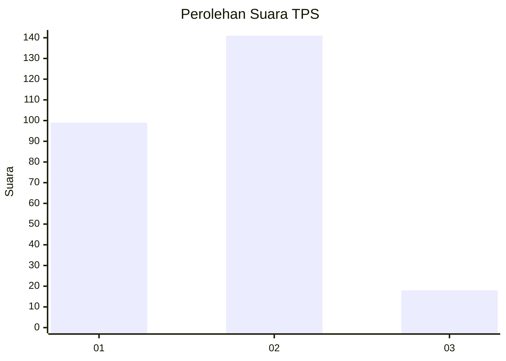

# Hasil

## Grafik

## Tabel

| No. | Nama Paslon    | Suara | Suara (raw) | Persentase |
|:--- |:-------------- | -----:| -----------:| ----------:|
| 1   | ANIES MUHAIMIN | 99    | [99][p-1]   | 38,37      |
| 2   | PRABOWO GIBRAN | 141   | [141][p-2]  | 54,65      |
| 3   | GANJAR MAHFUD  | 18    | [18][p-3]   | 6,98       |

[p-1]: https://github.com/gigit-pemilu/pemilu-2024-32-jawa-barat/blob/main/pilpres/hitung-suara/sub/32-jawa-barat/sub/02-sukabumi/sub/16-cicurug/sub/2004-benda/sub/032-tps/sub/paslon-1.txt
[p-2]: https://github.com/gigit-pemilu/pemilu-2024-32-jawa-barat/blob/main/pilpres/hitung-suara/sub/32-jawa-barat/sub/02-sukabumi/sub/16-cicurug/sub/2004-benda/sub/032-tps/sub/paslon-2.txt
[p-3]: https://github.com/gigit-pemilu/pemilu-2024-32-jawa-barat/blob/main/pilpres/hitung-suara/sub/32-jawa-barat/sub/02-sukabumi/sub/16-cicurug/sub/2004-benda/sub/032-tps/sub/paslon-3.txt

## Foto C Plano

https://sirekap-obj-formc.kpu.go.id/e522/pemilu/ppwp/32/02/16/20/04/3202162004032-20240215-045543--37421341-8821-465d-a339-72711210aea6.jpg

https://sirekap-obj-formc.kpu.go.id/e522/pemilu/ppwp/32/02/16/20/04/3202162004032-20240215-045722--6d6b7bd1-3656-49b5-8cb1-87e2e9d2a8ab.jpg

https://sirekap-obj-formc.kpu.go.id/e522/pemilu/ppwp/32/02/16/20/04/3202162004032-20240215-045853--f8065df4-56c4-49c8-a2fd-a18e0d939028.jpg

## Metadata

| Key        | Value               |
| ---------- | ------------------- |
| Time Stamp | 2024-02-24 22:31:28 |

