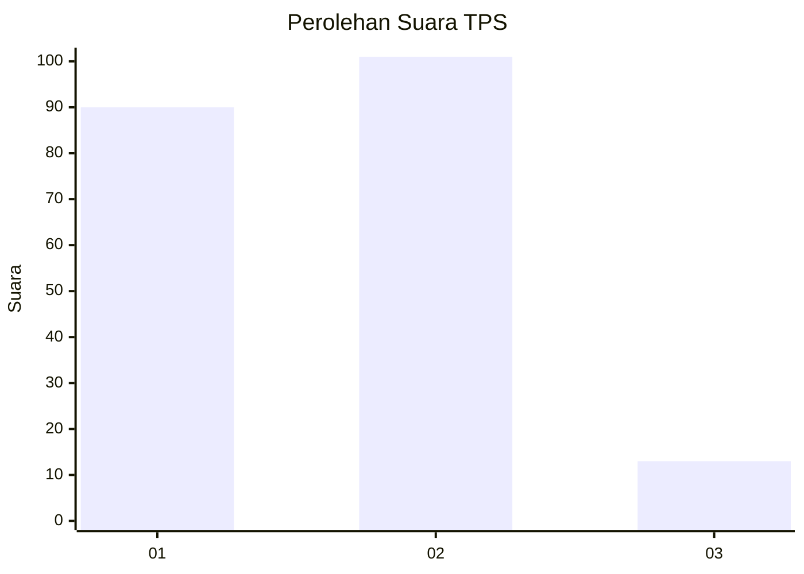
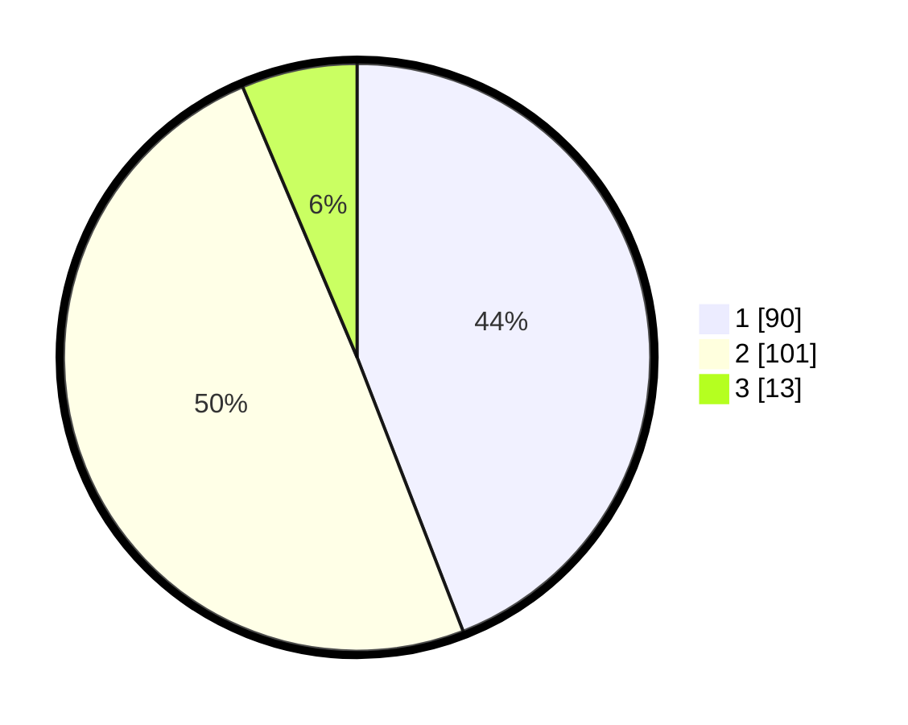

# Hasil

## Grafik

## Tabel

| No. | Nama Paslon    | Suara | Suara (raw) | Persentase |
|:--- |:-------------- | -----:| -----------:| ----------:|
| 1   | ANIES MUHAIMIN | 90    | [90][p-1]   | 44,12      |
| 2   | PRABOWO GIBRAN | 101   | [101][p-2]  | 49,51      |
| 3   | GANJAR MAHFUD  | 13    | [13][p-3]   | 6,37       |

[p-1]: https://github.com/gigit-pemilu/pemilu-2024/blob/main/pilpres/hitung-suara/sub/32-jawa-barat/sub/02-sukabumi/sub/17-cidahu/sub/2001-pondokkaso-tonggoh/sub/003-tps/sub/paslon-1.txt
[p-2]: https://github.com/gigit-pemilu/pemilu-2024/blob/main/pilpres/hitung-suara/sub/32-jawa-barat/sub/02-sukabumi/sub/17-cidahu/sub/2001-pondokkaso-tonggoh/sub/003-tps/sub/paslon-2.txt
[p-3]: https://github.com/gigit-pemilu/pemilu-2024/blob/main/pilpres/hitung-suara/sub/32-jawa-barat/sub/02-sukabumi/sub/17-cidahu/sub/2001-pondokkaso-tonggoh/sub/003-tps/sub/paslon-3.txt

## Foto C Plano

https://sirekap-obj-formc.kpu.go.id/f008/pemilu/ppwp/32/02/17/20/01/3202172001003-20240214-200120--36a2bd00-ee59-4265-a4b4-4b219c8e8328.jpg

https://sirekap-obj-formc.kpu.go.id/f008/pemilu/ppwp/32/02/17/20/01/3202172001003-20240214-160138--bebf37d9-b3fb-4a28-b413-d7984f69669b.jpg

https://sirekap-obj-formc.kpu.go.id/f008/pemilu/ppwp/32/02/17/20/01/3202172001003-20240214-200138--fdf52590-e2f5-4cc9-adbc-4540a26b66e8.jpg

## Metadata

| Key        | Value               |
| ---------- | ------------------- |
| Time Stamp | 2024-02-19 12:00:00 |

