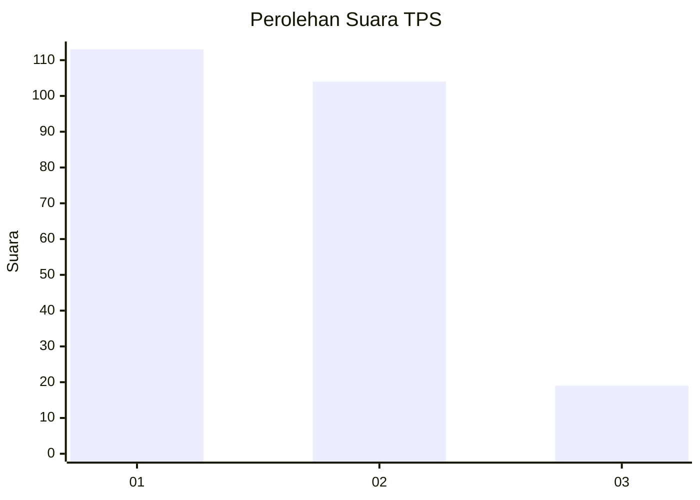
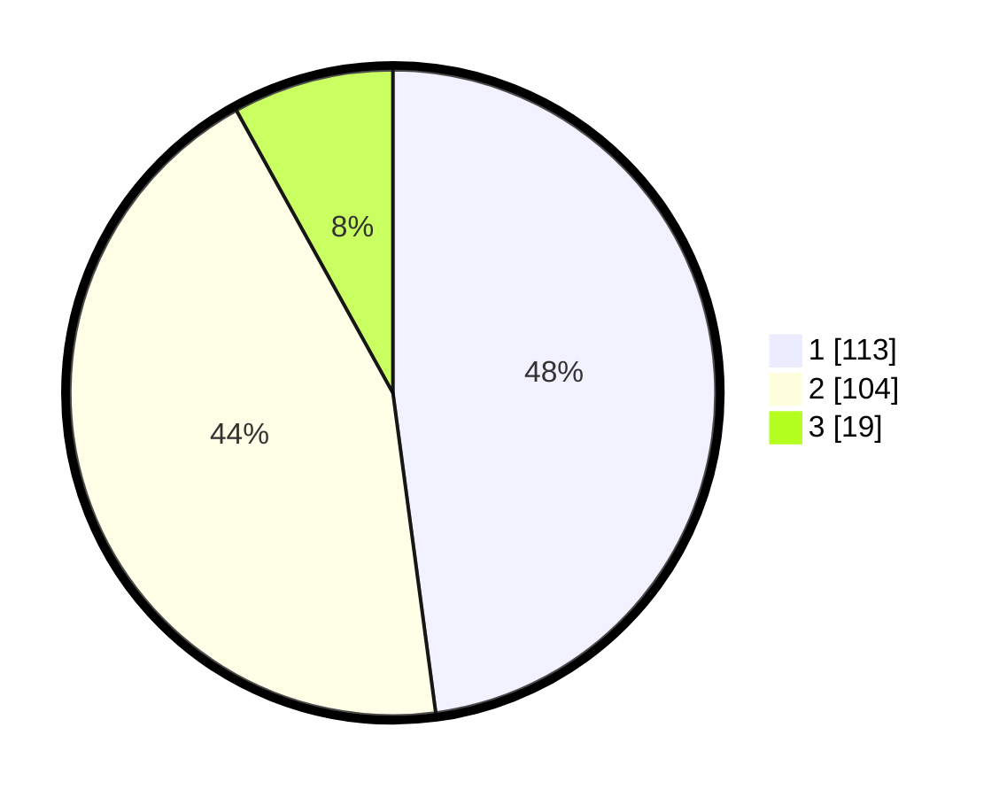

# Hasil

## Grafik

## Tabel

| No. | Nama Paslon    | Suara | Suara (raw) | Persentase |
|:--- |:-------------- | -----:| -----------:| ----------:|
| 1   | ANIES MUHAIMIN | 113   | [113][p-1]  | 47,88      |
| 2   | PRABOWO GIBRAN | 104   | [104][p-2]  | 44,07      |
| 3   | GANJAR MAHFUD  | 19    | [19][p-3]   | 8,05       |

[p-1]: https://github.com/gigit-pemilu/pemilu-2024-32-jawa-barat/blob/main/pilpres/hitung-suara/sub/32-jawa-barat/sub/02-sukabumi/sub/17-cidahu/sub/2001-pondokkaso-tonggoh/sub/011-tps/sub/paslon-1.txt
[p-2]: https://github.com/gigit-pemilu/pemilu-2024-32-jawa-barat/blob/main/pilpres/hitung-suara/sub/32-jawa-barat/sub/02-sukabumi/sub/17-cidahu/sub/2001-pondokkaso-tonggoh/sub/011-tps/sub/paslon-2.txt
[p-3]: https://github.com/gigit-pemilu/pemilu-2024-32-jawa-barat/blob/main/pilpres/hitung-suara/sub/32-jawa-barat/sub/02-sukabumi/sub/17-cidahu/sub/2001-pondokkaso-tonggoh/sub/011-tps/sub/paslon-3.txt

## Foto C Plano

https://sirekap-obj-formc.kpu.go.id/c74f/pemilu/ppwp/32/02/17/20/01/3202172001011-20240215-104704--dbe9ef26-74d9-461b-8607-29497928dddd.jpg

https://sirekap-obj-formc.kpu.go.id/c74f/pemilu/ppwp/32/02/17/20/01/3202172001011-20240215-104713--259a06e2-f549-462e-a6dc-a79859161534.jpg

https://sirekap-obj-formc.kpu.go.id/c74f/pemilu/ppwp/32/02/17/20/01/3202172001011-20240215-104719--fb84cc2f-9be3-4461-bc7d-fad4dfb06345.jpg

## Metadata

| Key        | Value               |
| ---------- | ------------------- |
| Time Stamp | 2024-02-15 19:30:26 |

