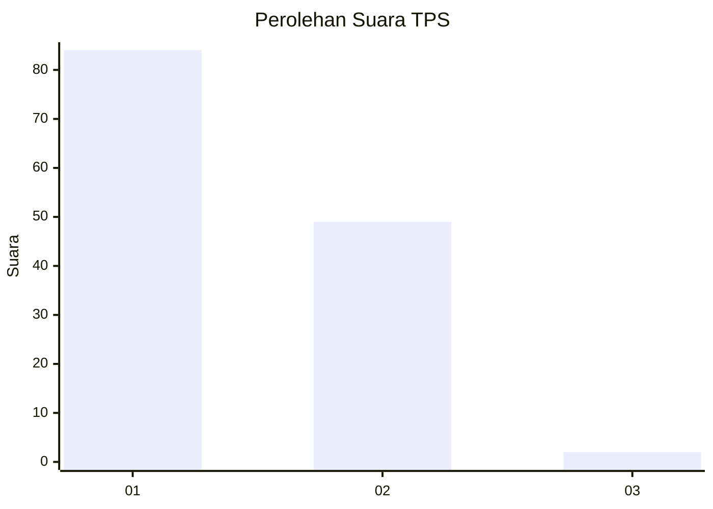
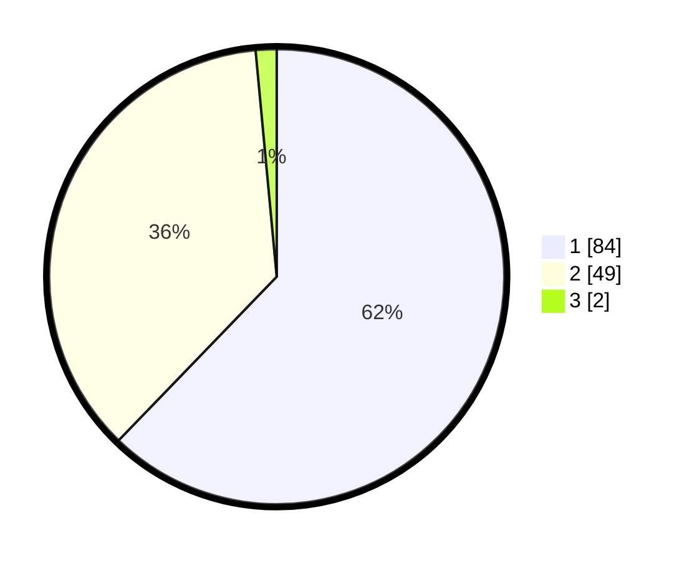

# Hasil

## Grafik

## Tabel

| No. | Nama Paslon    | Suara | Suara (raw) | Persentase |
|:--- |:-------------- | -----:| -----------:| ----------:|
| 1   | ANIES MUHAIMIN | 84    | [84][p-1]   | 62,22      |
| 2   | PRABOWO GIBRAN | 49    | [49][p-2]   | 36,30      |
| 3   | GANJAR MAHFUD  | 2     | [2][p-3]    | 1,48       |

[p-1]: https://github.com/gigit-pemilu/pemilu-2024/blob/main/pilpres/hitung-suara/sub/32-jawa-barat/sub/02-sukabumi/sub/18-kalapanunggal/sub/2002-palasari-girang/sub/002-tps/sub/paslon-1.txt
[p-2]: https://github.com/gigit-pemilu/pemilu-2024/blob/main/pilpres/hitung-suara/sub/32-jawa-barat/sub/02-sukabumi/sub/18-kalapanunggal/sub/2002-palasari-girang/sub/002-tps/sub/paslon-2.txt
[p-3]: https://github.com/gigit-pemilu/pemilu-2024/blob/main/pilpres/hitung-suara/sub/32-jawa-barat/sub/02-sukabumi/sub/18-kalapanunggal/sub/2002-palasari-girang/sub/002-tps/sub/paslon-3.txt

## Foto C Plano

https://sirekap-obj-formc.kpu.go.id/e332/pemilu/ppwp/32/02/18/20/02/3202182002002-20240214-222718--536cd9fc-1fee-4bbe-af3b-ea2cd0b056b2.jpg

https://sirekap-obj-formc.kpu.go.id/e332/pemilu/ppwp/32/02/18/20/02/3202182002002-20240214-222754--6369468e-cf82-4208-b89a-189d88a2e46d.jpg

https://sirekap-obj-formc.kpu.go.id/e332/pemilu/ppwp/32/02/18/20/02/3202182002002-20240214-234136--13a449f9-1620-4246-85cc-9871e0362463.jpg

## Metadata

| Key        | Value               |
| ---------- | ------------------- |
| Time Stamp | 2024-02-17 10:00:02 |

