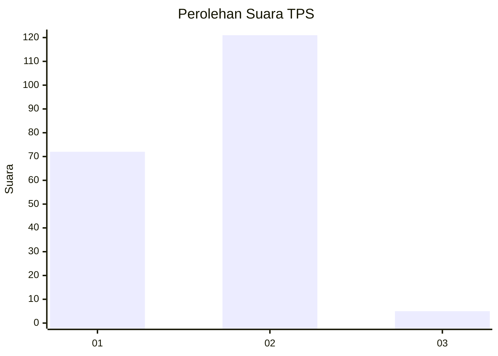
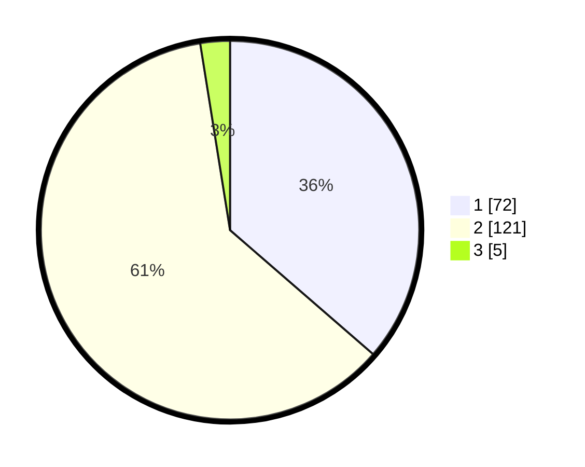

# Hasil

## Grafik

## Tabel

| No. | Nama Paslon    | Suara | Suara (raw) | Persentase |
|:--- |:-------------- | -----:| -----------:| ----------:|
| 1   | ANIES MUHAIMIN | 72    | [72][p-1]   | 36,36      |
| 2   | PRABOWO GIBRAN | 121   | [121][p-2]  | 61,11      |
| 3   | GANJAR MAHFUD  | 5     | [5][p-3]    | 2,53       |

[p-1]: https://github.com/gigit-pemilu/pemilu-2024/blob/main/pilpres/hitung-suara/sub/32-jawa-barat/sub/02-sukabumi/sub/19-kabandungan/sub/2001-kabandungan/sub/002-tps/sub/paslon-1.txt
[p-2]: https://github.com/gigit-pemilu/pemilu-2024/blob/main/pilpres/hitung-suara/sub/32-jawa-barat/sub/02-sukabumi/sub/19-kabandungan/sub/2001-kabandungan/sub/002-tps/sub/paslon-2.txt
[p-3]: https://github.com/gigit-pemilu/pemilu-2024/blob/main/pilpres/hitung-suara/sub/32-jawa-barat/sub/02-sukabumi/sub/19-kabandungan/sub/2001-kabandungan/sub/002-tps/sub/paslon-3.txt

## Foto C Plano

https://sirekap-obj-formc.kpu.go.id/1619/pemilu/ppwp/32/02/19/20/01/3202192001002-20240215-084702--4de3f891-562b-4243-9583-aaca71325157.jpg

https://sirekap-obj-formc.kpu.go.id/1619/pemilu/ppwp/32/02/19/20/01/3202192001002-20240215-084904--8de8da4b-b0ad-4bcd-a71c-a6d3928f9586.jpg

https://sirekap-obj-formc.kpu.go.id/1619/pemilu/ppwp/32/02/19/20/01/3202192001002-20240215-085159--2ad58604-db5f-406d-8068-6a1f450f5645.jpg

## Metadata

| Key        | Value               |
| ---------- | ------------------- |
| Time Stamp | 2024-02-16 09:30:28 |

