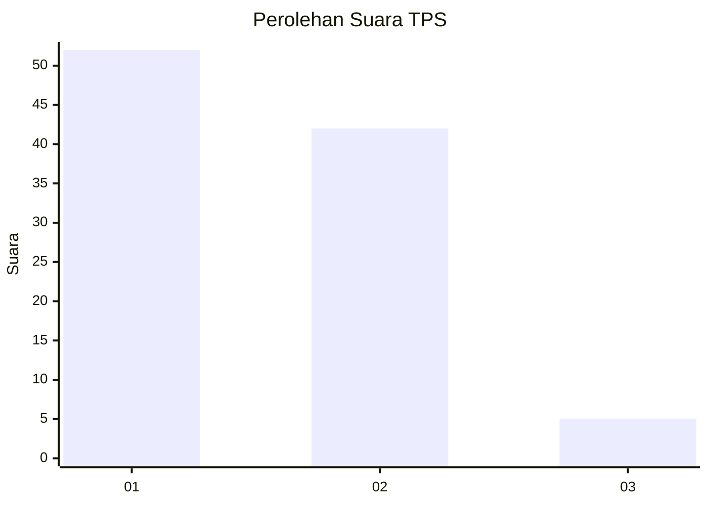
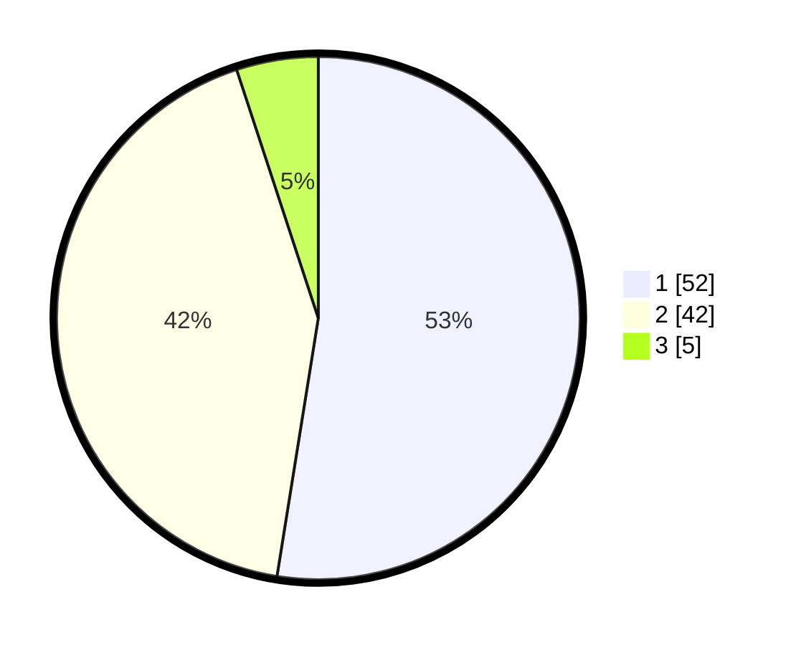

# Hasil

## Grafik

## Tabel

| No. | Nama Paslon    | Suara | Suara (raw) | Persentase |
|:--- |:-------------- | -----:| -----------:| ----------:|
| 1   | ANIES MUHAIMIN | 52    | [52][p-1]   | 52,53      |
| 2   | PRABOWO GIBRAN | 42    | [42][p-2]   | 42,42      |
| 3   | GANJAR MAHFUD  | 5     | [5][p-3]    | 5,05       |

[p-1]: https://github.com/gigit-pemilu/pemilu-2024-32-jawa-barat/blob/main/pilpres/hitung-suara/sub/32-jawa-barat/sub/02-sukabumi/sub/19-kabandungan/sub/2001-kabandungan/sub/005-tps/sub/paslon-1.txt
[p-2]: https://github.com/gigit-pemilu/pemilu-2024-32-jawa-barat/blob/main/pilpres/hitung-suara/sub/32-jawa-barat/sub/02-sukabumi/sub/19-kabandungan/sub/2001-kabandungan/sub/005-tps/sub/paslon-2.txt
[p-3]: https://github.com/gigit-pemilu/pemilu-2024-32-jawa-barat/blob/main/pilpres/hitung-suara/sub/32-jawa-barat/sub/02-sukabumi/sub/19-kabandungan/sub/2001-kabandungan/sub/005-tps/sub/paslon-3.txt

## Foto C Plano

https://sirekap-obj-formc.kpu.go.id/7eee/pemilu/ppwp/32/02/19/20/01/3202192001005-20240215-054652--1e6b4acc-177e-40b8-97e3-64d003306429.jpg

https://sirekap-obj-formc.kpu.go.id/7eee/pemilu/ppwp/32/02/19/20/01/3202192001005-20240214-212239--88c09785-5407-4975-880b-6af91684c959.jpg

https://sirekap-obj-formc.kpu.go.id/7eee/pemilu/ppwp/32/02/19/20/01/3202192001005-20240215-054852--1680db91-7f90-4804-962d-d8c9edee434b.jpg

## Metadata

| Key        | Value               |
| ---------- | ------------------- |
| Time Stamp | 2024-02-16 09:30:28 |

