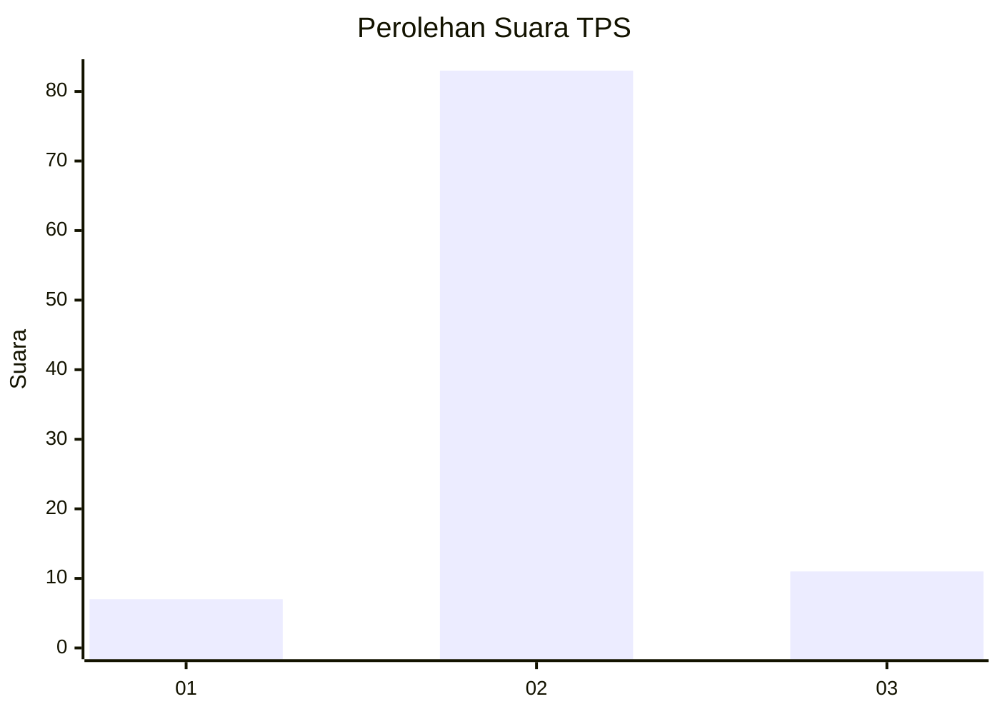
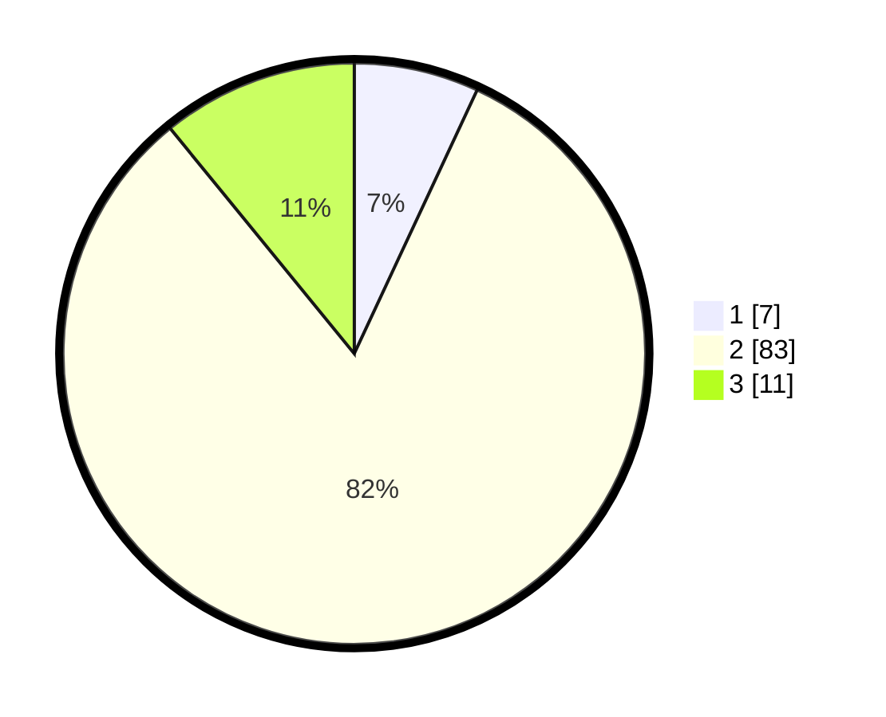

# Hasil

## Grafik

## Tabel

| No. | Nama Paslon    | Suara | Suara (raw) | Persentase |
|:--- |:-------------- | -----:| -----------:| ----------:|
| 1   | ANIES MUHAIMIN | 7     | [7][p-1]    | 6,93       |
| 2   | PRABOWO GIBRAN | 83    | [83][p-2]   | 82,18      |
| 3   | GANJAR MAHFUD  | 11    | [11][p-3]   | 10,89      |

[p-1]: https://github.com/gigit-pemilu/pemilu-2024/blob/main/pilpres/hitung-suara/sub/32-jawa-barat/sub/02-sukabumi/sub/19-kabandungan/sub/2002-cipeuteuy/sub/010-tps/sub/paslon-1.txt
[p-2]: https://github.com/gigit-pemilu/pemilu-2024/blob/main/pilpres/hitung-suara/sub/32-jawa-barat/sub/02-sukabumi/sub/19-kabandungan/sub/2002-cipeuteuy/sub/010-tps/sub/paslon-2.txt
[p-3]: https://github.com/gigit-pemilu/pemilu-2024/blob/main/pilpres/hitung-suara/sub/32-jawa-barat/sub/02-sukabumi/sub/19-kabandungan/sub/2002-cipeuteuy/sub/010-tps/sub/paslon-3.txt

## Foto C Plano

https://sirekap-obj-formc.kpu.go.id/e88c/pemilu/ppwp/32/02/19/20/02/3202192002010-20240215-001357--c5dc1c68-3a2d-415c-9aaa-ac4cb3b12c67.jpg

https://sirekap-obj-formc.kpu.go.id/e88c/pemilu/ppwp/32/02/19/20/02/3202192002010-20240215-001450--a9476e7d-0b80-4b7a-a964-7e083c1cfb1d.jpg

https://sirekap-obj-formc.kpu.go.id/e88c/pemilu/ppwp/32/02/19/20/02/3202192002010-20240215-001542--ddfbded0-2fe9-4c3e-b1a5-a42ecb6b6c9e.jpg

## Metadata

| Key        | Value               |
| ---------- | ------------------- |
| Time Stamp | 2024-02-16 10:00:28 |

