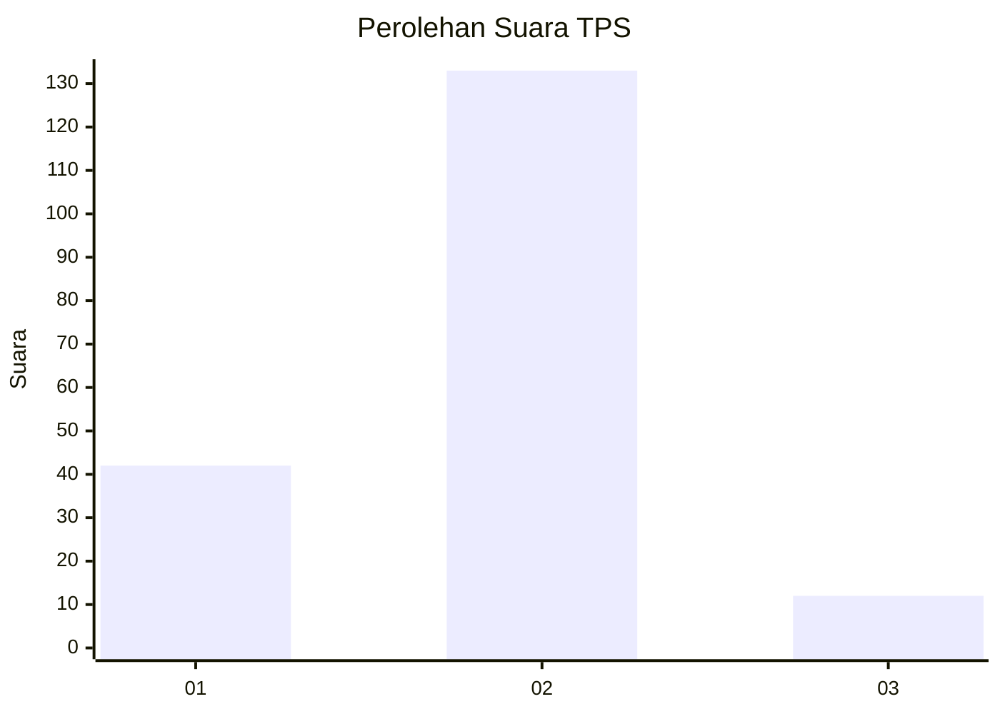

# Hasil

## Grafik

## Tabel

| No. | Nama Paslon    | Suara | Suara (raw) | Persentase |
|:--- |:-------------- | -----:| -----------:| ----------:|
| 1   | ANIES MUHAIMIN | 42    | [42][p-1]   | 22,46      |
| 2   | PRABOWO GIBRAN | 133   | [133][p-2]  | 71,12      |
| 3   | GANJAR MAHFUD  | 12    | [12][p-3]   | 6,42       |

[p-1]: https://github.com/gigit-pemilu/pemilu-2024/blob/main/pilpres/hitung-suara/sub/32-jawa-barat/sub/02-sukabumi/sub/20-waluran/sub/2001-waluran/sub/003-tps/sub/paslon-1.txt
[p-2]: https://github.com/gigit-pemilu/pemilu-2024/blob/main/pilpres/hitung-suara/sub/32-jawa-barat/sub/02-sukabumi/sub/20-waluran/sub/2001-waluran/sub/003-tps/sub/paslon-2.txt
[p-3]: https://github.com/gigit-pemilu/pemilu-2024/blob/main/pilpres/hitung-suara/sub/32-jawa-barat/sub/02-sukabumi/sub/20-waluran/sub/2001-waluran/sub/003-tps/sub/paslon-3.txt

## Foto C Plano

https://sirekap-obj-formc.kpu.go.id/4e1d/pemilu/ppwp/32/02/20/20/01/3202202001003-20240214-235953--688e5d6f-78d6-4c86-9489-f770e9e5977d.jpg

https://sirekap-obj-formc.kpu.go.id/4e1d/pemilu/ppwp/32/02/20/20/01/3202202001003-20240215-000142--f186b94b-b400-47aa-b1a8-f5c505771f15.jpg

https://sirekap-obj-formc.kpu.go.id/4e1d/pemilu/ppwp/32/02/20/20/01/3202202001003-20240215-223448--0eb8fd50-f545-4182-b944-1bfece197313.jpg

## Metadata

| Key        | Value               |
| ---------- | ------------------- |
| Time Stamp | 2024-02-15 22:40:13 |

