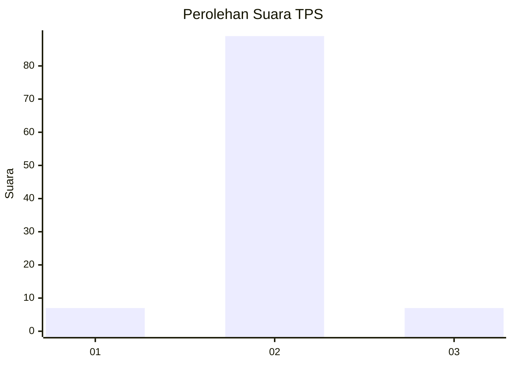
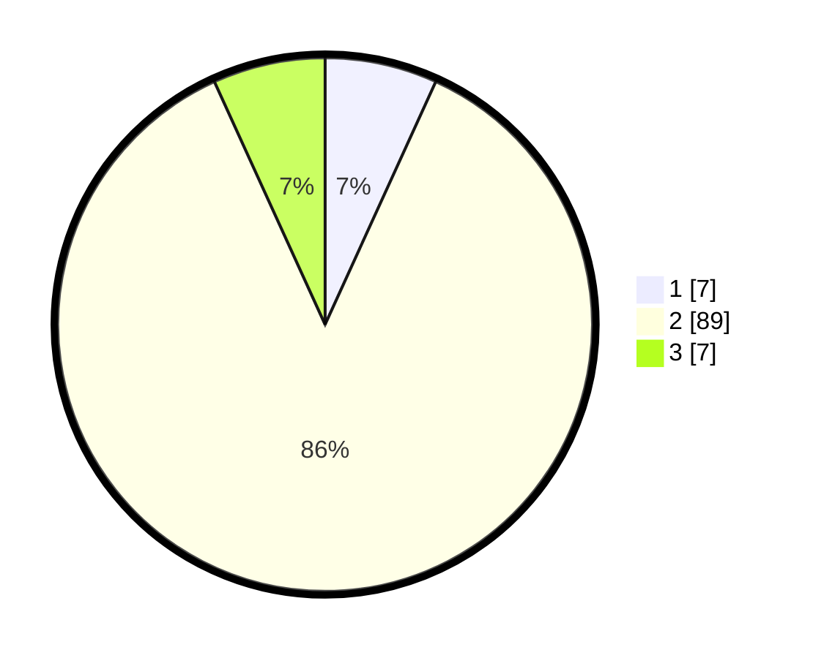

# Hasil

## Grafik

## Tabel

| No. | Nama Paslon    | Suara | Suara (raw) | Persentase |
|:--- |:-------------- | -----:| -----------:| ----------:|
| 1   | ANIES MUHAIMIN | 7     | [7][p-1]    | 6,80       |
| 2   | PRABOWO GIBRAN | 89    | [89][p-2]   | 86,41      |
| 3   | GANJAR MAHFUD  | 7     | [7][p-3]    | 6,80       |

[p-1]: https://github.com/gigit-pemilu/pemilu-2024/blob/main/pilpres/hitung-suara/sub/32-jawa-barat/sub/02-sukabumi/sub/22-ciemas/sub/2003-ciwaru/sub/005-tps/sub/paslon-1.txt
[p-2]: https://github.com/gigit-pemilu/pemilu-2024/blob/main/pilpres/hitung-suara/sub/32-jawa-barat/sub/02-sukabumi/sub/22-ciemas/sub/2003-ciwaru/sub/005-tps/sub/paslon-2.txt
[p-3]: https://github.com/gigit-pemilu/pemilu-2024/blob/main/pilpres/hitung-suara/sub/32-jawa-barat/sub/02-sukabumi/sub/22-ciemas/sub/2003-ciwaru/sub/005-tps/sub/paslon-3.txt

## Foto C Plano

https://sirekap-obj-formc.kpu.go.id/26f3/pemilu/ppwp/32/02/22/20/03/3202222003005-20240222-110928--1b392bda-23a2-494e-8978-b0a248bad654.jpg

https://sirekap-obj-formc.kpu.go.id/26f3/pemilu/ppwp/32/02/22/20/03/3202222003005-20240222-111222--a9dc8ecf-0b65-4f3b-8ca1-928d80186ec9.jpg

https://sirekap-obj-formc.kpu.go.id/26f3/pemilu/ppwp/32/02/22/20/03/3202222003005-20240222-111532--570d73d3-734e-4aab-aff1-6ef03a48d008.jpg

## Metadata

| Key        | Value               |
| ---------- | ------------------- |
| Time Stamp | 2024-02-25 16:00:00 |

