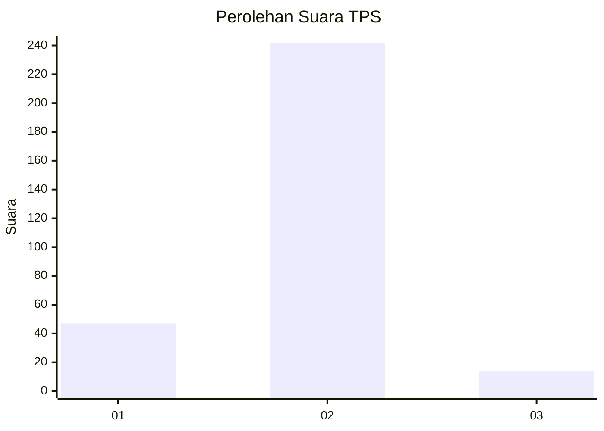
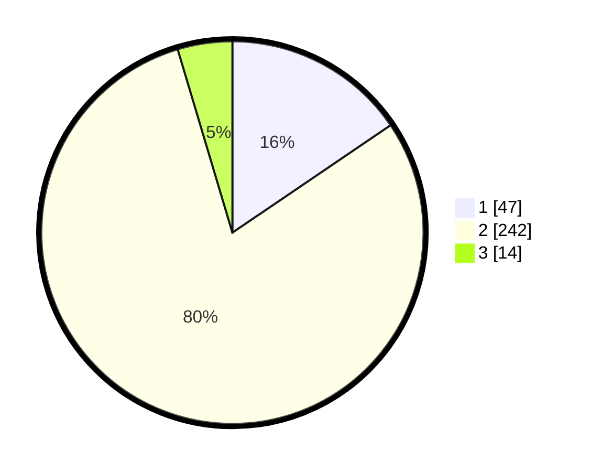

# Hasil

## Grafik

## Tabel

| No. | Nama Paslon    | Suara | Suara (raw) | Persentase |
|:--- |:-------------- | -----:| -----------:| ----------:|
| 1   | ANIES MUHAIMIN | 47    | [47][p-1]   | 15,51      |
| 2   | PRABOWO GIBRAN | 242   | [242][p-2]  | 79,87      |
| 3   | GANJAR MAHFUD  | 14    | [14][p-3]   | 4,62       |

[p-1]: https://github.com/gigit-pemilu/pemilu-2024/blob/main/pilpres/hitung-suara/sub/32-jawa-barat/sub/02-sukabumi/sub/22-ciemas/sub/2003-ciwaru/sub/015-tps/sub/paslon-1.txt
[p-2]: https://github.com/gigit-pemilu/pemilu-2024/blob/main/pilpres/hitung-suara/sub/32-jawa-barat/sub/02-sukabumi/sub/22-ciemas/sub/2003-ciwaru/sub/015-tps/sub/paslon-2.txt
[p-3]: https://github.com/gigit-pemilu/pemilu-2024/blob/main/pilpres/hitung-suara/sub/32-jawa-barat/sub/02-sukabumi/sub/22-ciemas/sub/2003-ciwaru/sub/015-tps/sub/paslon-3.txt

## Foto C Plano

https://sirekap-obj-formc.kpu.go.id/645f/pemilu/ppwp/32/02/22/20/03/3202222003015-20240215-104525--df6cf55b-0c9e-424c-9579-463b4b502c30.jpg

https://sirekap-obj-formc.kpu.go.id/645f/pemilu/ppwp/32/02/22/20/03/3202222003015-20240215-103829--6c5b0d80-7510-4427-a44d-d100548597c3.jpg

https://sirekap-obj-formc.kpu.go.id/645f/pemilu/ppwp/32/02/22/20/03/3202222003015-20240215-104130--c3435e58-886c-42b8-80a8-5329524ea871.jpg

## Metadata

| Key        | Value               |
| ---------- | ------------------- |
| Time Stamp | 2024-02-16 12:51:22 |

