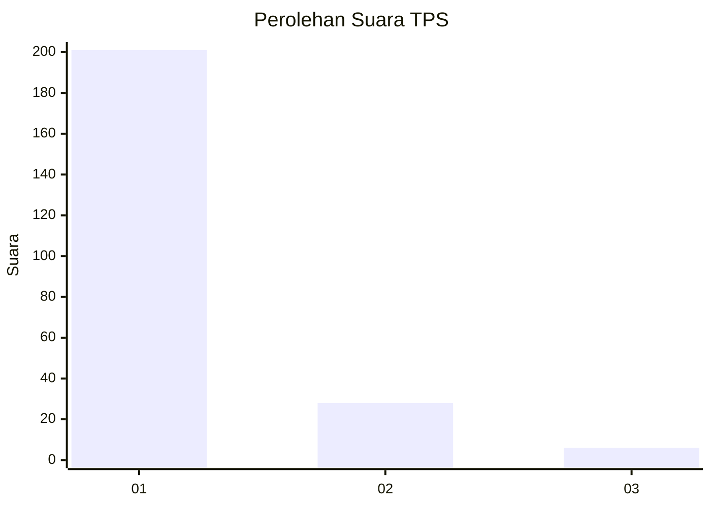
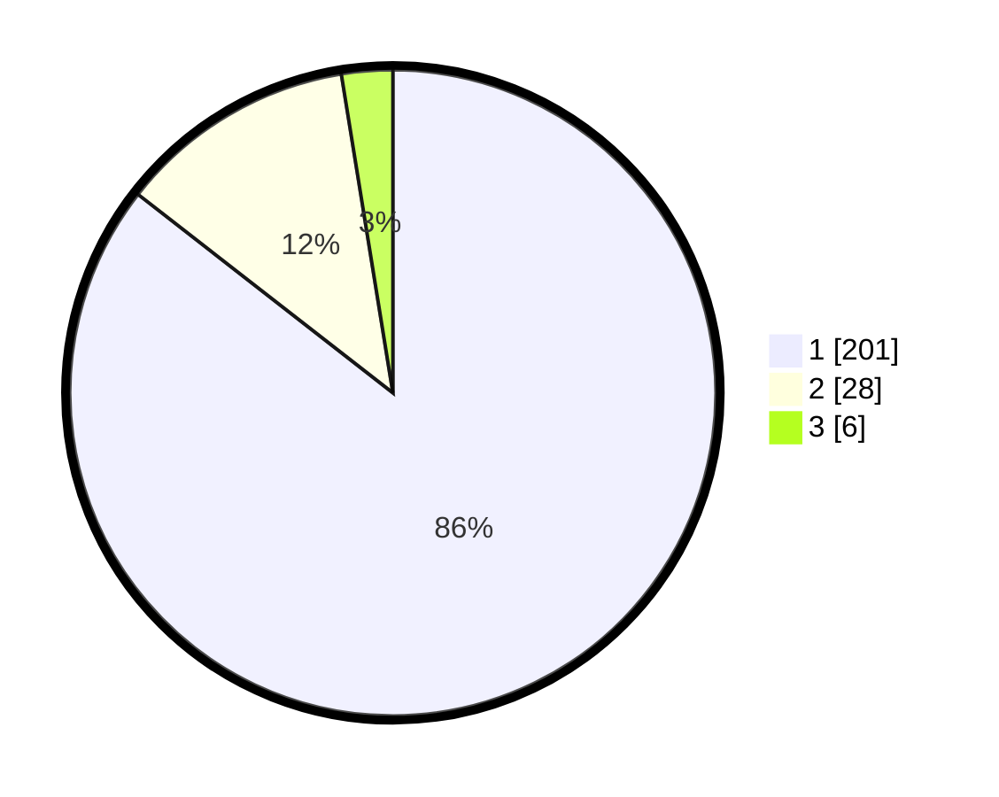

# Hasil

## Grafik

## Tabel

| No. | Nama Paslon    | Suara | Suara (raw) | Persentase |
|:--- |:-------------- | -----:| -----------:| ----------:|
| 1   | ANIES MUHAIMIN | 201   | [201][p-1]  | 85,53      |
| 2   | PRABOWO GIBRAN | 28    | [28][p-2]   | 11,91      |
| 3   | GANJAR MAHFUD  | 6     | [6][p-3]    | 2,55       |

[p-1]: https://github.com/gigit-pemilu/pemilu-2024/blob/main/pilpres/hitung-suara/sub/32-jawa-barat/sub/02-sukabumi/sub/22-ciemas/sub/2004-mekarjaya/sub/023-tps/sub/paslon-1.txt
[p-2]: https://github.com/gigit-pemilu/pemilu-2024/blob/main/pilpres/hitung-suara/sub/32-jawa-barat/sub/02-sukabumi/sub/22-ciemas/sub/2004-mekarjaya/sub/023-tps/sub/paslon-2.txt
[p-3]: https://github.com/gigit-pemilu/pemilu-2024/blob/main/pilpres/hitung-suara/sub/32-jawa-barat/sub/02-sukabumi/sub/22-ciemas/sub/2004-mekarjaya/sub/023-tps/sub/paslon-3.txt

## Foto C Plano

https://sirekap-obj-formc.kpu.go.id/6290/pemilu/ppwp/32/02/22/20/04/3202222004023-20240214-235026--7bcdc9a0-dac3-455c-8211-01a9939bb3df.jpg

https://sirekap-obj-formc.kpu.go.id/6290/pemilu/ppwp/32/02/22/20/04/3202222004023-20240214-184802--70c95b17-889f-4ada-b377-4f6cf7400dda.jpg

https://sirekap-obj-formc.kpu.go.id/6290/pemilu/ppwp/32/02/22/20/04/3202222004023-20240214-235957--209a3e0b-fd17-498d-9ccf-1880181fa269.jpg

## Metadata

| Key        | Value               |
| ---------- | ------------------- |
| Time Stamp | 2024-02-15 12:00:28 |

