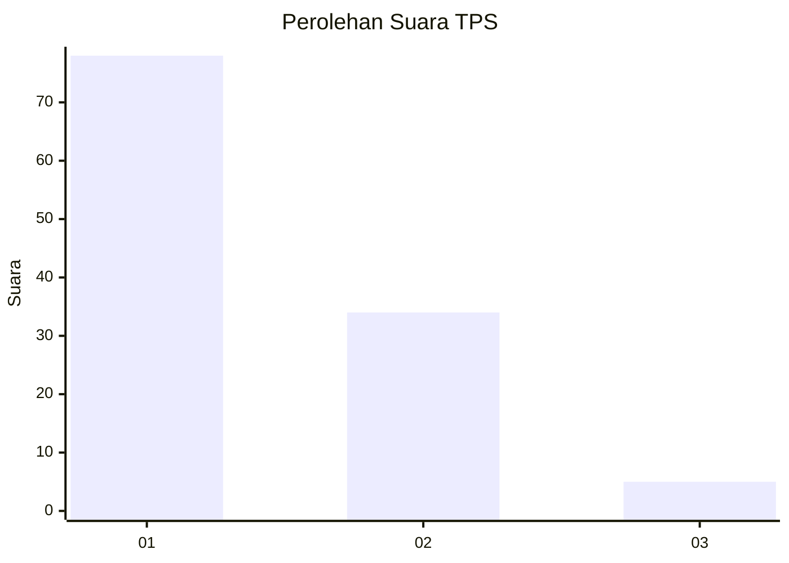
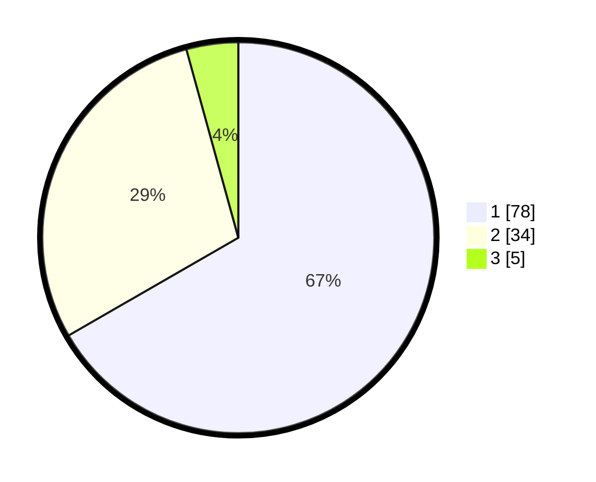

# Hasil

## Grafik

## Tabel

| No. | Nama Paslon    | Suara | Suara (raw) | Persentase |
|:--- |:-------------- | -----:| -----------:| ----------:|
| 1   | ANIES MUHAIMIN | 78    | [78][p-1]   | 66,67      |
| 2   | PRABOWO GIBRAN | 34    | [34][p-2]   | 29,06      |
| 3   | GANJAR MAHFUD  | 5     | [5][p-3]    | 4,27       |

[p-1]: https://github.com/gigit-pemilu/pemilu-2024-32-jawa-barat/blob/main/pilpres/hitung-suara/sub/32-jawa-barat/sub/02-sukabumi/sub/24-surade/sub/2008-cipeundeuy/sub/001-tps/sub/paslon-1.txt
[p-2]: https://github.com/gigit-pemilu/pemilu-2024-32-jawa-barat/blob/main/pilpres/hitung-suara/sub/32-jawa-barat/sub/02-sukabumi/sub/24-surade/sub/2008-cipeundeuy/sub/001-tps/sub/paslon-2.txt
[p-3]: https://github.com/gigit-pemilu/pemilu-2024-32-jawa-barat/blob/main/pilpres/hitung-suara/sub/32-jawa-barat/sub/02-sukabumi/sub/24-surade/sub/2008-cipeundeuy/sub/001-tps/sub/paslon-3.txt

## Foto C Plano

https://sirekap-obj-formc.kpu.go.id/0dd1/pemilu/ppwp/32/02/24/20/08/3202242008001-20240214-205117--8aa5b2f8-554e-4d09-b14b-434cefaea27b.jpg

https://sirekap-obj-formc.kpu.go.id/0dd1/pemilu/ppwp/32/02/24/20/08/3202242008001-20240214-205104--37b2dc76-0b70-43b7-8826-158f28033f25.jpg

https://sirekap-obj-formc.kpu.go.id/0dd1/pemilu/ppwp/32/02/24/20/08/3202242008001-20240214-205027--a5af8b39-f958-429a-96fd-dd08a7abd80c.jpg

## Metadata

| Key        | Value               |
| ---------- | ------------------- |
| Time Stamp | 2024-02-16 12:51:22 |

