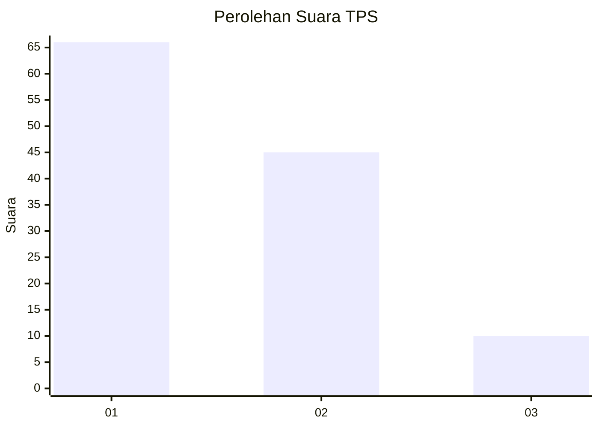
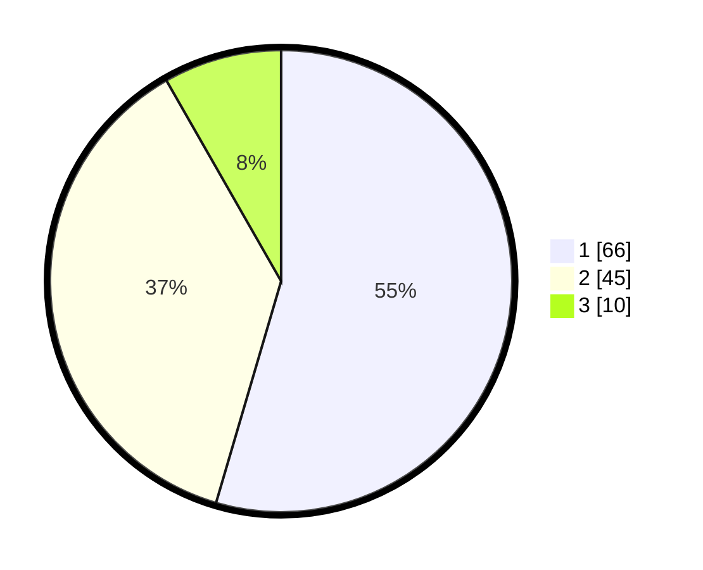

# Hasil

## Grafik

## Tabel

| No. | Nama Paslon    | Suara | Suara (raw) | Persentase |
|:--- |:-------------- | -----:| -----------:| ----------:|
| 1   | ANIES MUHAIMIN | 66    | [66][p-1]   | 54,55      |
| 2   | PRABOWO GIBRAN | 45    | [45][p-2]   | 37,19      |
| 3   | GANJAR MAHFUD  | 10    | [10][p-3]   | 8,26       |

[p-1]: https://github.com/gigit-pemilu/pemilu-2024/blob/main/pilpres/hitung-suara/sub/32-jawa-barat/sub/02-sukabumi/sub/24-surade/sub/2008-cipeundeuy/sub/003-tps/sub/paslon-1.txt
[p-2]: https://github.com/gigit-pemilu/pemilu-2024/blob/main/pilpres/hitung-suara/sub/32-jawa-barat/sub/02-sukabumi/sub/24-surade/sub/2008-cipeundeuy/sub/003-tps/sub/paslon-2.txt
[p-3]: https://github.com/gigit-pemilu/pemilu-2024/blob/main/pilpres/hitung-suara/sub/32-jawa-barat/sub/02-sukabumi/sub/24-surade/sub/2008-cipeundeuy/sub/003-tps/sub/paslon-3.txt

## Foto C Plano

https://sirekap-obj-formc.kpu.go.id/75a5/pemilu/ppwp/32/02/24/20/08/3202242008003-20240214-205617--2e828c14-c60a-4c23-9a45-88992d5a30c3.jpg

https://sirekap-obj-formc.kpu.go.id/75a5/pemilu/ppwp/32/02/24/20/08/3202242008003-20240214-155456--711470bd-a6af-4d42-ae6f-82e22039c41b.jpg

https://sirekap-obj-formc.kpu.go.id/75a5/pemilu/ppwp/32/02/24/20/08/3202242008003-20240214-205741--d4c846f8-2404-4cd7-af99-4f5163c429d0.jpg

## Metadata

| Key        | Value               |
| ---------- | ------------------- |
| Time Stamp | 2024-02-15 00:41:44 |

