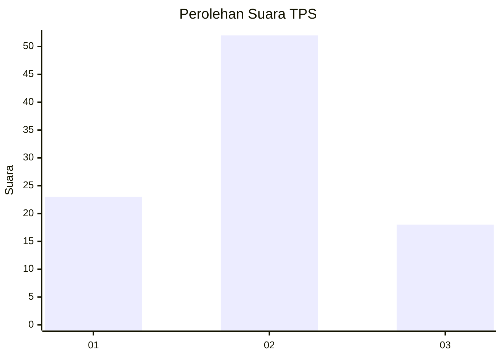
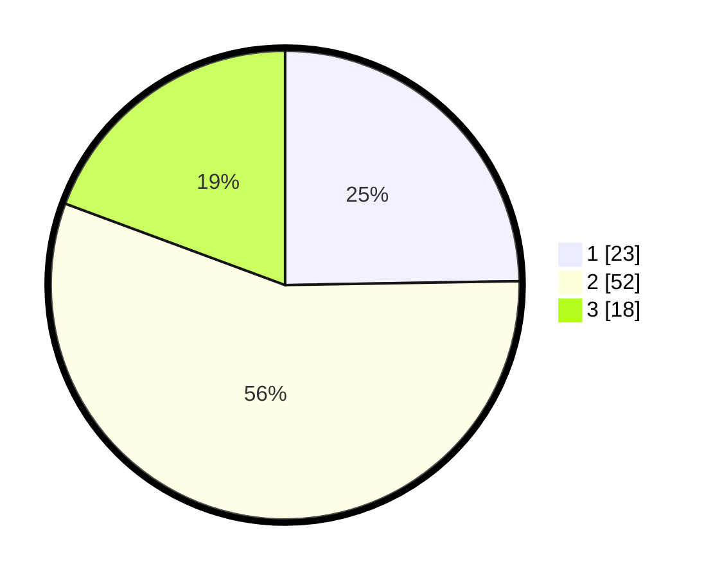

# Hasil

## Grafik

## Tabel

| No. | Nama Paslon    | Suara | Suara (raw) | Persentase |
|:--- |:-------------- | -----:| -----------:| ----------:|
| 1   | ANIES MUHAIMIN | 23    | [23][p-1]   | 24,73      |
| 2   | PRABOWO GIBRAN | 52    | [52][p-2]   | 55,91      |
| 3   | GANJAR MAHFUD  | 18    | [18][p-3]   | 19,35      |

[p-1]: https://github.com/gigit-pemilu/pemilu-2024-32-jawa-barat/blob/main/pilpres/hitung-suara/sub/32-jawa-barat/sub/02-sukabumi/sub/24-surade/sub/2009-pasiripis/sub/029-tps/sub/paslon-1.txt
[p-2]: https://github.com/gigit-pemilu/pemilu-2024-32-jawa-barat/blob/main/pilpres/hitung-suara/sub/32-jawa-barat/sub/02-sukabumi/sub/24-surade/sub/2009-pasiripis/sub/029-tps/sub/paslon-2.txt
[p-3]: https://github.com/gigit-pemilu/pemilu-2024-32-jawa-barat/blob/main/pilpres/hitung-suara/sub/32-jawa-barat/sub/02-sukabumi/sub/24-surade/sub/2009-pasiripis/sub/029-tps/sub/paslon-3.txt

## Foto C Plano

https://sirekap-obj-formc.kpu.go.id/1727/pemilu/ppwp/32/02/24/20/09/3202242009029-20240214-201411--98f11ba0-39b6-4748-b652-9fda3d73ae10.jpg

https://sirekap-obj-formc.kpu.go.id/1727/pemilu/ppwp/32/02/24/20/09/3202242009029-20240220-112604--fb575a30-f009-47cd-9fb6-0b7353158142.jpg

https://sirekap-obj-formc.kpu.go.id/1727/pemilu/ppwp/32/02/24/20/09/3202242009029-20240214-202143--3cabbccd-1937-41c5-b039-02a0526d9c94.jpg

## Metadata

| Key        | Value               |
| ---------- | ------------------- |
| Time Stamp | 2024-02-25 17:00:00 |

