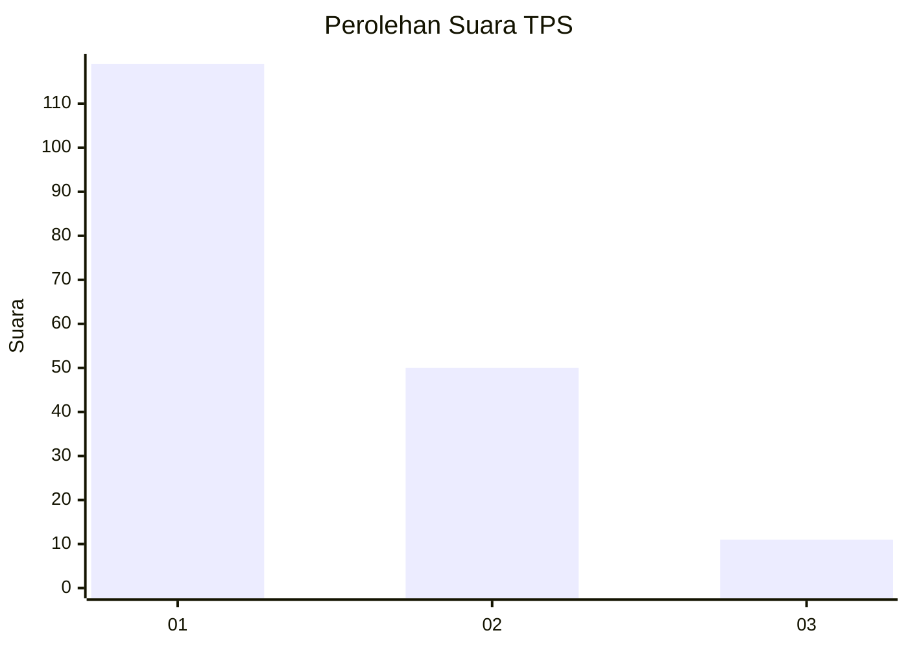
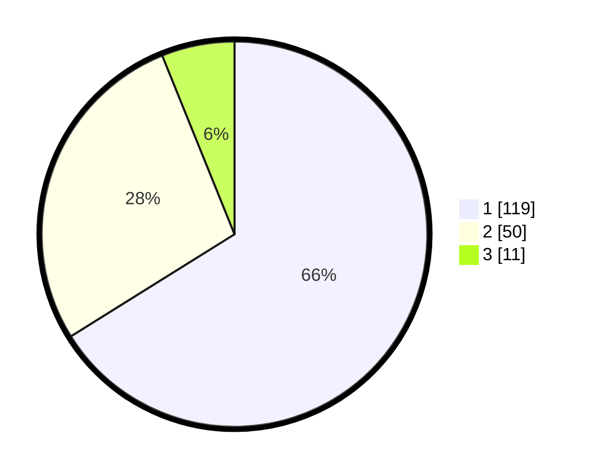

# Hasil

## Grafik

## Tabel

| No. | Nama Paslon    | Suara | Suara (raw) | Persentase |
|:--- |:-------------- | -----:| -----------:| ----------:|
| 1   | ANIES MUHAIMIN | 119   | [119][p-1]  | 66,11      |
| 2   | PRABOWO GIBRAN | 50    | [50][p-2]   | 27,78      |
| 3   | GANJAR MAHFUD  | 11    | [11][p-3]   | 6,11       |

[p-1]: https://github.com/gigit-pemilu/pemilu-2024-32-jawa-barat/blob/main/pilpres/hitung-suara/sub/32-jawa-barat/sub/02-sukabumi/sub/24-surade/sub/2011-sukatani/sub/015-tps/sub/paslon-1.txt
[p-2]: https://github.com/gigit-pemilu/pemilu-2024-32-jawa-barat/blob/main/pilpres/hitung-suara/sub/32-jawa-barat/sub/02-sukabumi/sub/24-surade/sub/2011-sukatani/sub/015-tps/sub/paslon-2.txt
[p-3]: https://github.com/gigit-pemilu/pemilu-2024-32-jawa-barat/blob/main/pilpres/hitung-suara/sub/32-jawa-barat/sub/02-sukabumi/sub/24-surade/sub/2011-sukatani/sub/015-tps/sub/paslon-3.txt

## Foto C Plano

https://sirekap-obj-formc.kpu.go.id/d1fb/pemilu/ppwp/32/02/24/20/11/3202242011015-20240214-140925--32bb8363-720d-4a83-8573-435f2c40e1e2.jpg

https://sirekap-obj-formc.kpu.go.id/d1fb/pemilu/ppwp/32/02/24/20/11/3202242011015-20240214-141015--ed6fc8a9-d2ba-467d-b50c-2e87db7bf739.jpg

https://sirekap-obj-formc.kpu.go.id/d1fb/pemilu/ppwp/32/02/24/20/11/3202242011015-20240216-065825--81a7a1cd-a266-47a0-8d3b-30254522cc6c.jpg

## Metadata

| Key        | Value               |
| ---------- | ------------------- |
| Time Stamp | 2024-02-16 08:00:28 |

## DATA PEMILIH TETAP

Jumlah pemilih dalam DPT: **685**.
 * L: **899**.
 * P: **36**.

## DATA PENGGUNA HAK PILIH

Jumlah pengguna hak pilih dalam DPT: **255**.
 * L: **505**.
 * P: **106**.

Jumlah pengguna hak pilih dalam DPTb: **808**.
 * L: **8**.
 * P: **808**.

Jumlah pengguna hak pilih dalam DPK: **800**.
 * L: **880**.
 * P: **0**.

Jumlah pengguna hak pilih: **248**.
 * L: **105**.
 * P: **106**.

## JUMLAH SUARA SAH DAN TIDAK SAH

JUMLAH SELURUH SUARA SAH: **0**.

JUMLAH SUARA TIDAK SAH: **0**.

JUMLAH SELURUH SUARA SAH DAN SUARA TIDAK SAH: **0**.

