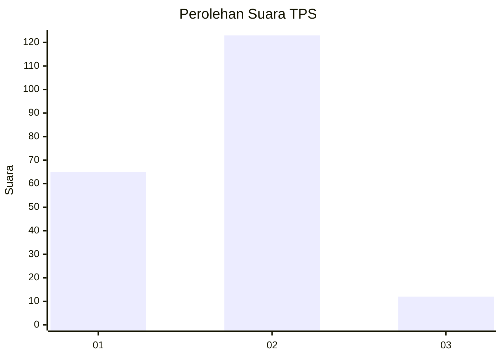
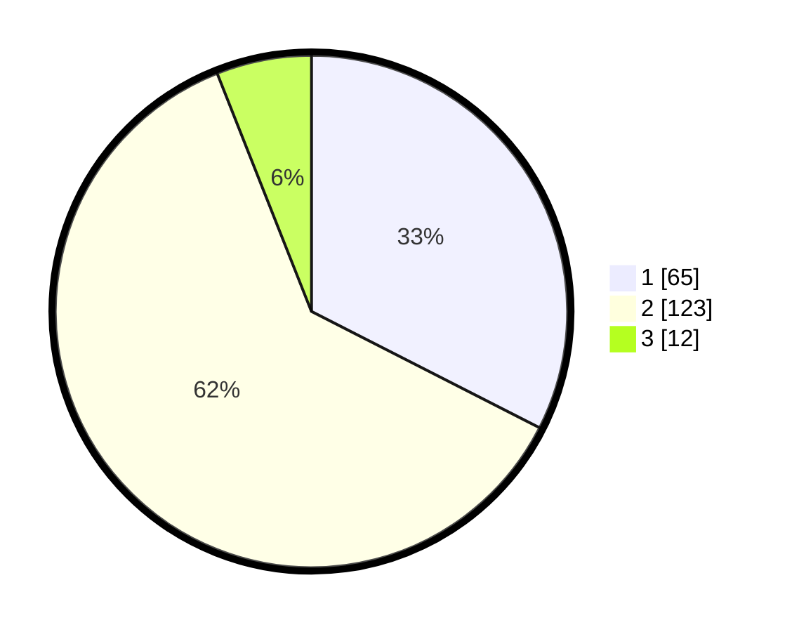

# Hasil

## Grafik

## Tabel

| No. | Nama Paslon    | Suara | Suara (raw) | Persentase |
|:--- |:-------------- | -----:| -----------:| ----------:|
| 1   | ANIES MUHAIMIN | 65    | [65][p-1]   | 32,50      |
| 2   | PRABOWO GIBRAN | 123   | [123][p-2]  | 61,50      |
| 3   | GANJAR MAHFUD  | 12    | [12][p-3]   | 6,00       |

[p-1]: https://github.com/gigit-pemilu/pemilu-2024-32-jawa-barat/blob/main/pilpres/hitung-suara/sub/32-jawa-barat/sub/02-sukabumi/sub/27-gunungguruh/sub/2001-cikujang/sub/003-tps/sub/paslon-1.txt
[p-2]: https://github.com/gigit-pemilu/pemilu-2024-32-jawa-barat/blob/main/pilpres/hitung-suara/sub/32-jawa-barat/sub/02-sukabumi/sub/27-gunungguruh/sub/2001-cikujang/sub/003-tps/sub/paslon-2.txt
[p-3]: https://github.com/gigit-pemilu/pemilu-2024-32-jawa-barat/blob/main/pilpres/hitung-suara/sub/32-jawa-barat/sub/02-sukabumi/sub/27-gunungguruh/sub/2001-cikujang/sub/003-tps/sub/paslon-3.txt

## Foto C Plano

https://sirekap-obj-formc.kpu.go.id/ca33/pemilu/ppwp/32/02/27/20/01/3202272001003-20240214-141723--7c826fd9-b4d1-42e4-84b3-bd36d9e74c83.jpg

https://sirekap-obj-formc.kpu.go.id/ca33/pemilu/ppwp/32/02/27/20/01/3202272001003-20240214-141823--0374f1a7-1687-4982-8c5a-a70ef037ef33.jpg

https://sirekap-obj-formc.kpu.go.id/ca33/pemilu/ppwp/32/02/27/20/01/3202272001003-20240229-114926--f14038af-e38e-4039-b14d-2a91b13efec5.jpg

## Metadata

| Key        | Value               |
| ---------- | ------------------- |
| Time Stamp | 2024-02-29 12:00:00 |

