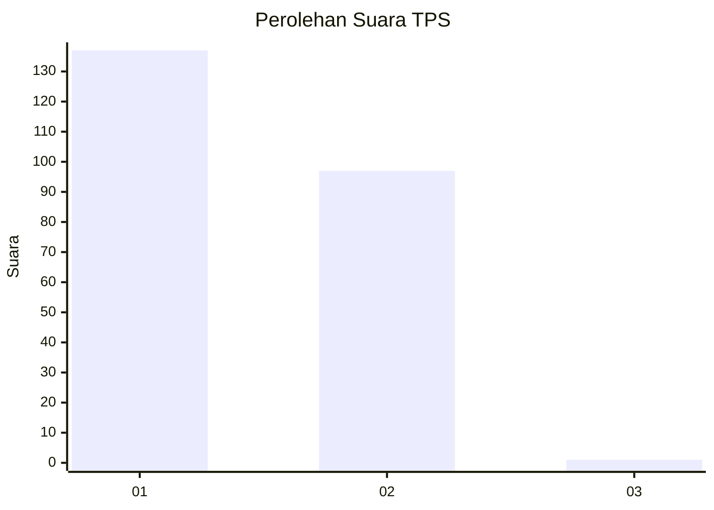
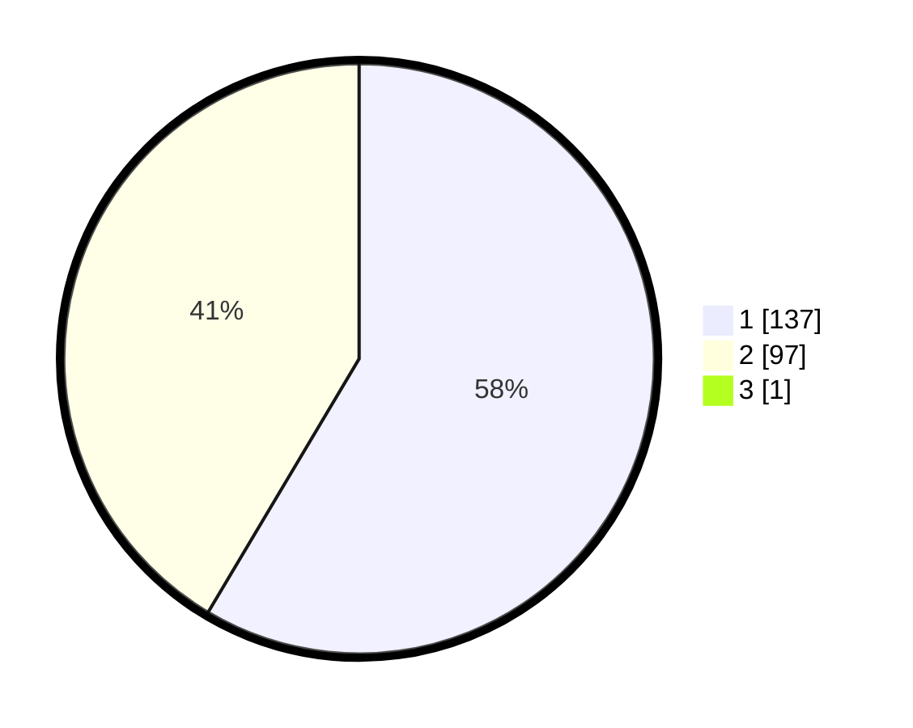

# Hasil

## Grafik

## Tabel

| No. | Nama Paslon    | Suara | Suara (raw) | Persentase |
|:--- |:-------------- | -----:| -----------:| ----------:|
| 1   | ANIES MUHAIMIN | 137   | [137][p-1]  | 58,30      |
| 2   | PRABOWO GIBRAN | 97    | [97][p-2]   | 41,28      |
| 3   | GANJAR MAHFUD  | 1     | [1][p-3]    | 0,43       |

[p-1]: https://github.com/gigit-pemilu/pemilu-2024-32-jawa-barat/blob/main/pilpres/hitung-suara/sub/32-jawa-barat/sub/02-sukabumi/sub/28-cicantayan/sub/2001-cicantayan/sub/002-tps/sub/paslon-1.txt
[p-2]: https://github.com/gigit-pemilu/pemilu-2024-32-jawa-barat/blob/main/pilpres/hitung-suara/sub/32-jawa-barat/sub/02-sukabumi/sub/28-cicantayan/sub/2001-cicantayan/sub/002-tps/sub/paslon-2.txt
[p-3]: https://github.com/gigit-pemilu/pemilu-2024-32-jawa-barat/blob/main/pilpres/hitung-suara/sub/32-jawa-barat/sub/02-sukabumi/sub/28-cicantayan/sub/2001-cicantayan/sub/002-tps/sub/paslon-3.txt

## Foto C Plano

https://sirekap-obj-formc.kpu.go.id/70ad/pemilu/ppwp/32/02/28/20/01/3202282001002-20240215-102556--835a4048-c655-45e5-bd39-78dc5b1513d7.jpg

https://sirekap-obj-formc.kpu.go.id/70ad/pemilu/ppwp/32/02/28/20/01/3202282001002-20240215-102550--753ffbcc-d59c-4250-8c73-14b0b955655c.jpg

https://sirekap-obj-formc.kpu.go.id/70ad/pemilu/ppwp/32/02/28/20/01/3202282001002-20240215-102358--cdf3bbc9-d7bb-4312-9f68-320e13f4679e.jpg

## Metadata

| Key        | Value               |
| ---------- | ------------------- |
| Time Stamp | 2024-02-17 13:37:34 |

