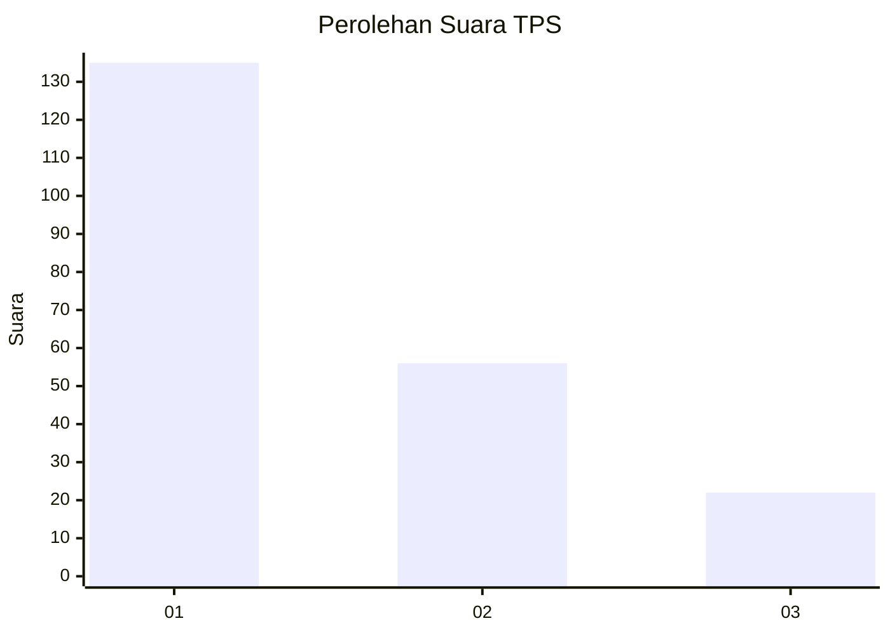
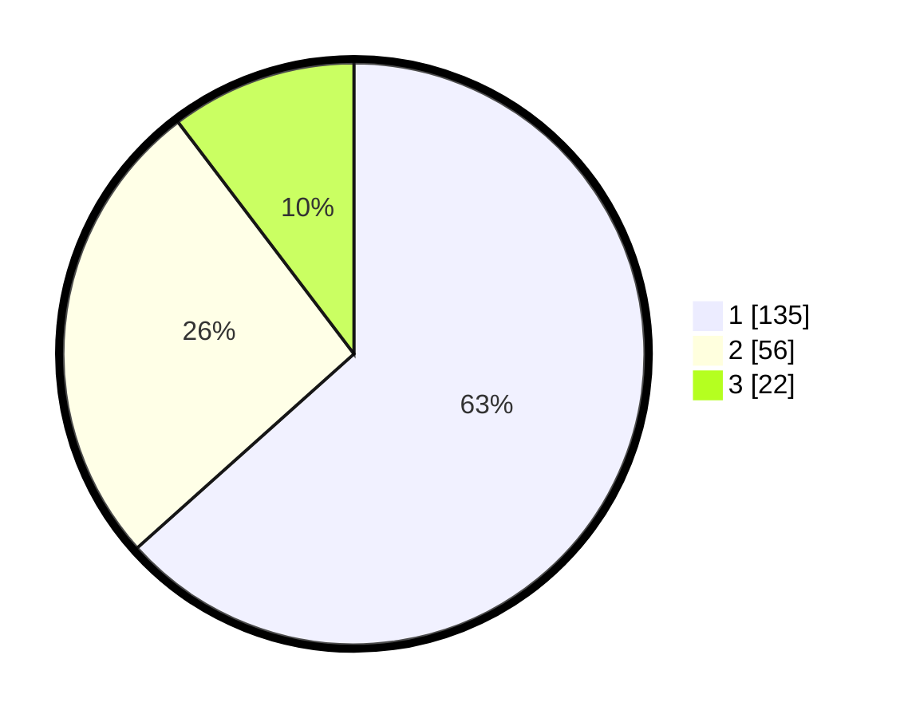

# Hasil

## Grafik

## Tabel

| No. | Nama Paslon    | Suara | Suara (raw) | Persentase |
|:--- |:-------------- | -----:| -----------:| ----------:|
| 1   | ANIES MUHAIMIN | 135   | [135][p-1]  | 63,38      |
| 2   | PRABOWO GIBRAN | 56    | [56][p-2]   | 26,29      |
| 3   | GANJAR MAHFUD  | 22    | [22][p-3]   | 10,33      |

[p-1]: https://github.com/gigit-pemilu/pemilu-2024/blob/main/pilpres/hitung-suara/sub/32-jawa-barat/sub/02-sukabumi/sub/28-cicantayan/sub/2006-hegarmanah/sub/002-tps/sub/paslon-1.txt
[p-2]: https://github.com/gigit-pemilu/pemilu-2024/blob/main/pilpres/hitung-suara/sub/32-jawa-barat/sub/02-sukabumi/sub/28-cicantayan/sub/2006-hegarmanah/sub/002-tps/sub/paslon-2.txt
[p-3]: https://github.com/gigit-pemilu/pemilu-2024/blob/main/pilpres/hitung-suara/sub/32-jawa-barat/sub/02-sukabumi/sub/28-cicantayan/sub/2006-hegarmanah/sub/002-tps/sub/paslon-3.txt

## Foto C Plano

https://sirekap-obj-formc.kpu.go.id/5fa3/pemilu/ppwp/32/02/28/20/06/3202282006002-20240214-195810--2261b4ae-9a52-43da-8cc5-45811d8dcf8b.jpg

https://sirekap-obj-formc.kpu.go.id/5fa3/pemilu/ppwp/32/02/28/20/06/3202282006002-20240214-195105--67d66ade-0bcf-4a08-8194-252df4173dc7.jpg

https://sirekap-obj-formc.kpu.go.id/5fa3/pemilu/ppwp/32/02/28/20/06/3202282006002-20240214-195434--64cdd4a7-444c-4566-8480-75f668cae787.jpg

## Metadata

| Key        | Value               |
| ---------- | ------------------- |
| Time Stamp | 2024-02-17 13:37:34 |

