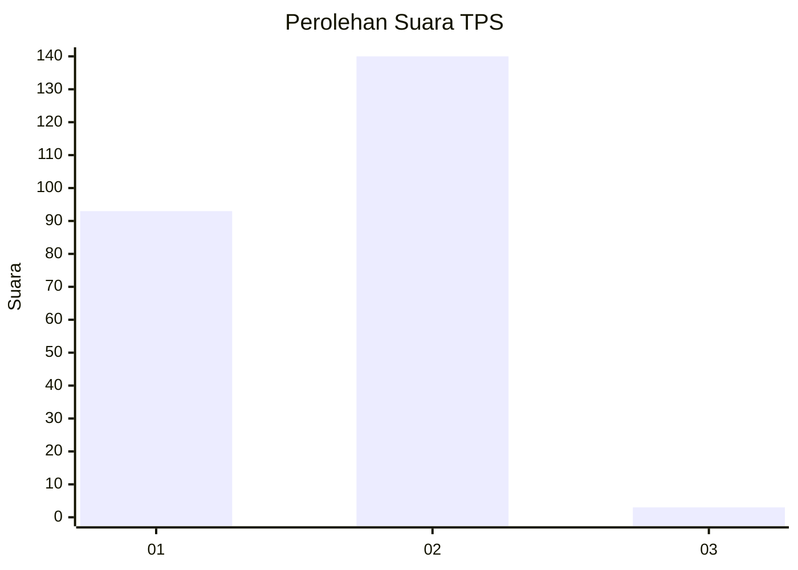
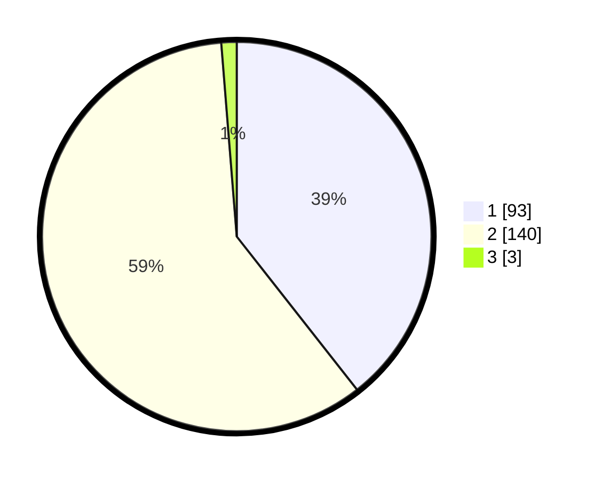

# Hasil

## Grafik

## Tabel

| No. | Nama Paslon    | Suara | Suara (raw) | Persentase |
|:--- |:-------------- | -----:| -----------:| ----------:|
| 1   | ANIES MUHAIMIN | 93    | [93][p-1]   | 39,41      |
| 2   | PRABOWO GIBRAN | 140   | [140][p-2]  | 59,32      |
| 3   | GANJAR MAHFUD  | 3     | [3][p-3]    | 1,27       |

[p-1]: https://github.com/gigit-pemilu/pemilu-2024/blob/main/pilpres/hitung-suara/sub/32-jawa-barat/sub/02-sukabumi/sub/29-cisaat/sub/2001-gunungjaya/sub/001-tps/sub/paslon-1.txt
[p-2]: https://github.com/gigit-pemilu/pemilu-2024/blob/main/pilpres/hitung-suara/sub/32-jawa-barat/sub/02-sukabumi/sub/29-cisaat/sub/2001-gunungjaya/sub/001-tps/sub/paslon-2.txt
[p-3]: https://github.com/gigit-pemilu/pemilu-2024/blob/main/pilpres/hitung-suara/sub/32-jawa-barat/sub/02-sukabumi/sub/29-cisaat/sub/2001-gunungjaya/sub/001-tps/sub/paslon-3.txt

## Foto C Plano

https://sirekap-obj-formc.kpu.go.id/bbee/pemilu/ppwp/32/02/29/20/01/3202292001001-20240219-100101--6042e747-54f9-4f9c-baa4-4c82acfc826f.jpg

https://sirekap-obj-formc.kpu.go.id/bbee/pemilu/ppwp/32/02/29/20/01/3202292001001-20240219-100200--7929f4da-5bab-4e3b-b33a-b81ef3b288cc.jpg

https://sirekap-obj-formc.kpu.go.id/bbee/pemilu/ppwp/32/02/29/20/01/3202292001001-20240214-193110--2ff0805c-6725-4d2e-b8b9-f3648f52cdc5.jpg

## Metadata

| Key        | Value               |
| ---------- | ------------------- |
| Time Stamp | 2024-02-24 22:31:28 |

