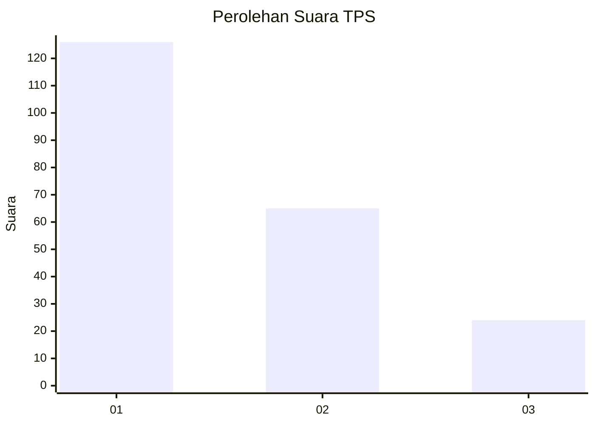
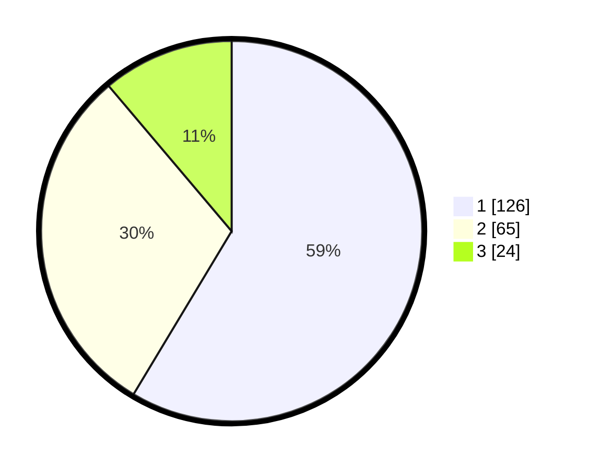

# Hasil

## Grafik

## Tabel

| No. | Nama Paslon    | Suara | Suara (raw) | Persentase |
|:--- |:-------------- | -----:| -----------:| ----------:|
| 1   | ANIES MUHAIMIN | 126   | [126][p-1]  | 58,60      |
| 2   | PRABOWO GIBRAN | 65    | [65][p-2]   | 30,23      |
| 3   | GANJAR MAHFUD  | 24    | [24][p-3]   | 11,16      |

[p-1]: https://github.com/gigit-pemilu/pemilu-2024/blob/main/pilpres/hitung-suara/sub/32-jawa-barat/sub/02-sukabumi/sub/29-cisaat/sub/2001-gunungjaya/sub/016-tps/sub/paslon-1.txt
[p-2]: https://github.com/gigit-pemilu/pemilu-2024/blob/main/pilpres/hitung-suara/sub/32-jawa-barat/sub/02-sukabumi/sub/29-cisaat/sub/2001-gunungjaya/sub/016-tps/sub/paslon-2.txt
[p-3]: https://github.com/gigit-pemilu/pemilu-2024/blob/main/pilpres/hitung-suara/sub/32-jawa-barat/sub/02-sukabumi/sub/29-cisaat/sub/2001-gunungjaya/sub/016-tps/sub/paslon-3.txt

## Foto C Plano

https://sirekap-obj-formc.kpu.go.id/73a3/pemilu/ppwp/32/02/29/20/01/3202292001016-20240214-223140--3fbb3410-3d18-42b7-bf4b-97939ad71229.jpg

https://sirekap-obj-formc.kpu.go.id/73a3/pemilu/ppwp/32/02/29/20/01/3202292001016-20240214-223313--363dc8c4-7ebf-450d-8218-53f61e3c1532.jpg

https://sirekap-obj-formc.kpu.go.id/73a3/pemilu/ppwp/32/02/29/20/01/3202292001016-20240214-223421--b968256c-96e4-4e8c-b9ce-35cef1b23128.jpg

## Metadata

| Key        | Value               |
| ---------- | ------------------- |
| Time Stamp | 2024-02-15 15:00:29 |

