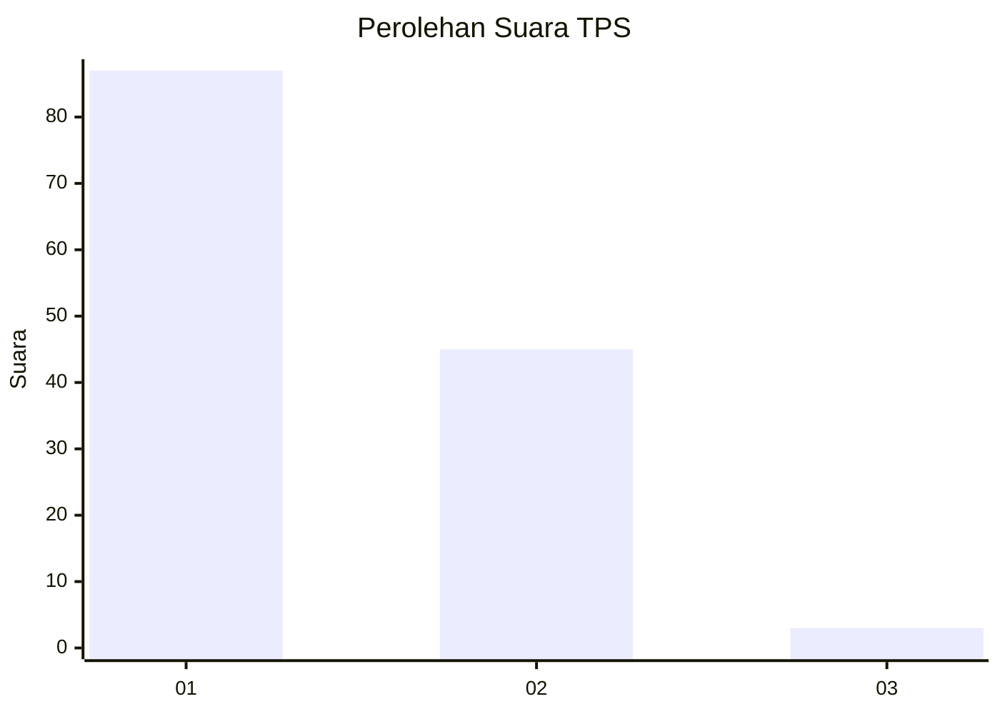
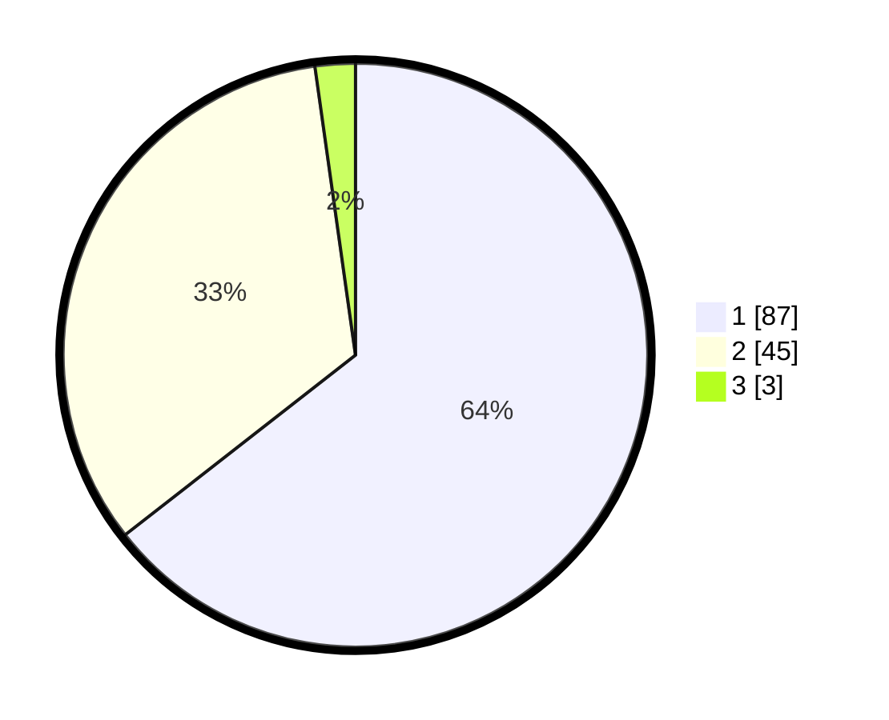

# Hasil

## Grafik

## Tabel

| No. | Nama Paslon    | Suara | Suara (raw) | Persentase |
|:--- |:-------------- | -----:| -----------:| ----------:|
| 1   | ANIES MUHAIMIN | 87    | [87][p-1]   | 64,44      |
| 2   | PRABOWO GIBRAN | 45    | [45][p-2]   | 33,33      |
| 3   | GANJAR MAHFUD  | 3     | [3][p-3]    | 2,22       |

[p-1]: https://github.com/gigit-pemilu/pemilu-2024/blob/main/pilpres/hitung-suara/sub/32-jawa-barat/sub/02-sukabumi/sub/29-cisaat/sub/2008-cibatu/sub/005-tps/sub/paslon-1.txt
[p-2]: https://github.com/gigit-pemilu/pemilu-2024/blob/main/pilpres/hitung-suara/sub/32-jawa-barat/sub/02-sukabumi/sub/29-cisaat/sub/2008-cibatu/sub/005-tps/sub/paslon-2.txt
[p-3]: https://github.com/gigit-pemilu/pemilu-2024/blob/main/pilpres/hitung-suara/sub/32-jawa-barat/sub/02-sukabumi/sub/29-cisaat/sub/2008-cibatu/sub/005-tps/sub/paslon-3.txt

## Foto C Plano

https://sirekap-obj-formc.kpu.go.id/15f4/pemilu/ppwp/32/02/29/20/08/3202292008005-20240214-141140--6155c751-6aa7-417b-80b7-e34ddef4a10d.jpg

https://sirekap-obj-formc.kpu.go.id/15f4/pemilu/ppwp/32/02/29/20/08/3202292008005-20240214-141246--dc566861-5ed4-4a26-a9a8-5f4b3d0a621a.jpg

https://sirekap-obj-formc.kpu.go.id/15f4/pemilu/ppwp/32/02/29/20/08/3202292008005-20240214-141320--f7162b85-4295-47a0-8568-b99efd2c8546.jpg

## Metadata

| Key        | Value               |
| ---------- | ------------------- |
| Time Stamp | 2024-02-14 21:46:01 |

