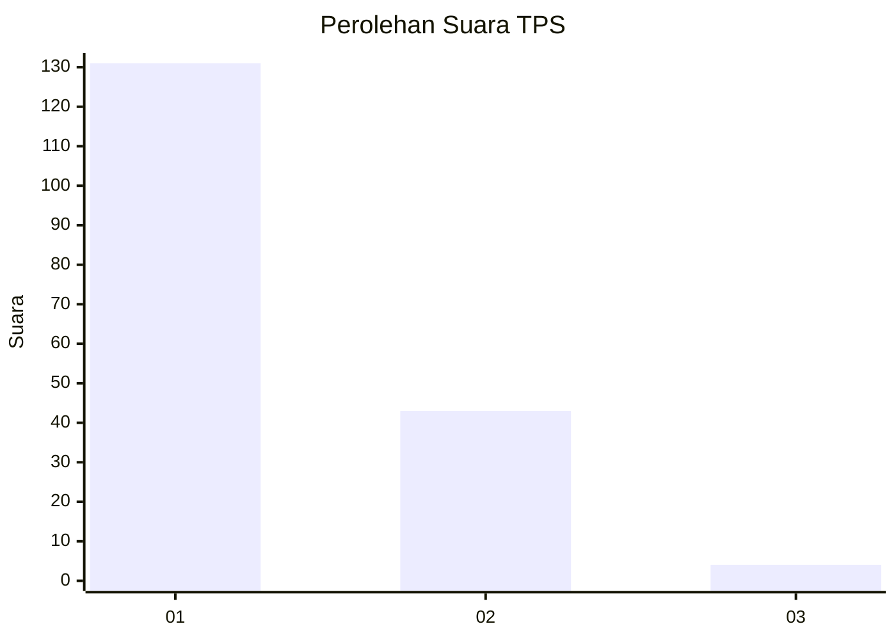
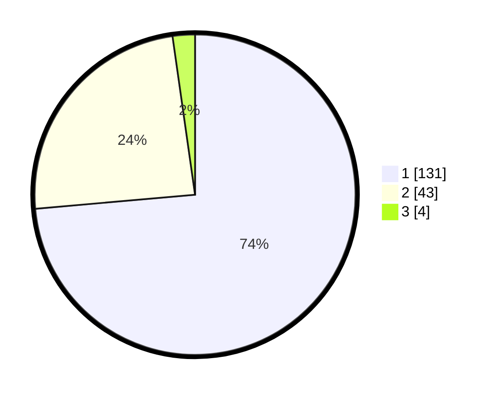

# Hasil

## Grafik

## Tabel

| No. | Nama Paslon    | Suara | Suara (raw) | Persentase |
|:--- |:-------------- | -----:| -----------:| ----------:|
| 1   | ANIES MUHAIMIN | 131   | [131][p-1]  | 73,60      |
| 2   | PRABOWO GIBRAN | 43    | [43][p-2]   | 24,16      |
| 3   | GANJAR MAHFUD  | 4     | [4][p-3]    | 2,25       |

[p-1]: https://github.com/gigit-pemilu/pemilu-2024/blob/main/pilpres/hitung-suara/sub/32-jawa-barat/sub/02-sukabumi/sub/29-cisaat/sub/2011-cibolang-kaler/sub/001-tps/sub/paslon-1.txt
[p-2]: https://github.com/gigit-pemilu/pemilu-2024/blob/main/pilpres/hitung-suara/sub/32-jawa-barat/sub/02-sukabumi/sub/29-cisaat/sub/2011-cibolang-kaler/sub/001-tps/sub/paslon-2.txt
[p-3]: https://github.com/gigit-pemilu/pemilu-2024/blob/main/pilpres/hitung-suara/sub/32-jawa-barat/sub/02-sukabumi/sub/29-cisaat/sub/2011-cibolang-kaler/sub/001-tps/sub/paslon-3.txt

## Foto C Plano

https://sirekap-obj-formc.kpu.go.id/d97f/pemilu/ppwp/32/02/29/20/11/3202292011001-20240214-210205--111c981a-c801-464e-aff8-6353083516f0.jpg

https://sirekap-obj-formc.kpu.go.id/d97f/pemilu/ppwp/32/02/29/20/11/3202292011001-20240214-210829--e6660190-b7cf-4e92-b509-cff94d3f9670.jpg

https://sirekap-obj-formc.kpu.go.id/d97f/pemilu/ppwp/32/02/29/20/11/3202292011001-20240214-210629--90d8397c-c1bc-4ce7-bda0-34ce2da0f065.jpg

## Metadata

| Key        | Value               |
| ---------- | ------------------- |
| Time Stamp | 2024-02-15 15:30:25 |

