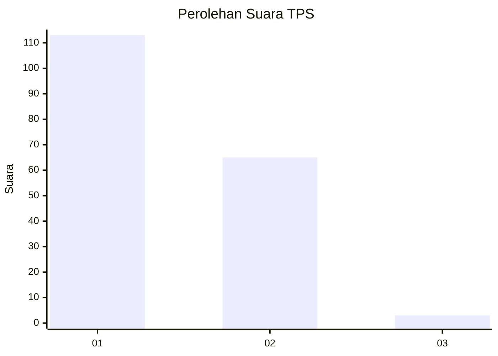
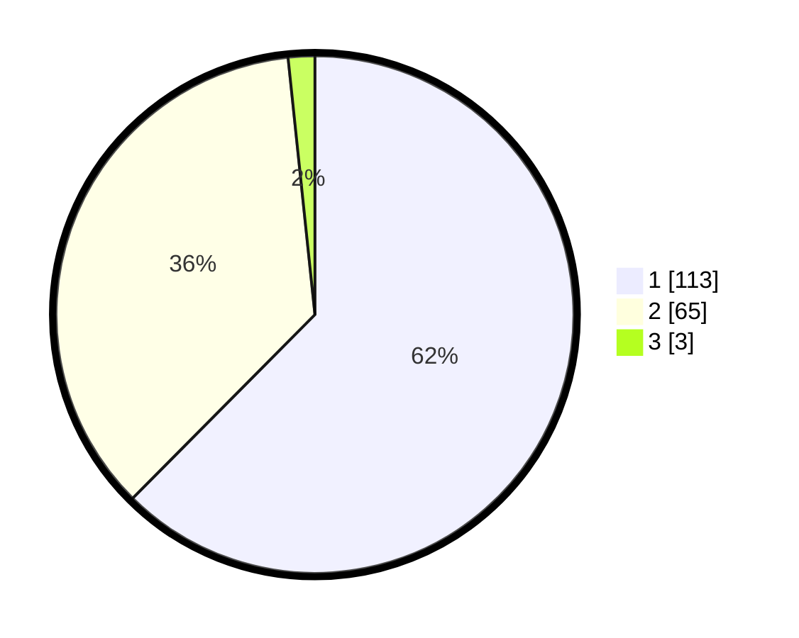

# Hasil

## Grafik

## Tabel

| No. | Nama Paslon    | Suara | Suara (raw) | Persentase |
|:--- |:-------------- | -----:| -----------:| ----------:|
| 1   | ANIES MUHAIMIN | 113   | [113][p-1]  | 62,43      |
| 2   | PRABOWO GIBRAN | 65    | [65][p-2]   | 35,91      |
| 3   | GANJAR MAHFUD  | 3     | [3][p-3]    | 1,66       |

[p-1]: https://github.com/gigit-pemilu/pemilu-2024-32-jawa-barat/blob/main/pilpres/hitung-suara/sub/32-jawa-barat/sub/02-sukabumi/sub/30-kadudampit/sub/2001-kadudampit/sub/001-tps/sub/paslon-1.txt
[p-2]: https://github.com/gigit-pemilu/pemilu-2024-32-jawa-barat/blob/main/pilpres/hitung-suara/sub/32-jawa-barat/sub/02-sukabumi/sub/30-kadudampit/sub/2001-kadudampit/sub/001-tps/sub/paslon-2.txt
[p-3]: https://github.com/gigit-pemilu/pemilu-2024-32-jawa-barat/blob/main/pilpres/hitung-suara/sub/32-jawa-barat/sub/02-sukabumi/sub/30-kadudampit/sub/2001-kadudampit/sub/001-tps/sub/paslon-3.txt

## Foto C Plano

https://sirekap-obj-formc.kpu.go.id/c8f9/pemilu/ppwp/32/02/30/20/01/3202302001001-20240219-092708--8210c4c7-2b31-48d7-aec0-bc79686467c9.jpg

https://sirekap-obj-formc.kpu.go.id/c8f9/pemilu/ppwp/32/02/30/20/01/3202302001001-20240219-092608--c180748c-c631-42d2-acce-17a7483256b5.jpg

https://sirekap-obj-formc.kpu.go.id/c8f9/pemilu/ppwp/32/02/30/20/01/3202302001001-20240219-092736--dd7dbbf8-5b62-4d30-b997-472f6ad6209a.jpg

## Metadata

| Key        | Value               |
| ---------- | ------------------- |
| Time Stamp | 2024-02-19 10:00:00 |

