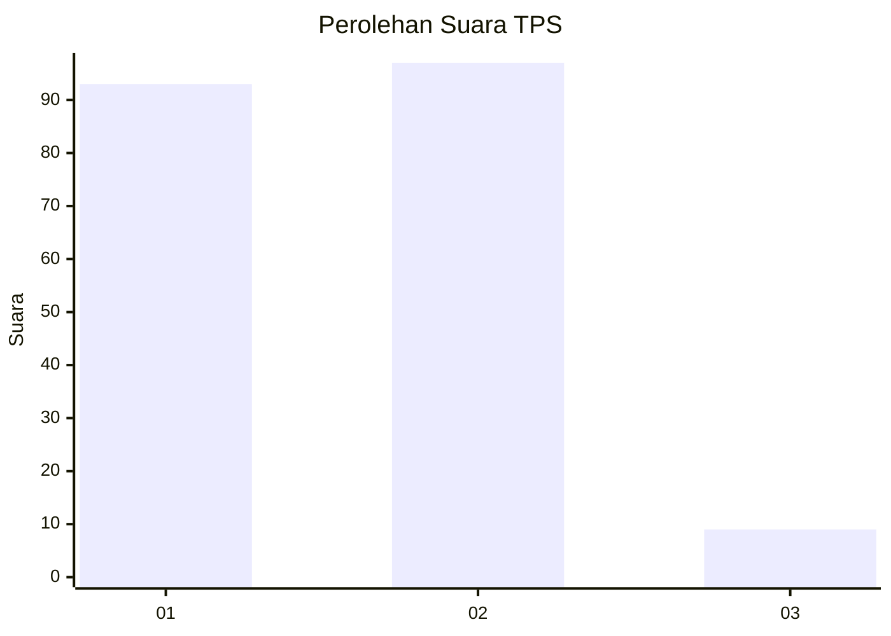
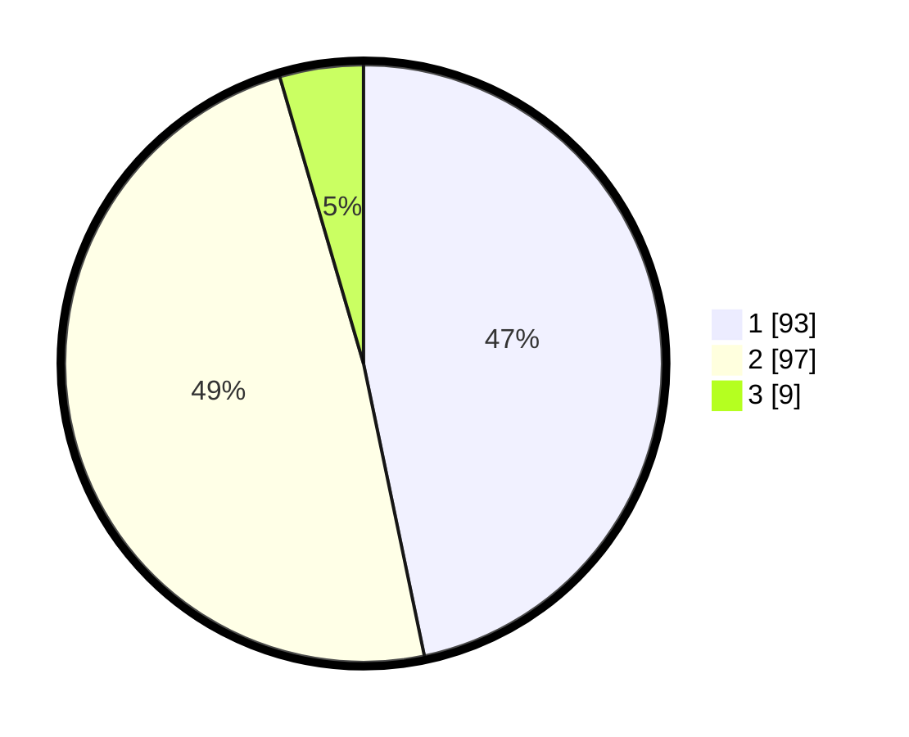

# Hasil

## Grafik

## Tabel

| No. | Nama Paslon    | Suara | Suara (raw) | Persentase |
|:--- |:-------------- | -----:| -----------:| ----------:|
| 1   | ANIES MUHAIMIN | 93    | [93][p-1]   | 46,73      |
| 2   | PRABOWO GIBRAN | 97    | [97][p-2]   | 48,74      |
| 3   | GANJAR MAHFUD  | 9     | [9][p-3]    | 4,52       |

[p-1]: https://github.com/gigit-pemilu/pemilu-2024-32-jawa-barat/blob/main/pilpres/hitung-suara/sub/32-jawa-barat/sub/02-sukabumi/sub/30-kadudampit/sub/2001-kadudampit/sub/003-tps/sub/paslon-1.txt
[p-2]: https://github.com/gigit-pemilu/pemilu-2024-32-jawa-barat/blob/main/pilpres/hitung-suara/sub/32-jawa-barat/sub/02-sukabumi/sub/30-kadudampit/sub/2001-kadudampit/sub/003-tps/sub/paslon-2.txt
[p-3]: https://github.com/gigit-pemilu/pemilu-2024-32-jawa-barat/blob/main/pilpres/hitung-suara/sub/32-jawa-barat/sub/02-sukabumi/sub/30-kadudampit/sub/2001-kadudampit/sub/003-tps/sub/paslon-3.txt

## Foto C Plano

https://sirekap-obj-formc.kpu.go.id/5e5b/pemilu/ppwp/32/02/30/20/01/3202302001003-20240219-093056--ecccd60a-d1d4-4ae0-b5e2-a88689df0c64.jpg

https://sirekap-obj-formc.kpu.go.id/5e5b/pemilu/ppwp/32/02/30/20/01/3202302001003-20240219-093118--eb29caa3-e2d5-49d5-a9b5-c84862bf1165.jpg

https://sirekap-obj-formc.kpu.go.id/5e5b/pemilu/ppwp/32/02/30/20/01/3202302001003-20240219-093159--5440b8b2-a9e5-4bbd-8085-bb461643c3f0.jpg

## Metadata

| Key        | Value               |
| ---------- | ------------------- |
| Time Stamp | 2024-02-19 10:00:00 |

