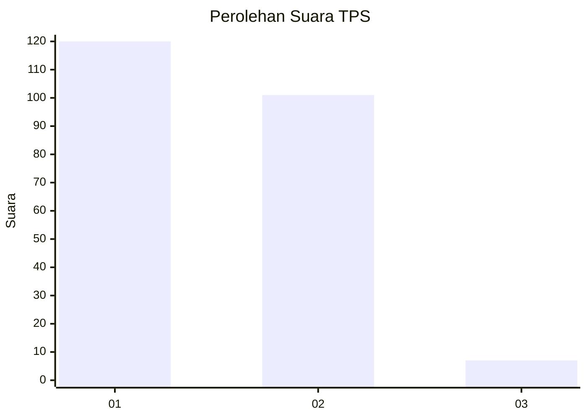
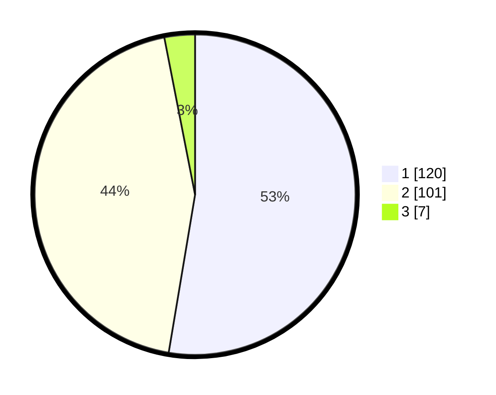

# Hasil

## Grafik

## Tabel

| No. | Nama Paslon    | Suara | Suara (raw) | Persentase |
|:--- |:-------------- | -----:| -----------:| ----------:|
| 1   | ANIES MUHAIMIN | 120   | [120][p-1]  | 52,63      |
| 2   | PRABOWO GIBRAN | 101   | [101][p-2]  | 44,30      |
| 3   | GANJAR MAHFUD  | 7     | [7][p-3]    | 3,07       |

[p-1]: https://github.com/gigit-pemilu/pemilu-2024/blob/main/pilpres/hitung-suara/sub/32-jawa-barat/sub/02-sukabumi/sub/30-kadudampit/sub/2001-kadudampit/sub/004-tps/sub/paslon-1.txt
[p-2]: https://github.com/gigit-pemilu/pemilu-2024/blob/main/pilpres/hitung-suara/sub/32-jawa-barat/sub/02-sukabumi/sub/30-kadudampit/sub/2001-kadudampit/sub/004-tps/sub/paslon-2.txt
[p-3]: https://github.com/gigit-pemilu/pemilu-2024/blob/main/pilpres/hitung-suara/sub/32-jawa-barat/sub/02-sukabumi/sub/30-kadudampit/sub/2001-kadudampit/sub/004-tps/sub/paslon-3.txt

## Foto C Plano

https://sirekap-obj-formc.kpu.go.id/907b/pemilu/ppwp/32/02/30/20/01/3202302001004-20240219-095942--beec1233-c30d-42a4-8724-0545eb56046e.jpg

https://sirekap-obj-formc.kpu.go.id/907b/pemilu/ppwp/32/02/30/20/01/3202302001004-20240219-100110--42695a56-6683-4366-bd90-c0fccad05aa4.jpg

https://sirekap-obj-formc.kpu.go.id/907b/pemilu/ppwp/32/02/30/20/01/3202302001004-20240219-100210--8ba18635-67cf-4785-b340-0ac3402f87f9.jpg

## Metadata

| Key        | Value               |
| ---------- | ------------------- |
| Time Stamp | 2024-02-19 11:00:00 |

