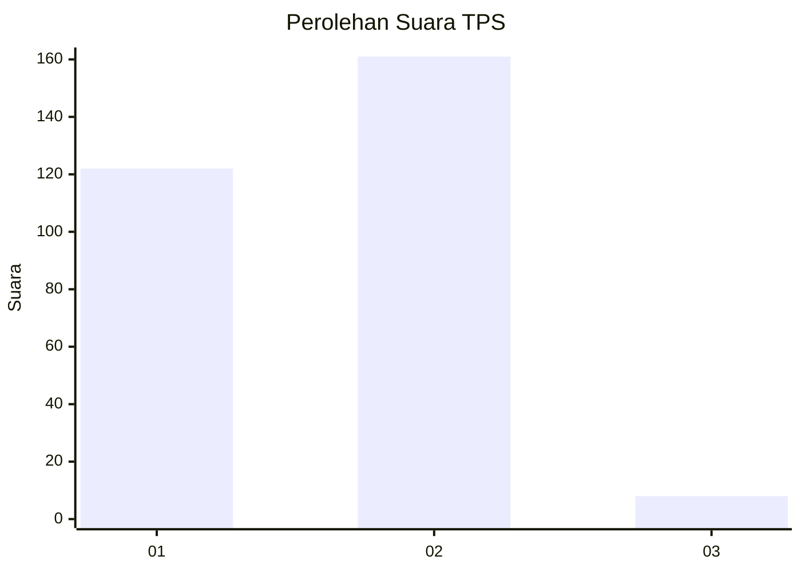
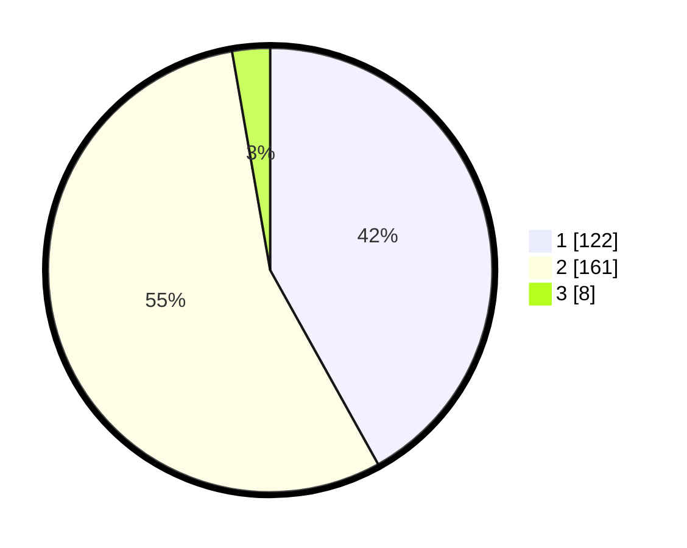

# Hasil

## Grafik

## Tabel

| No. | Nama Paslon    | Suara | Suara (raw) | Persentase |
|:--- |:-------------- | -----:| -----------:| ----------:|
| 1   | ANIES MUHAIMIN | 122   | [122][p-1]  | 41,92      |
| 2   | PRABOWO GIBRAN | 161   | [161][p-2]  | 55,33      |
| 3   | GANJAR MAHFUD  | 8     | [8][p-3]    | 2,75       |

[p-1]: https://github.com/gigit-pemilu/pemilu-2024-32-jawa-barat/blob/main/pilpres/hitung-suara/sub/32-jawa-barat/sub/02-sukabumi/sub/30-kadudampit/sub/2004-gedepangrango/sub/008-tps/sub/paslon-1.txt
[p-2]: https://github.com/gigit-pemilu/pemilu-2024-32-jawa-barat/blob/main/pilpres/hitung-suara/sub/32-jawa-barat/sub/02-sukabumi/sub/30-kadudampit/sub/2004-gedepangrango/sub/008-tps/sub/paslon-2.txt
[p-3]: https://github.com/gigit-pemilu/pemilu-2024-32-jawa-barat/blob/main/pilpres/hitung-suara/sub/32-jawa-barat/sub/02-sukabumi/sub/30-kadudampit/sub/2004-gedepangrango/sub/008-tps/sub/paslon-3.txt

## Foto C Plano

https://sirekap-obj-formc.kpu.go.id/beb3/pemilu/ppwp/32/02/30/20/04/3202302004008-20240219-122338--7e4c70b5-1deb-4b9f-be18-0789720f8366.jpg

https://sirekap-obj-formc.kpu.go.id/beb3/pemilu/ppwp/32/02/30/20/04/3202302004008-20240219-122451--5a0741b5-9f2a-46b6-a1e0-56f938b9379d.jpg

https://sirekap-obj-formc.kpu.go.id/beb3/pemilu/ppwp/32/02/30/20/04/3202302004008-20240219-122706--a66702a1-c663-420d-bb0b-7471bd812b49.jpg

## Metadata

| Key        | Value               |
| ---------- | ------------------- |
| Time Stamp | 2024-02-22 09:00:00 |

