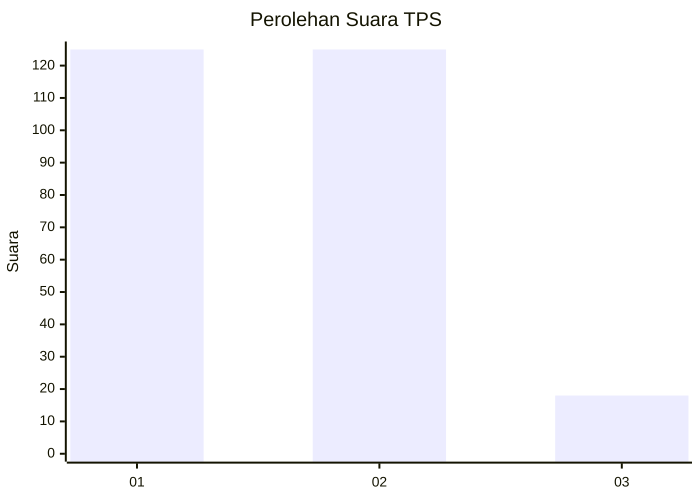
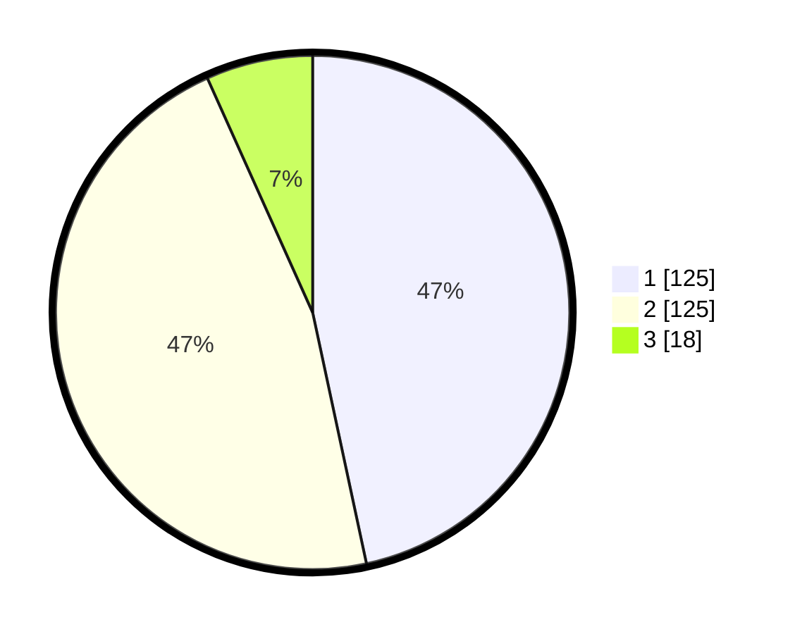

# Hasil

## Grafik

## Tabel

| No. | Nama Paslon    | Suara | Suara (raw) | Persentase |
|:--- |:-------------- | -----:| -----------:| ----------:|
| 1   | ANIES MUHAIMIN | 125   | [125][p-1]  | 46,64      |
| 2   | PRABOWO GIBRAN | 125   | [125][p-2]  | 46,64      |
| 3   | GANJAR MAHFUD  | 18    | [18][p-3]   | 6,72       |

[p-1]: https://github.com/gigit-pemilu/pemilu-2024/blob/main/pilpres/hitung-suara/sub/32-jawa-barat/sub/02-sukabumi/sub/30-kadudampit/sub/2004-gedepangrango/sub/011-tps/sub/paslon-1.txt
[p-2]: https://github.com/gigit-pemilu/pemilu-2024/blob/main/pilpres/hitung-suara/sub/32-jawa-barat/sub/02-sukabumi/sub/30-kadudampit/sub/2004-gedepangrango/sub/011-tps/sub/paslon-2.txt
[p-3]: https://github.com/gigit-pemilu/pemilu-2024/blob/main/pilpres/hitung-suara/sub/32-jawa-barat/sub/02-sukabumi/sub/30-kadudampit/sub/2004-gedepangrango/sub/011-tps/sub/paslon-3.txt

## Foto C Plano

https://sirekap-obj-formc.kpu.go.id/c77c/pemilu/ppwp/32/02/30/20/04/3202302004011-20240219-123837--c9fe84f6-6d9f-4cd9-aeb4-cedd8f2f3caf.jpg

https://sirekap-obj-formc.kpu.go.id/c77c/pemilu/ppwp/32/02/30/20/04/3202302004011-20240219-123933--3c6abd7c-5990-4df3-b162-49ef91ce8a47.jpg

https://sirekap-obj-formc.kpu.go.id/c77c/pemilu/ppwp/32/02/30/20/04/3202302004011-20240219-124032--2f8d0612-c0a0-4c29-adee-99926eb1dd6c.jpg

## Metadata

| Key        | Value               |
| ---------- | ------------------- |
| Time Stamp | 2024-02-22 09:00:00 |

