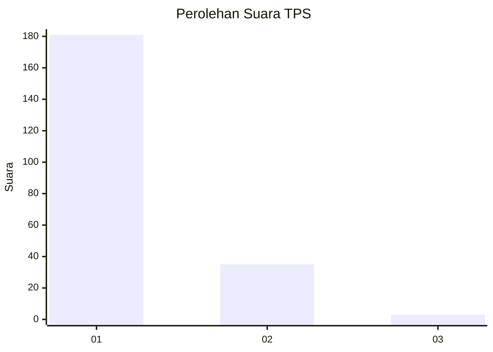
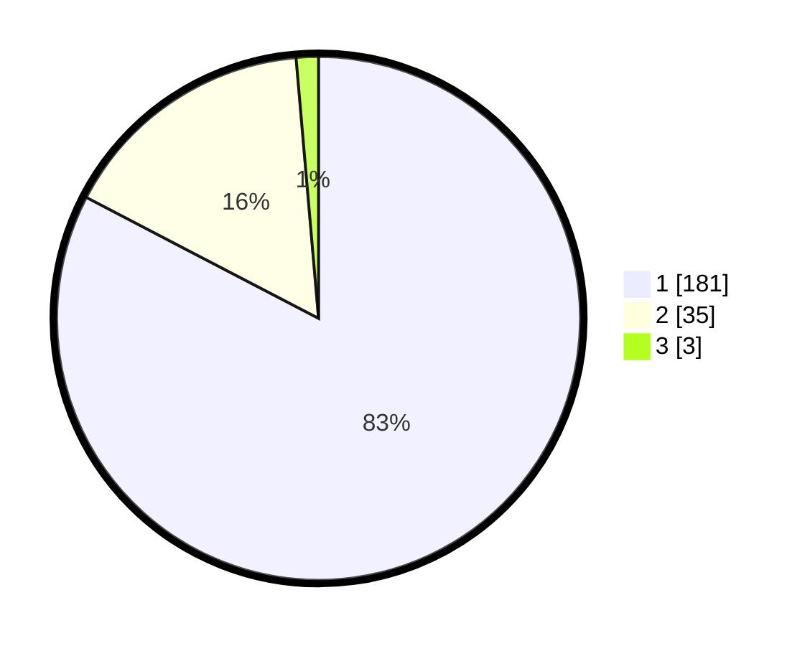

# Hasil

## Grafik

## Tabel

| No. | Nama Paslon    | Suara | Suara (raw) | Persentase |
|:--- |:-------------- | -----:| -----------:| ----------:|
| 1   | ANIES MUHAIMIN | 181   | [181][p-1]  | 82,65      |
| 2   | PRABOWO GIBRAN | 35    | [35][p-2]   | 15,98      |
| 3   | GANJAR MAHFUD  | 3     | [3][p-3]    | 1,37       |

[p-1]: https://github.com/gigit-pemilu/pemilu-2024-32-jawa-barat/blob/main/pilpres/hitung-suara/sub/32-jawa-barat/sub/02-sukabumi/sub/30-kadudampit/sub/2007-cipetir/sub/004-tps/sub/paslon-1.txt
[p-2]: https://github.com/gigit-pemilu/pemilu-2024-32-jawa-barat/blob/main/pilpres/hitung-suara/sub/32-jawa-barat/sub/02-sukabumi/sub/30-kadudampit/sub/2007-cipetir/sub/004-tps/sub/paslon-2.txt
[p-3]: https://github.com/gigit-pemilu/pemilu-2024-32-jawa-barat/blob/main/pilpres/hitung-suara/sub/32-jawa-barat/sub/02-sukabumi/sub/30-kadudampit/sub/2007-cipetir/sub/004-tps/sub/paslon-3.txt

## Foto C Plano

https://sirekap-obj-formc.kpu.go.id/26c6/pemilu/ppwp/32/02/30/20/07/3202302007004-20240219-150505--43245dc6-5b3d-4b3e-923b-73e54cff6bd1.jpg

https://sirekap-obj-formc.kpu.go.id/26c6/pemilu/ppwp/32/02/30/20/07/3202302007004-20240219-150614--0bba0853-2629-4d5f-90b4-ba751f8136dc.jpg

https://sirekap-obj-formc.kpu.go.id/26c6/pemilu/ppwp/32/02/30/20/07/3202302007004-20240219-150643--f92ce744-0302-43d1-87df-955c23687b2e.jpg

## Metadata

| Key        | Value               |
| ---------- | ------------------- |
| Time Stamp | 2024-02-22 09:00:00 |

