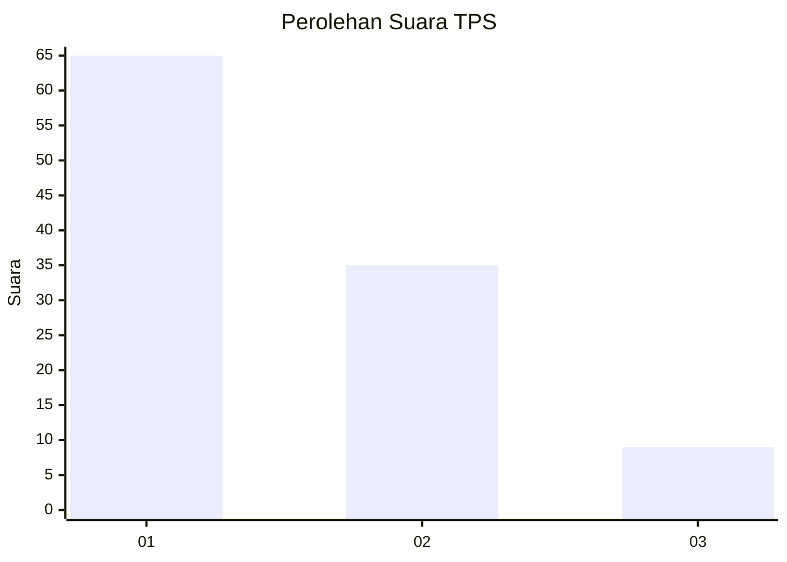
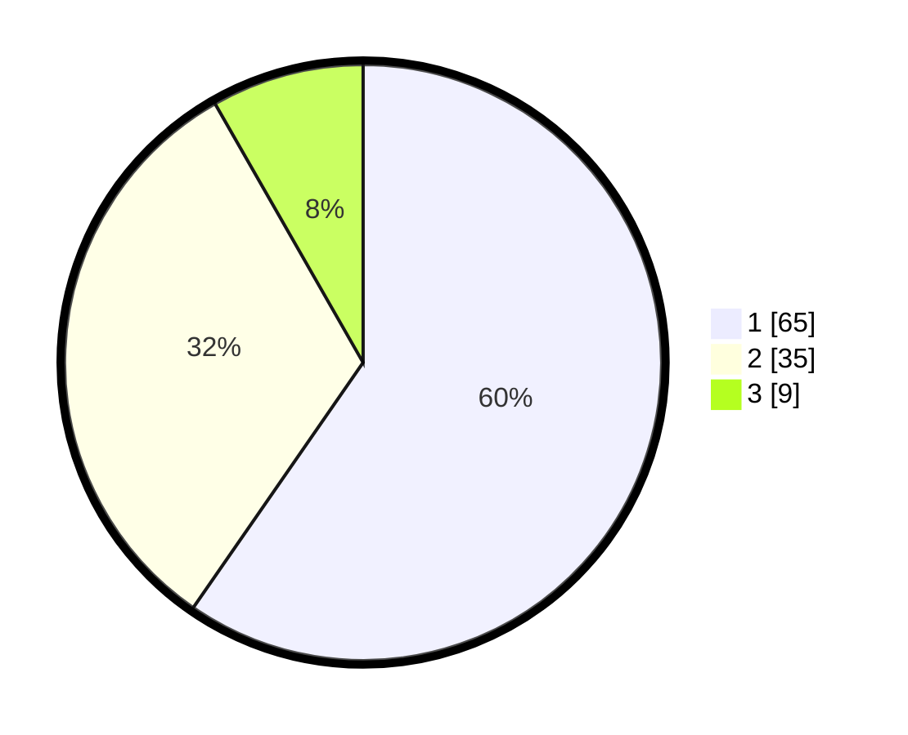

# Hasil

## Grafik

## Tabel

| No. | Nama Paslon    | Suara | Suara (raw) | Persentase |
|:--- |:-------------- | -----:| -----------:| ----------:|
| 1   | ANIES MUHAIMIN | 65    | [65][p-1]   | 59,63      |
| 2   | PRABOWO GIBRAN | 35    | [35][p-2]   | 32,11      |
| 3   | GANJAR MAHFUD  | 9     | [9][p-3]    | 8,26       |

[p-1]: https://github.com/gigit-pemilu/pemilu-2024-32-jawa-barat/blob/main/pilpres/hitung-suara/sub/32-jawa-barat/sub/02-sukabumi/sub/33-sukaraja/sub/2002-selaawi/sub/009-tps/sub/paslon-1.txt
[p-2]: https://github.com/gigit-pemilu/pemilu-2024-32-jawa-barat/blob/main/pilpres/hitung-suara/sub/32-jawa-barat/sub/02-sukabumi/sub/33-sukaraja/sub/2002-selaawi/sub/009-tps/sub/paslon-2.txt
[p-3]: https://github.com/gigit-pemilu/pemilu-2024-32-jawa-barat/blob/main/pilpres/hitung-suara/sub/32-jawa-barat/sub/02-sukabumi/sub/33-sukaraja/sub/2002-selaawi/sub/009-tps/sub/paslon-3.txt

## Foto C Plano

https://sirekap-obj-formc.kpu.go.id/ea36/pemilu/ppwp/32/02/33/20/02/3202332002009-20240219-172102--edc032b6-a2f8-4b20-bfa5-30a2081f0b6d.jpg

https://sirekap-obj-formc.kpu.go.id/ea36/pemilu/ppwp/32/02/33/20/02/3202332002009-20240220-071540--3603a747-f44e-40b5-b38b-50894693bb17.jpg

https://sirekap-obj-formc.kpu.go.id/ea36/pemilu/ppwp/32/02/33/20/02/3202332002009-20240219-222311--b3e61b19-e770-436b-87e1-0bf8164c50de.jpg

## Metadata

| Key        | Value               |
| ---------- | ------------------- |
| Time Stamp | 2024-02-21 09:00:00 |

