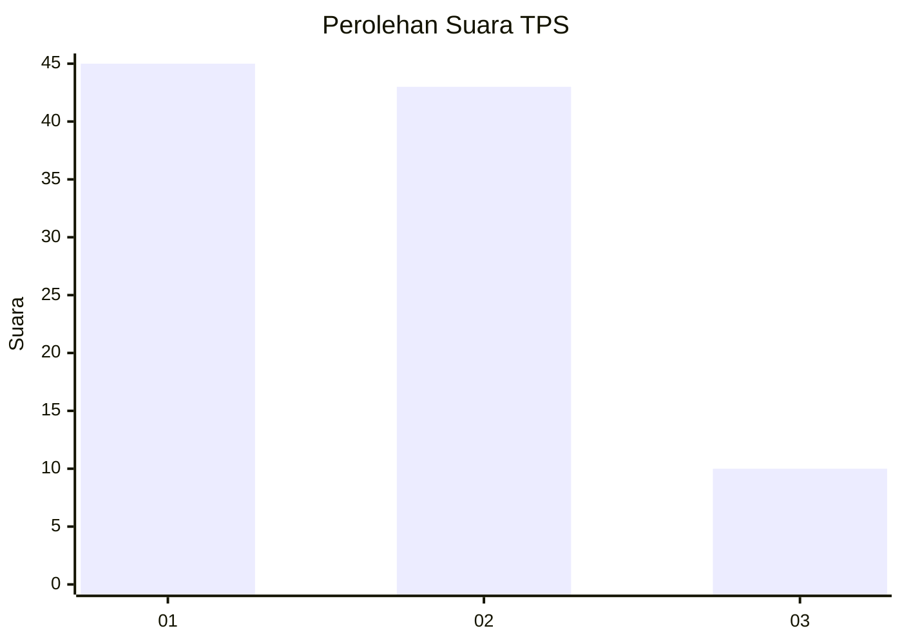
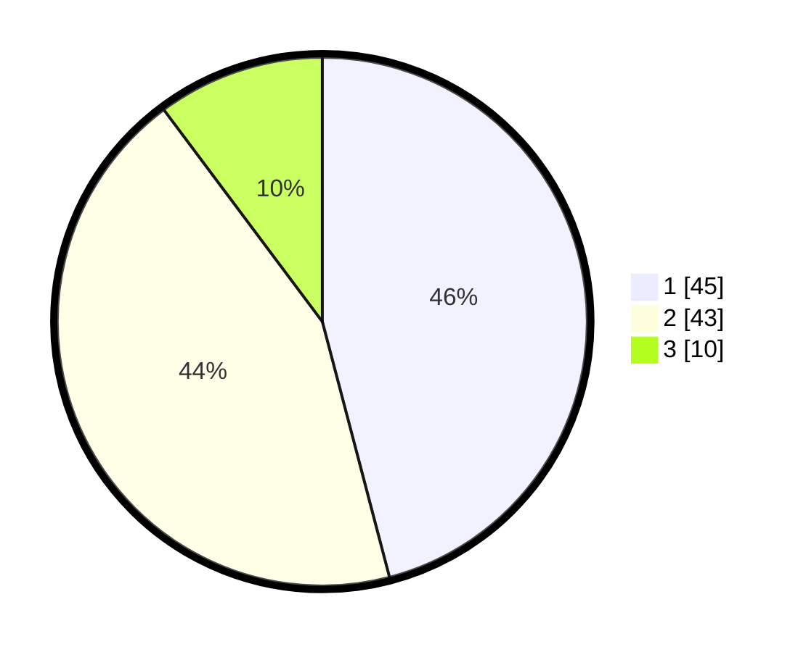

# Hasil

## Grafik

## Tabel

| No. | Nama Paslon    | Suara | Suara (raw) | Persentase |
|:--- |:-------------- | -----:| -----------:| ----------:|
| 1   | ANIES MUHAIMIN | 45    | [45][p-1]   | 45,92      |
| 2   | PRABOWO GIBRAN | 43    | [43][p-2]   | 43,88      |
| 3   | GANJAR MAHFUD  | 10    | [10][p-3]   | 10,20      |

[p-1]: https://github.com/gigit-pemilu/pemilu-2024/blob/main/pilpres/hitung-suara/sub/32-jawa-barat/sub/02-sukabumi/sub/33-sukaraja/sub/2002-selaawi/sub/026-tps/sub/paslon-1.txt
[p-2]: https://github.com/gigit-pemilu/pemilu-2024/blob/main/pilpres/hitung-suara/sub/32-jawa-barat/sub/02-sukabumi/sub/33-sukaraja/sub/2002-selaawi/sub/026-tps/sub/paslon-2.txt
[p-3]: https://github.com/gigit-pemilu/pemilu-2024/blob/main/pilpres/hitung-suara/sub/32-jawa-barat/sub/02-sukabumi/sub/33-sukaraja/sub/2002-selaawi/sub/026-tps/sub/paslon-3.txt

## Foto C Plano

https://sirekap-obj-formc.kpu.go.id/32f4/pemilu/ppwp/32/02/33/20/02/3202332002026-20240219-181302--7fb3a280-f7f1-4fa5-8b4a-f3cff3a5f26f.jpg

https://sirekap-obj-formc.kpu.go.id/32f4/pemilu/ppwp/32/02/33/20/02/3202332002026-20240219-181331--0ef445e2-94c9-4122-8bb6-6c0d0fb2847a.jpg

https://sirekap-obj-formc.kpu.go.id/32f4/pemilu/ppwp/32/02/33/20/02/3202332002026-20240219-181411--bb5974ec-608c-43fd-ad03-ea6697585a25.jpg

## Metadata

| Key        | Value               |
| ---------- | ------------------- |
| Time Stamp | 2024-02-21 09:00:00 |

