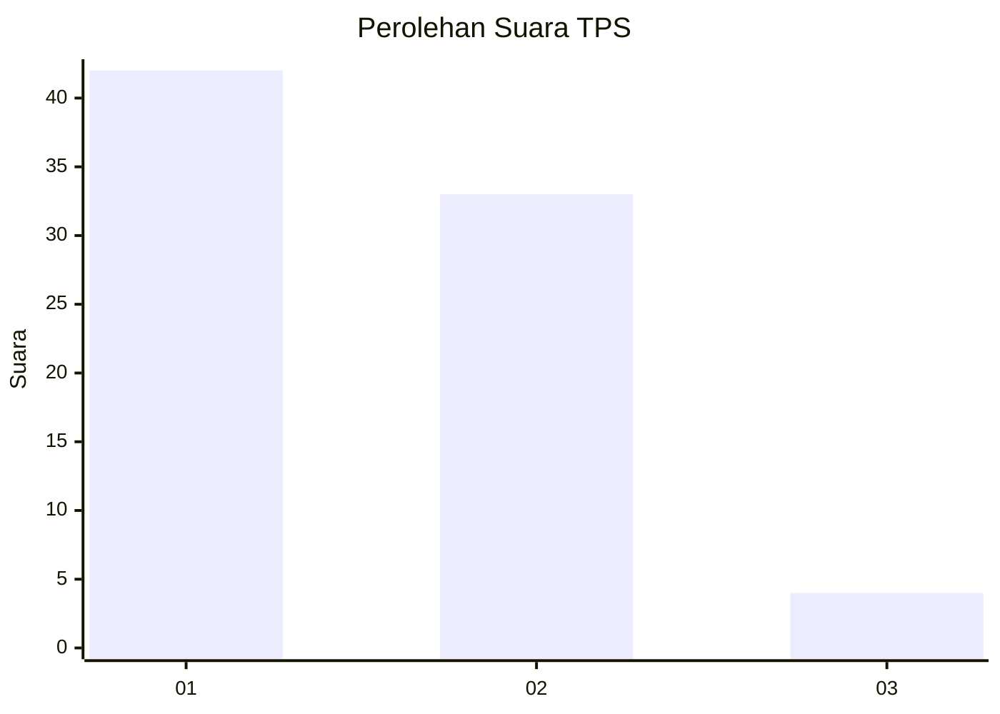
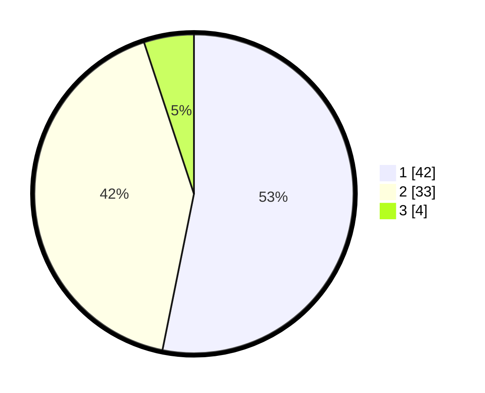

# Hasil

## Grafik

## Tabel

| No. | Nama Paslon    | Suara | Suara (raw) | Persentase |
|:--- |:-------------- | -----:| -----------:| ----------:|
| 1   | ANIES MUHAIMIN | 42    | [42][p-1]   | 53,16      |
| 2   | PRABOWO GIBRAN | 33    | [33][p-2]   | 41,77      |
| 3   | GANJAR MAHFUD  | 4     | [4][p-3]    | 5,06       |

[p-1]: https://github.com/gigit-pemilu/pemilu-2024-32-jawa-barat/blob/main/pilpres/hitung-suara/sub/32-jawa-barat/sub/02-sukabumi/sub/33-sukaraja/sub/2003-langensari/sub/011-tps/sub/paslon-1.txt
[p-2]: https://github.com/gigit-pemilu/pemilu-2024-32-jawa-barat/blob/main/pilpres/hitung-suara/sub/32-jawa-barat/sub/02-sukabumi/sub/33-sukaraja/sub/2003-langensari/sub/011-tps/sub/paslon-2.txt
[p-3]: https://github.com/gigit-pemilu/pemilu-2024-32-jawa-barat/blob/main/pilpres/hitung-suara/sub/32-jawa-barat/sub/02-sukabumi/sub/33-sukaraja/sub/2003-langensari/sub/011-tps/sub/paslon-3.txt

## Foto C Plano

https://sirekap-obj-formc.kpu.go.id/d2a4/pemilu/ppwp/32/02/33/20/03/3202332003011-20240220-154718--068f92cc-8300-4928-9d1b-41c7e77dc380.jpg

https://sirekap-obj-formc.kpu.go.id/d2a4/pemilu/ppwp/32/02/33/20/03/3202332003011-20240215-015247--7519d3da-8dbb-4678-a1f7-ad0f8125e6d6.jpg

https://sirekap-obj-formc.kpu.go.id/d2a4/pemilu/ppwp/32/02/33/20/03/3202332003011-20240215-015337--6d1c9875-6f30-43e6-8720-5ed342490021.jpg

## Metadata

| Key        | Value               |
| ---------- | ------------------- |
| Time Stamp | 2024-02-20 16:00:00 |

