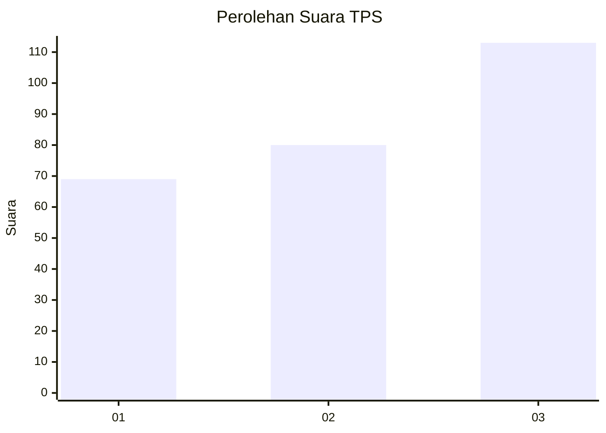
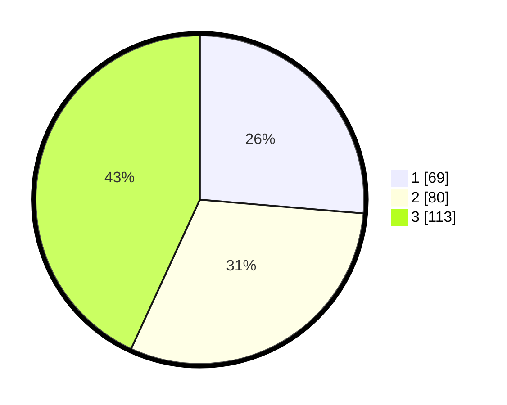

# Hasil

## Grafik

## Tabel

| No. | Nama Paslon    | Suara | Suara (raw) | Persentase |
|:--- |:-------------- | -----:| -----------:| ----------:|
| 1   | ANIES MUHAIMIN | 69    | [69][p-1]   | 26,34      |
| 2   | PRABOWO GIBRAN | 80    | [80][p-2]   | 30,53      |
| 3   | GANJAR MAHFUD  | 113   | [113][p-3]  | 43,13      |

[p-1]: https://github.com/gigit-pemilu/pemilu-2024-32-jawa-barat/blob/main/pilpres/hitung-suara/sub/32-jawa-barat/sub/02-sukabumi/sub/33-sukaraja/sub/2003-langensari/sub/018-tps/sub/paslon-1.txt
[p-2]: https://github.com/gigit-pemilu/pemilu-2024-32-jawa-barat/blob/main/pilpres/hitung-suara/sub/32-jawa-barat/sub/02-sukabumi/sub/33-sukaraja/sub/2003-langensari/sub/018-tps/sub/paslon-2.txt
[p-3]: https://github.com/gigit-pemilu/pemilu-2024-32-jawa-barat/blob/main/pilpres/hitung-suara/sub/32-jawa-barat/sub/02-sukabumi/sub/33-sukaraja/sub/2003-langensari/sub/018-tps/sub/paslon-3.txt

## Foto C Plano

https://sirekap-obj-formc.kpu.go.id/774e/pemilu/ppwp/32/02/33/20/03/3202332003018-20240220-163509--bf1d4977-7b23-4964-9f8c-f659ee626176.jpg

https://sirekap-obj-formc.kpu.go.id/774e/pemilu/ppwp/32/02/33/20/03/3202332003018-20240215-001258--7575170d-1abd-4e97-8485-65688860c0ec.jpg

https://sirekap-obj-formc.kpu.go.id/774e/pemilu/ppwp/32/02/33/20/03/3202332003018-20240215-001328--393231da-d435-47b6-8eec-a0a09501b8f6.jpg

## Metadata

| Key        | Value               |
| ---------- | ------------------- |
| Time Stamp | 2024-02-20 17:00:00 |

