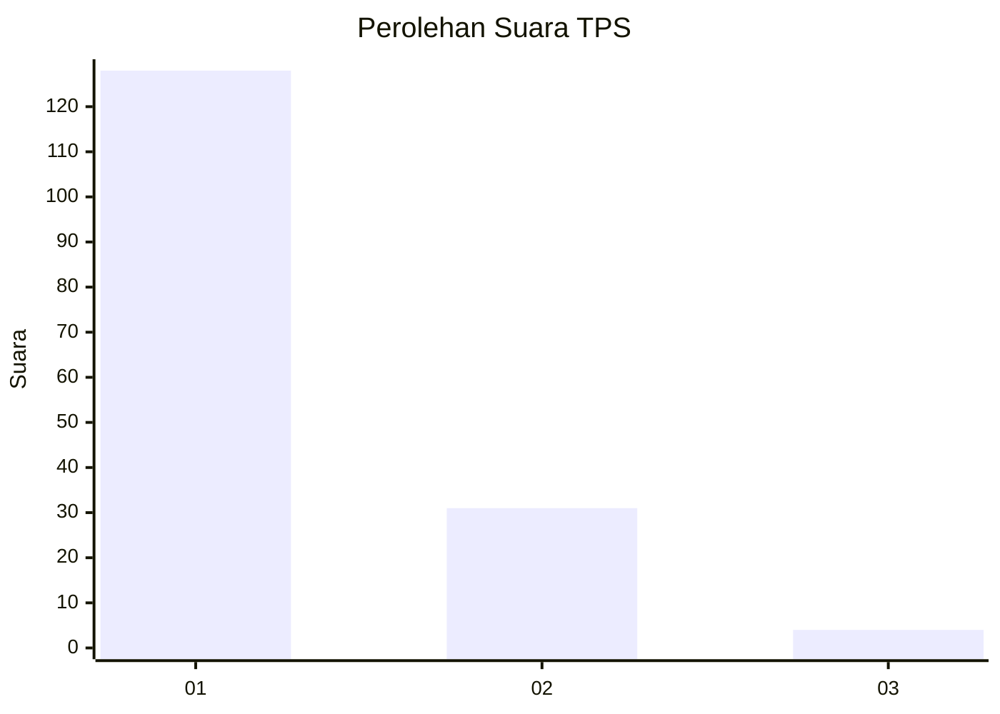
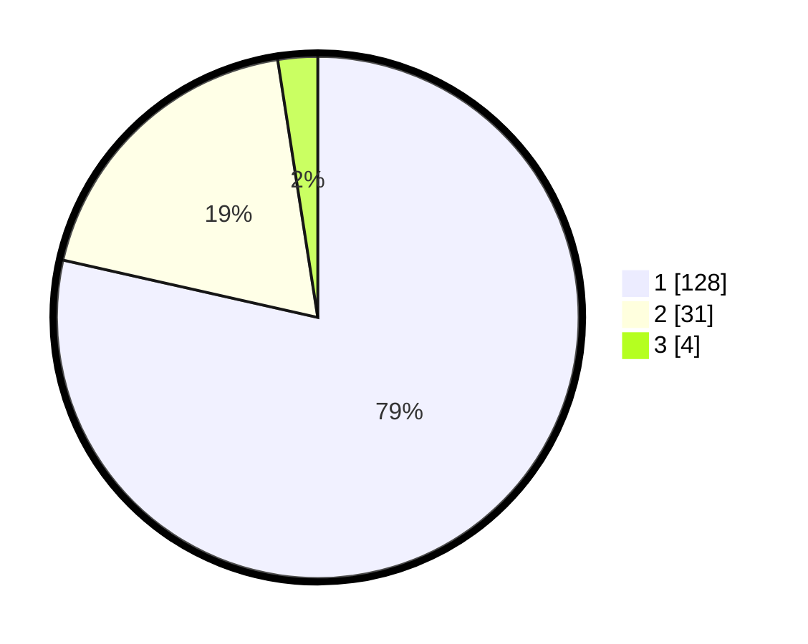

# Hasil

## Grafik

## Tabel

| No. | Nama Paslon    | Suara | Suara (raw) | Persentase |
|:--- |:-------------- | -----:| -----------:| ----------:|
| 1   | ANIES MUHAIMIN | 128   | [128][p-1]  | 78,53      |
| 2   | PRABOWO GIBRAN | 31    | [31][p-2]   | 19,02      |
| 3   | GANJAR MAHFUD  | 4     | [4][p-3]    | 2,45       |

[p-1]: https://github.com/gigit-pemilu/pemilu-2024-32-jawa-barat/blob/main/pilpres/hitung-suara/sub/32-jawa-barat/sub/02-sukabumi/sub/33-sukaraja/sub/2003-langensari/sub/028-tps/sub/paslon-1.txt
[p-2]: https://github.com/gigit-pemilu/pemilu-2024-32-jawa-barat/blob/main/pilpres/hitung-suara/sub/32-jawa-barat/sub/02-sukabumi/sub/33-sukaraja/sub/2003-langensari/sub/028-tps/sub/paslon-2.txt
[p-3]: https://github.com/gigit-pemilu/pemilu-2024-32-jawa-barat/blob/main/pilpres/hitung-suara/sub/32-jawa-barat/sub/02-sukabumi/sub/33-sukaraja/sub/2003-langensari/sub/028-tps/sub/paslon-3.txt

## Foto C Plano

https://sirekap-obj-formc.kpu.go.id/2b60/pemilu/ppwp/32/02/33/20/03/3202332003028-20240220-173713--7091f029-a5c5-4e7f-b3c5-a416d579afb6.jpg

https://sirekap-obj-formc.kpu.go.id/2b60/pemilu/ppwp/32/02/33/20/03/3202332003028-20240220-173816--afba9b37-9513-45d7-a3e8-b31ac841ac73.jpg

https://sirekap-obj-formc.kpu.go.id/2b60/pemilu/ppwp/32/02/33/20/03/3202332003028-20240220-173843--177fb2d4-39cb-4d51-8a2a-d92a374e4d0b.jpg

## Metadata

| Key        | Value               |
| ---------- | ------------------- |
| Time Stamp | 2024-02-21 09:00:00 |

