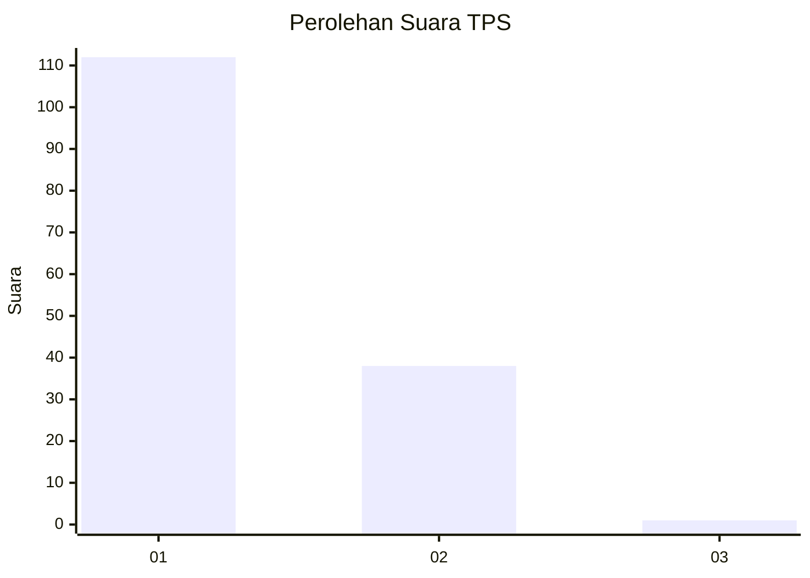
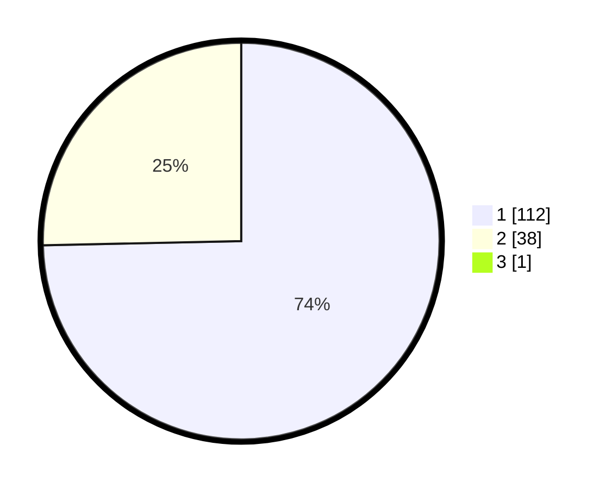

# Hasil

## Grafik

## Tabel

| No. | Nama Paslon    | Suara | Suara (raw) | Persentase |
|:--- |:-------------- | -----:| -----------:| ----------:|
| 1   | ANIES MUHAIMIN | 112   | [112][p-1]  | 74,17      |
| 2   | PRABOWO GIBRAN | 38    | [38][p-2]   | 25,17      |
| 3   | GANJAR MAHFUD  | 1     | [1][p-3]    | 0,66       |

[p-1]: https://github.com/gigit-pemilu/pemilu-2024-32-jawa-barat/blob/main/pilpres/hitung-suara/sub/32-jawa-barat/sub/02-sukabumi/sub/33-sukaraja/sub/2003-langensari/sub/029-tps/sub/paslon-1.txt
[p-2]: https://github.com/gigit-pemilu/pemilu-2024-32-jawa-barat/blob/main/pilpres/hitung-suara/sub/32-jawa-barat/sub/02-sukabumi/sub/33-sukaraja/sub/2003-langensari/sub/029-tps/sub/paslon-2.txt
[p-3]: https://github.com/gigit-pemilu/pemilu-2024-32-jawa-barat/blob/main/pilpres/hitung-suara/sub/32-jawa-barat/sub/02-sukabumi/sub/33-sukaraja/sub/2003-langensari/sub/029-tps/sub/paslon-3.txt

## Foto C Plano

https://sirekap-obj-formc.kpu.go.id/82ca/pemilu/ppwp/32/02/33/20/03/3202332003029-20240220-174034--06cd48f2-a1ce-4ca0-9a23-9b5f80c910f9.jpg

https://sirekap-obj-formc.kpu.go.id/82ca/pemilu/ppwp/32/02/33/20/03/3202332003029-20240214-194201--c275063c-5eb8-473d-a871-5b103ea720ba.jpg

https://sirekap-obj-formc.kpu.go.id/82ca/pemilu/ppwp/32/02/33/20/03/3202332003029-20240214-192604--0f3cd637-f35d-427c-a83f-f9555b77f259.jpg

## Metadata

| Key        | Value               |
| ---------- | ------------------- |
| Time Stamp | 2024-02-20 18:00:00 |

