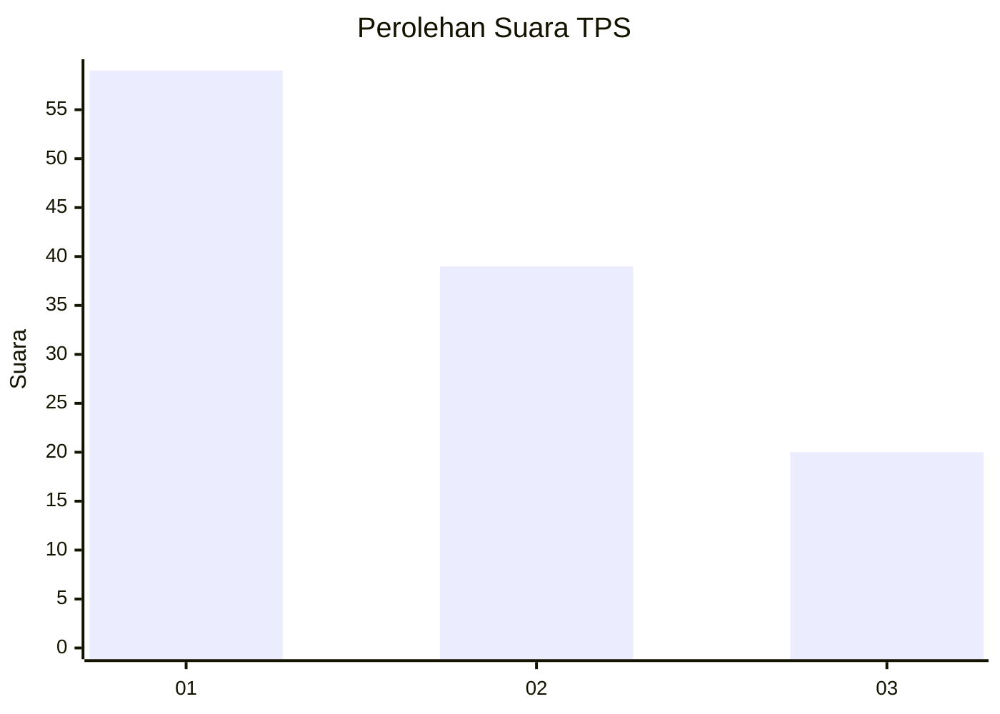
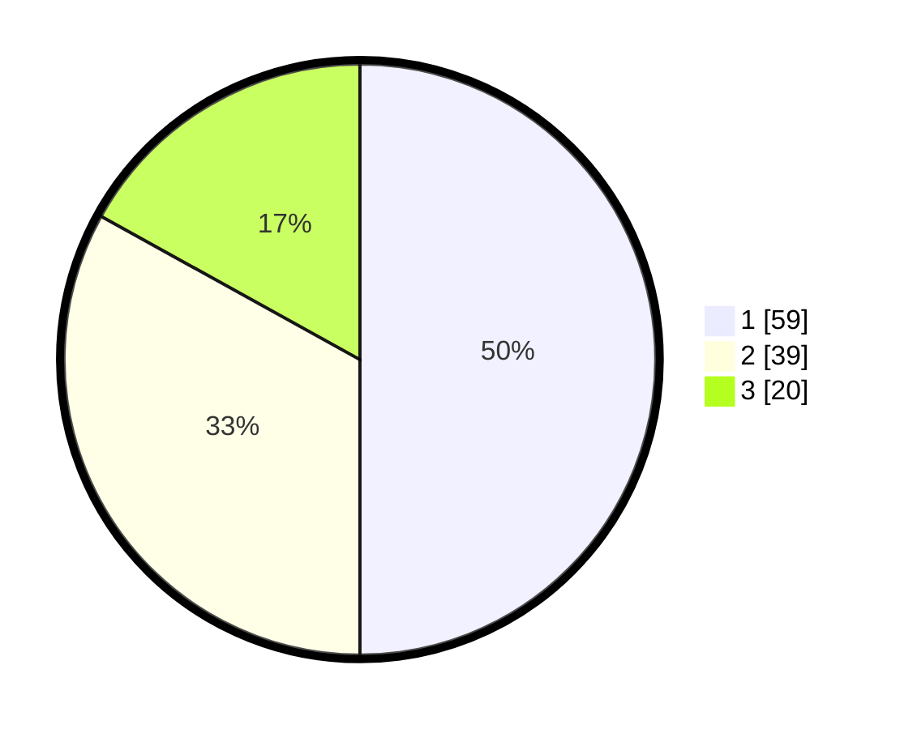

# Hasil

## Grafik

## Tabel

| No. | Nama Paslon    | Suara | Suara (raw) | Persentase |
|:--- |:-------------- | -----:| -----------:| ----------:|
| 1   | ANIES MUHAIMIN | 59    | [59][p-1]   | 50,00      |
| 2   | PRABOWO GIBRAN | 39    | [39][p-2]   | 33,05      |
| 3   | GANJAR MAHFUD  | 20    | [20][p-3]   | 16,95      |

[p-1]: https://github.com/gigit-pemilu/pemilu-2024/blob/main/pilpres/hitung-suara/sub/32-jawa-barat/sub/02-sukabumi/sub/33-sukaraja/sub/2005-limbangan/sub/026-tps/sub/paslon-1.txt
[p-2]: https://github.com/gigit-pemilu/pemilu-2024/blob/main/pilpres/hitung-suara/sub/32-jawa-barat/sub/02-sukabumi/sub/33-sukaraja/sub/2005-limbangan/sub/026-tps/sub/paslon-2.txt
[p-3]: https://github.com/gigit-pemilu/pemilu-2024/blob/main/pilpres/hitung-suara/sub/32-jawa-barat/sub/02-sukabumi/sub/33-sukaraja/sub/2005-limbangan/sub/026-tps/sub/paslon-3.txt

## Foto C Plano

https://sirekap-obj-formc.kpu.go.id/5d24/pemilu/ppwp/32/02/33/20/05/3202332005026-20240214-212545--1be9f0ee-1051-4c56-96f8-e60e57c1c429.jpg

https://sirekap-obj-formc.kpu.go.id/5d24/pemilu/ppwp/32/02/33/20/05/3202332005026-20240215-013654--18f2d282-7520-44e9-bc30-95250be77be9.jpg

https://sirekap-obj-formc.kpu.go.id/5d24/pemilu/ppwp/32/02/33/20/05/3202332005026-20240214-212601--b8f33274-f05b-47de-98ac-da919431ced8.jpg

## Metadata

| Key        | Value               |
| ---------- | ------------------- |
| Time Stamp | 2024-02-16 10:00:28 |

