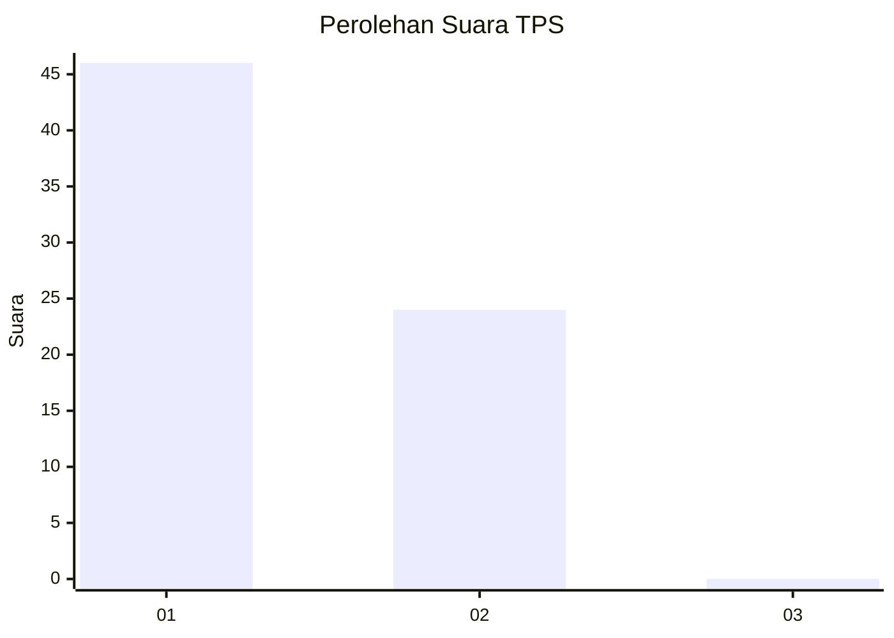
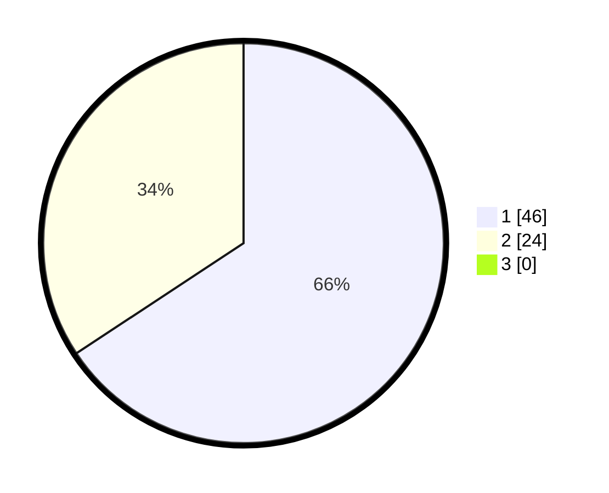

# Hasil

## Grafik

## Tabel

| No. | Nama Paslon    | Suara | Suara (raw) | Persentase |
|:--- |:-------------- | -----:| -----------:| ----------:|
| 1   | ANIES MUHAIMIN | 46    | [46][p-1]   | 65,71      |
| 2   | PRABOWO GIBRAN | 24    | [24][p-2]   | 34,29      |
| 3   | GANJAR MAHFUD  | 0     | [0][p-3]    | 0,00       |

[p-1]: https://github.com/gigit-pemilu/pemilu-2024/blob/main/pilpres/hitung-suara/sub/32-jawa-barat/sub/02-sukabumi/sub/33-sukaraja/sub/2008-selawangi/sub/008-tps/sub/paslon-1.txt
[p-2]: https://github.com/gigit-pemilu/pemilu-2024/blob/main/pilpres/hitung-suara/sub/32-jawa-barat/sub/02-sukabumi/sub/33-sukaraja/sub/2008-selawangi/sub/008-tps/sub/paslon-2.txt
[p-3]: https://github.com/gigit-pemilu/pemilu-2024/blob/main/pilpres/hitung-suara/sub/32-jawa-barat/sub/02-sukabumi/sub/33-sukaraja/sub/2008-selawangi/sub/008-tps/sub/paslon-3.txt

## Foto C Plano

https://sirekap-obj-formc.kpu.go.id/1f1d/pemilu/ppwp/32/02/33/20/08/3202332008008-20240214-193735--496adeeb-920d-4d1f-b900-2a6d2bfe3011.jpg

https://sirekap-obj-formc.kpu.go.id/1f1d/pemilu/ppwp/32/02/33/20/08/3202332008008-20240214-195413--a617de75-8d29-4fe1-ae40-f4cf8bd565f5.jpg

https://sirekap-obj-formc.kpu.go.id/1f1d/pemilu/ppwp/32/02/33/20/08/3202332008008-20240214-193953--e5905297-b7da-48fd-91c3-9f5c201f41ce.jpg

## Metadata

| Key        | Value               |
| ---------- | ------------------- |
| Time Stamp | 2024-02-16 10:30:29 |

