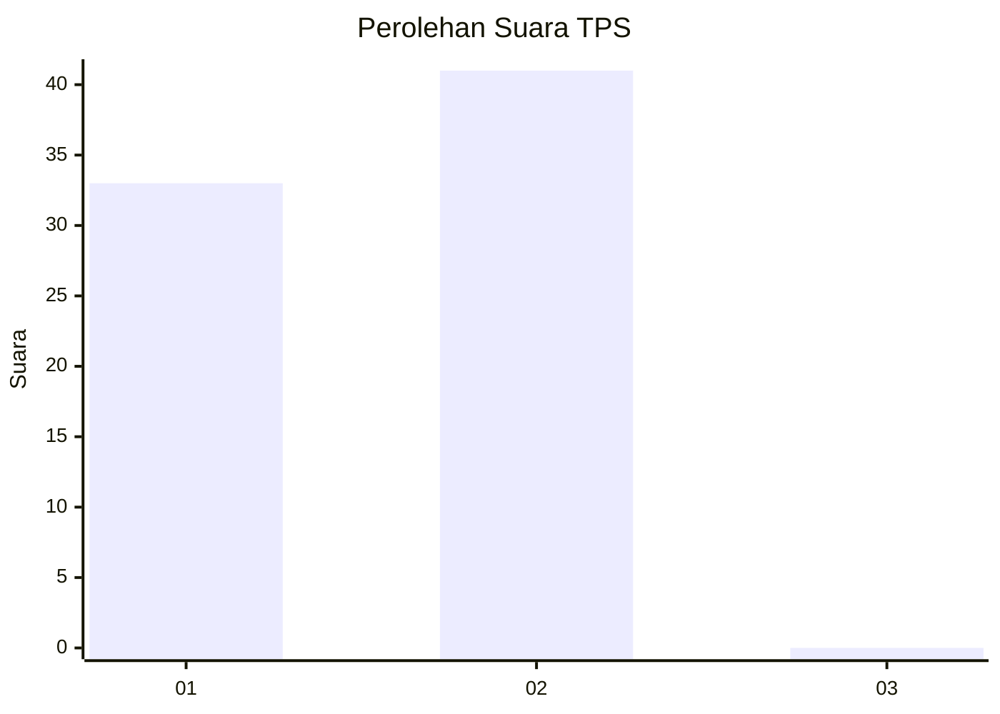
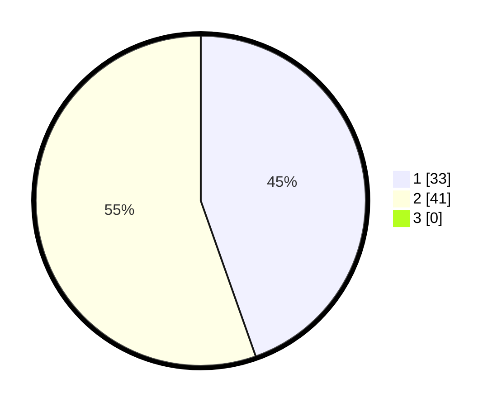

# Hasil

## Grafik

## Tabel

| No. | Nama Paslon    | Suara | Suara (raw) | Persentase |
|:--- |:-------------- | -----:| -----------:| ----------:|
| 1   | ANIES MUHAIMIN | 33    | [33][p-1]   | 44,59      |
| 2   | PRABOWO GIBRAN | 41    | [41][p-2]   | 55,41      |
| 3   | GANJAR MAHFUD  | 0     | [0][p-3]    | 0,00       |

[p-1]: https://github.com/gigit-pemilu/pemilu-2024/blob/main/pilpres/hitung-suara/sub/32-jawa-barat/sub/02-sukabumi/sub/33-sukaraja/sub/2008-selawangi/sub/017-tps/sub/paslon-1.txt
[p-2]: https://github.com/gigit-pemilu/pemilu-2024/blob/main/pilpres/hitung-suara/sub/32-jawa-barat/sub/02-sukabumi/sub/33-sukaraja/sub/2008-selawangi/sub/017-tps/sub/paslon-2.txt
[p-3]: https://github.com/gigit-pemilu/pemilu-2024/blob/main/pilpres/hitung-suara/sub/32-jawa-barat/sub/02-sukabumi/sub/33-sukaraja/sub/2008-selawangi/sub/017-tps/sub/paslon-3.txt

## Foto C Plano

https://sirekap-obj-formc.kpu.go.id/393d/pemilu/ppwp/32/02/33/20/08/3202332008017-20240221-163846--3436e864-1971-4e95-92f6-b54dbfa91b78.jpg

https://sirekap-obj-formc.kpu.go.id/393d/pemilu/ppwp/32/02/33/20/08/3202332008017-20240221-163916--e01f34e2-d51b-4651-a09c-004920dbe0d6.jpg

https://sirekap-obj-formc.kpu.go.id/393d/pemilu/ppwp/32/02/33/20/08/3202332008017-20240221-164046--df17c1b4-589b-4a1b-ac9d-de5dfdd9c740.jpg

## Metadata

| Key        | Value               |
| ---------- | ------------------- |
| Time Stamp | 2024-02-24 22:31:28 |

