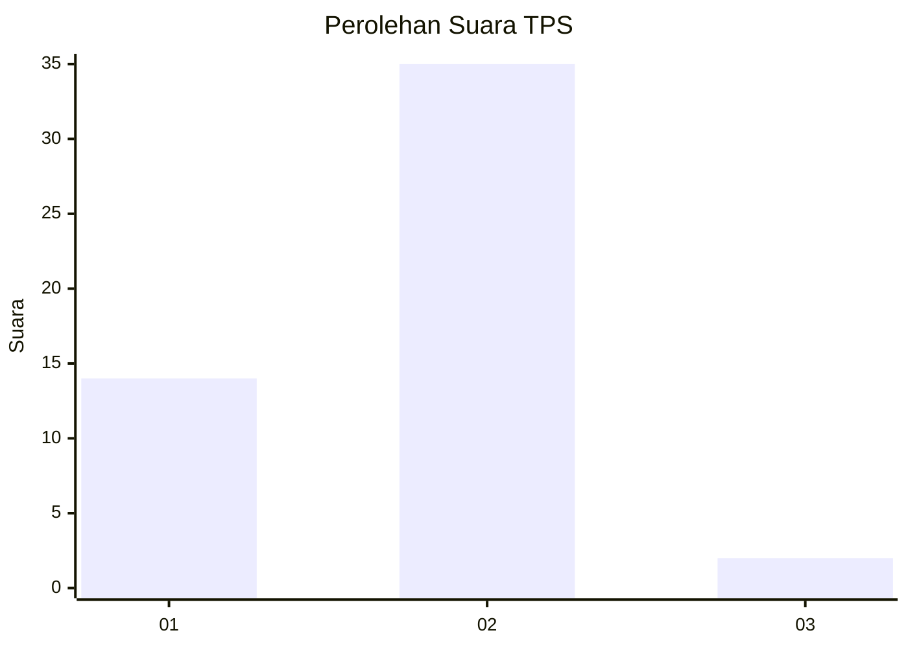
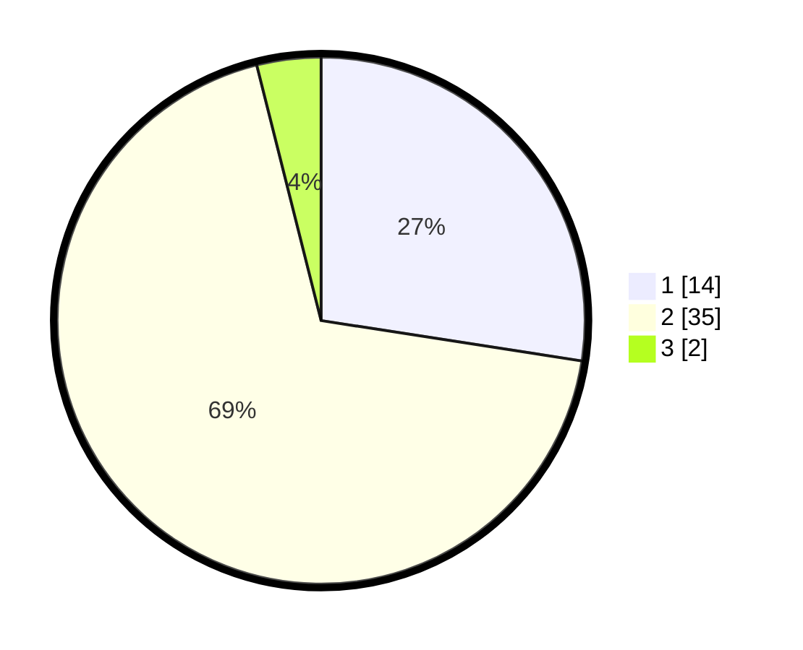

# Hasil

## Grafik

## Tabel

| No. | Nama Paslon    | Suara | Suara (raw) | Persentase |
|:--- |:-------------- | -----:| -----------:| ----------:|
| 1   | ANIES MUHAIMIN | 14    | [14][p-1]   | 27,45      |
| 2   | PRABOWO GIBRAN | 35    | [35][p-2]   | 68,63      |
| 3   | GANJAR MAHFUD  | 2     | [2][p-3]    | 3,92       |

[p-1]: https://github.com/gigit-pemilu/pemilu-2024/blob/main/pilpres/hitung-suara/sub/32-jawa-barat/sub/02-sukabumi/sub/33-sukaraja/sub/2008-selawangi/sub/022-tps/sub/paslon-1.txt
[p-2]: https://github.com/gigit-pemilu/pemilu-2024/blob/main/pilpres/hitung-suara/sub/32-jawa-barat/sub/02-sukabumi/sub/33-sukaraja/sub/2008-selawangi/sub/022-tps/sub/paslon-2.txt
[p-3]: https://github.com/gigit-pemilu/pemilu-2024/blob/main/pilpres/hitung-suara/sub/32-jawa-barat/sub/02-sukabumi/sub/33-sukaraja/sub/2008-selawangi/sub/022-tps/sub/paslon-3.txt

## Foto C Plano

https://sirekap-obj-formc.kpu.go.id/6e0f/pemilu/ppwp/32/02/33/20/08/3202332008022-20240214-200936--81e14afb-275b-4f3f-b068-cc5aadc2b99a.jpg

https://sirekap-obj-formc.kpu.go.id/6e0f/pemilu/ppwp/32/02/33/20/08/3202332008022-20240214-201125--b0f0e75d-4417-42aa-b42c-15631f612126.jpg

https://sirekap-obj-formc.kpu.go.id/6e0f/pemilu/ppwp/32/02/33/20/08/3202332008022-20240214-201244--9c1aec7e-bdb6-42f4-9bc9-57737a95932c.jpg

## Metadata

| Key        | Value               |
| ---------- | ------------------- |
| Time Stamp | 2024-02-15 15:00:29 |

