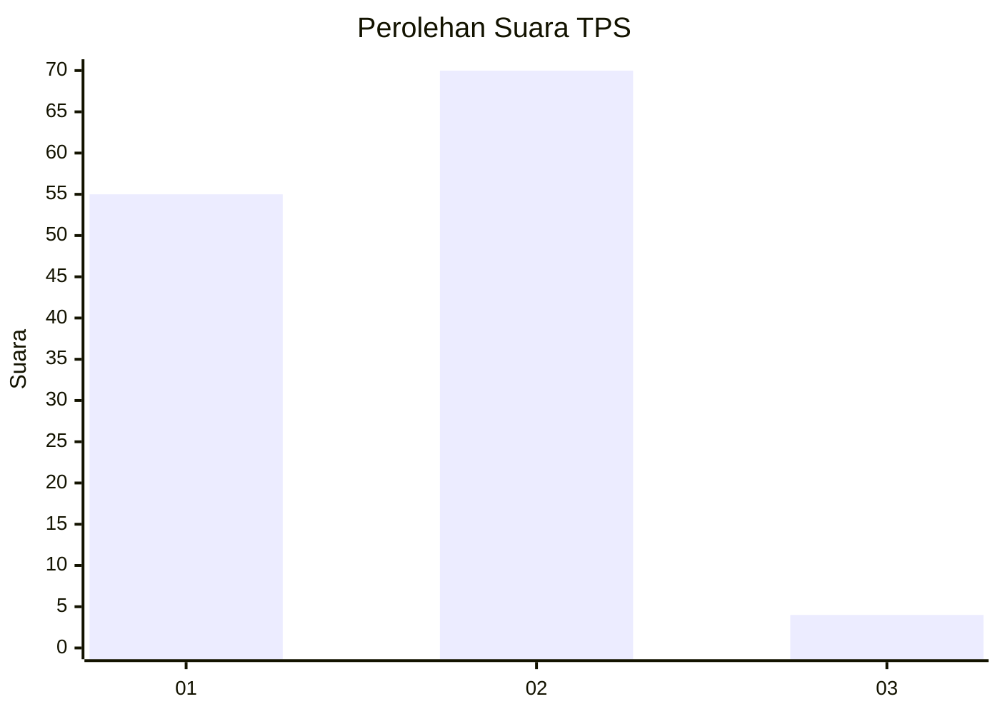
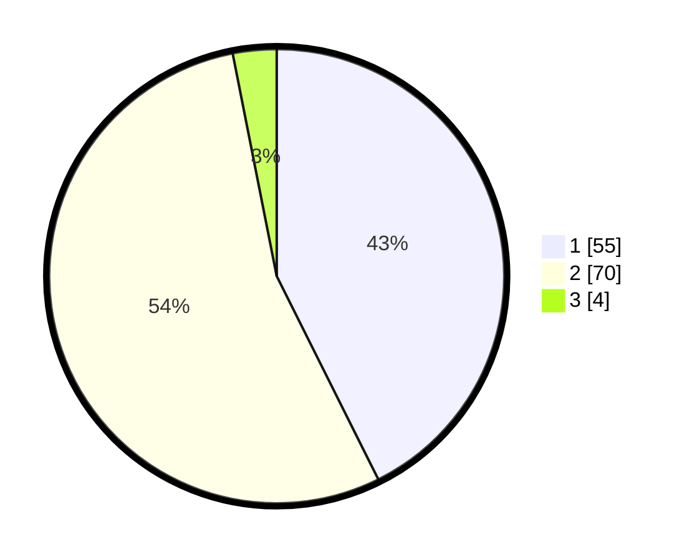

# Hasil

## Grafik

## Tabel

| No. | Nama Paslon    | Suara | Suara (raw) | Persentase |
|:--- |:-------------- | -----:| -----------:| ----------:|
| 1   | ANIES MUHAIMIN | 55    | [55][p-1]   | 42,64      |
| 2   | PRABOWO GIBRAN | 70    | [70][p-2]   | 54,26      |
| 3   | GANJAR MAHFUD  | 4     | [4][p-3]    | 3,10       |

[p-1]: https://github.com/gigit-pemilu/pemilu-2024/blob/main/pilpres/hitung-suara/sub/32-jawa-barat/sub/02-sukabumi/sub/35-cireunghas/sub/2001-cireunghas/sub/005-tps/sub/paslon-1.txt
[p-2]: https://github.com/gigit-pemilu/pemilu-2024/blob/main/pilpres/hitung-suara/sub/32-jawa-barat/sub/02-sukabumi/sub/35-cireunghas/sub/2001-cireunghas/sub/005-tps/sub/paslon-2.txt
[p-3]: https://github.com/gigit-pemilu/pemilu-2024/blob/main/pilpres/hitung-suara/sub/32-jawa-barat/sub/02-sukabumi/sub/35-cireunghas/sub/2001-cireunghas/sub/005-tps/sub/paslon-3.txt

## Foto C Plano

https://sirekap-obj-formc.kpu.go.id/f9f7/pemilu/ppwp/32/02/35/20/01/3202352001005-20240214-234537--d9bba3b1-0304-4d3a-be12-e1702a8f0e2a.jpg

https://sirekap-obj-formc.kpu.go.id/f9f7/pemilu/ppwp/32/02/35/20/01/3202352001005-20240214-234630--cb34068b-0872-4787-ae7b-fc7afa2820a0.jpg

https://sirekap-obj-formc.kpu.go.id/f9f7/pemilu/ppwp/32/02/35/20/01/3202352001005-20240214-234716--bb75bc22-94d5-4416-850f-c435916050c6.jpg

## Metadata

| Key        | Value               |
| ---------- | ------------------- |
| Time Stamp | 2024-02-15 12:00:28 |

