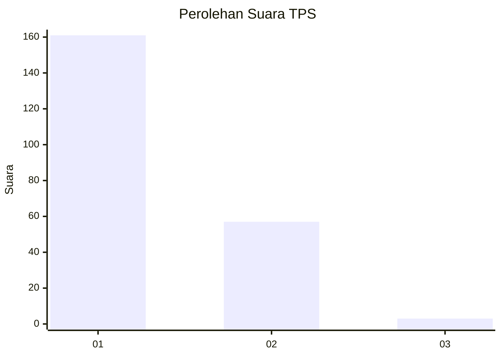
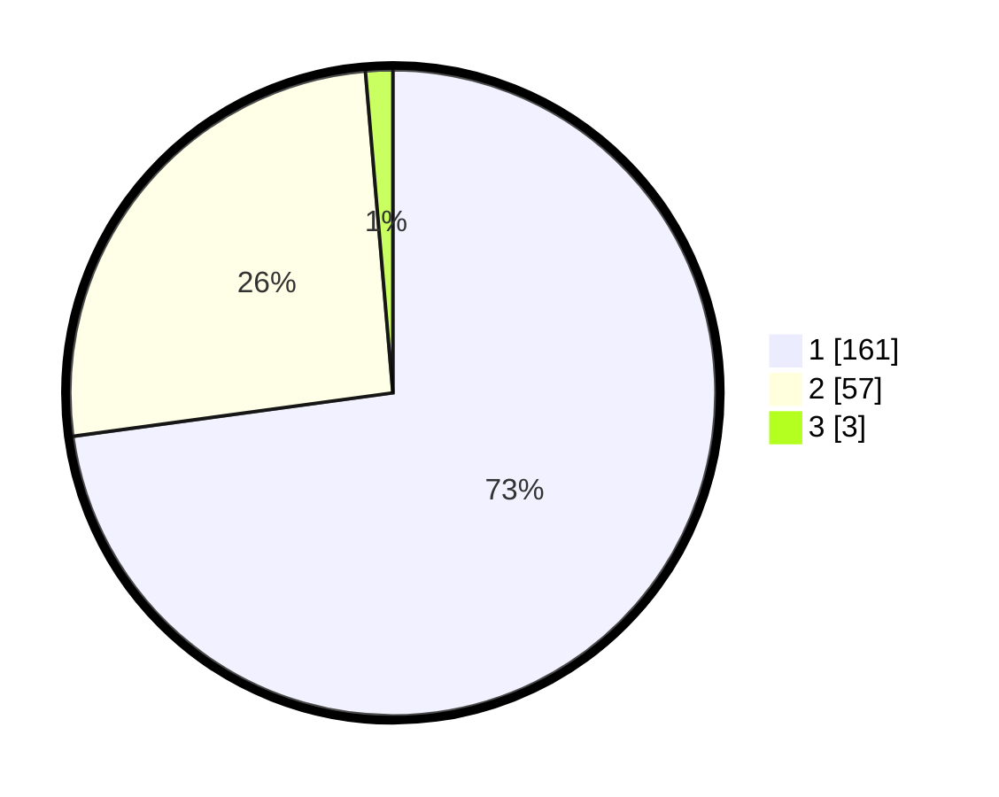

# Hasil

## Grafik

## Tabel

| No. | Nama Paslon    | Suara | Suara (raw) | Persentase |
|:--- |:-------------- | -----:| -----------:| ----------:|
| 1   | ANIES MUHAIMIN | 161   | [161][p-1]  | 72,85      |
| 2   | PRABOWO GIBRAN | 57    | [57][p-2]   | 25,79      |
| 3   | GANJAR MAHFUD  | 3     | [3][p-3]    | 1,36       |

[p-1]: https://github.com/gigit-pemilu/pemilu-2024/blob/main/pilpres/hitung-suara/sub/32-jawa-barat/sub/02-sukabumi/sub/37-pabuaran/sub/2001-pabuaran/sub/006-tps/sub/paslon-1.txt
[p-2]: https://github.com/gigit-pemilu/pemilu-2024/blob/main/pilpres/hitung-suara/sub/32-jawa-barat/sub/02-sukabumi/sub/37-pabuaran/sub/2001-pabuaran/sub/006-tps/sub/paslon-2.txt
[p-3]: https://github.com/gigit-pemilu/pemilu-2024/blob/main/pilpres/hitung-suara/sub/32-jawa-barat/sub/02-sukabumi/sub/37-pabuaran/sub/2001-pabuaran/sub/006-tps/sub/paslon-3.txt

## Foto C Plano

https://sirekap-obj-formc.kpu.go.id/3f4e/pemilu/ppwp/32/02/37/20/01/3202372001006-20240220-080654--98474053-8daf-4e8b-8f7f-b0641954aacb.jpg

https://sirekap-obj-formc.kpu.go.id/3f4e/pemilu/ppwp/32/02/37/20/01/3202372001006-20240220-080702--25b72db2-6253-416b-adcd-e66f47e0a079.jpg

https://sirekap-obj-formc.kpu.go.id/3f4e/pemilu/ppwp/32/02/37/20/01/3202372001006-20240220-080710--8d326038-3bf2-4942-93a6-3447a5cbcd29.jpg

## Metadata

| Key        | Value               |
| ---------- | ------------------- |
| Time Stamp | 2024-02-22 10:00:00 |

