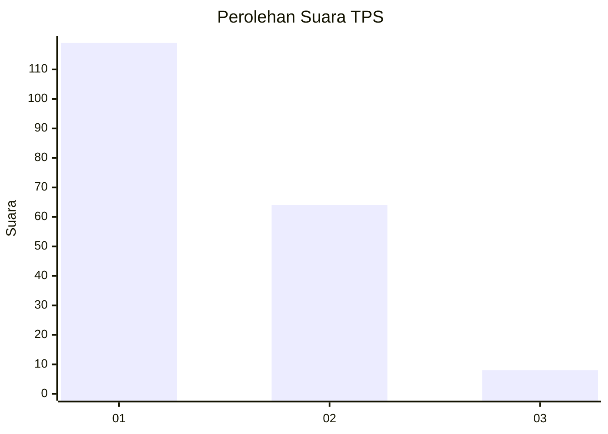
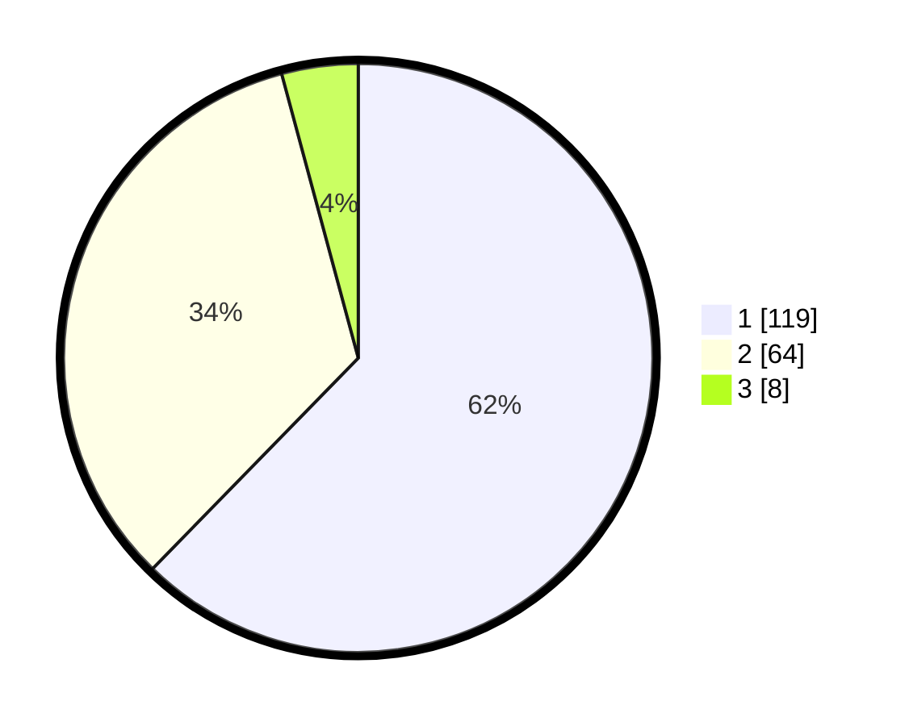

# Hasil

## Grafik

## Tabel

| No. | Nama Paslon    | Suara | Suara (raw) | Persentase |
|:--- |:-------------- | -----:| -----------:| ----------:|
| 1   | ANIES MUHAIMIN | 119   | [119][p-1]  | 62,30      |
| 2   | PRABOWO GIBRAN | 64    | [64][p-2]   | 33,51      |
| 3   | GANJAR MAHFUD  | 8     | [8][p-3]    | 4,19       |

[p-1]: https://github.com/gigit-pemilu/pemilu-2024-32-jawa-barat/blob/main/pilpres/hitung-suara/sub/32-jawa-barat/sub/02-sukabumi/sub/38-purabaya/sub/2007-cicukang/sub/005-tps/sub/paslon-1.txt
[p-2]: https://github.com/gigit-pemilu/pemilu-2024-32-jawa-barat/blob/main/pilpres/hitung-suara/sub/32-jawa-barat/sub/02-sukabumi/sub/38-purabaya/sub/2007-cicukang/sub/005-tps/sub/paslon-2.txt
[p-3]: https://github.com/gigit-pemilu/pemilu-2024-32-jawa-barat/blob/main/pilpres/hitung-suara/sub/32-jawa-barat/sub/02-sukabumi/sub/38-purabaya/sub/2007-cicukang/sub/005-tps/sub/paslon-3.txt

## Foto C Plano

https://sirekap-obj-formc.kpu.go.id/5ba5/pemilu/ppwp/32/02/38/20/07/3202382007005-20240214-194147--3fa3d869-a9f1-402d-949b-1a9f3fbba55b.jpg

https://sirekap-obj-formc.kpu.go.id/5ba5/pemilu/ppwp/32/02/38/20/07/3202382007005-20240214-194255--6867b8b4-ab38-4e6c-86a2-40f08ae8197c.jpg

https://sirekap-obj-formc.kpu.go.id/5ba5/pemilu/ppwp/32/02/38/20/07/3202382007005-20240215-092815--90764442-09c1-469d-9cbd-2cd5d7b601ed.jpg

## Metadata

| Key        | Value               |
| ---------- | ------------------- |
| Time Stamp | 2024-02-15 15:30:25 |

