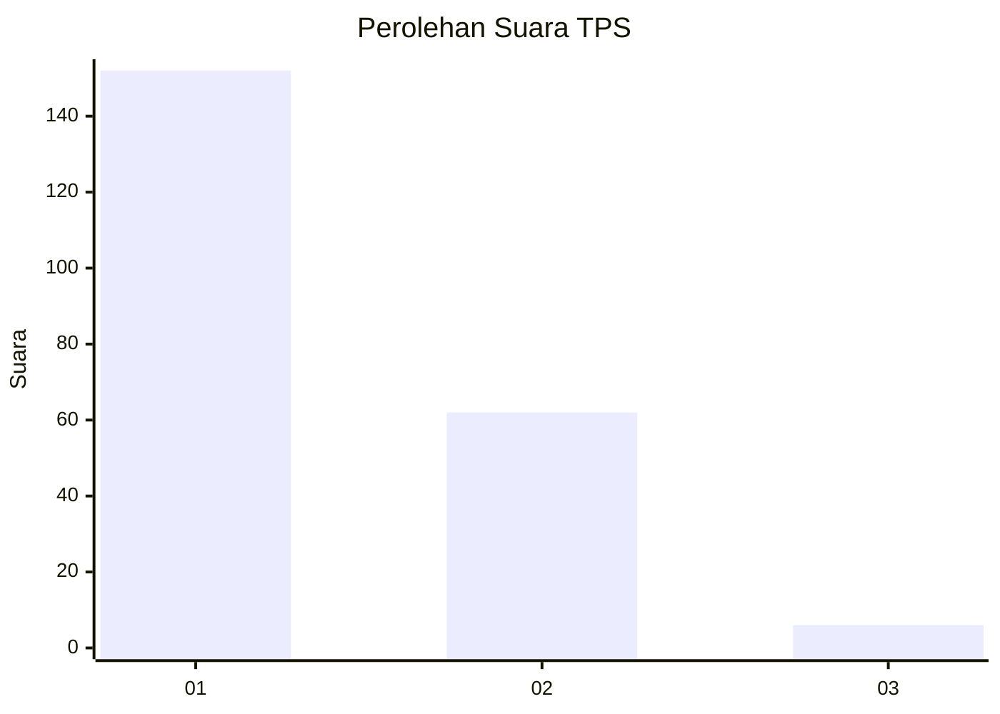
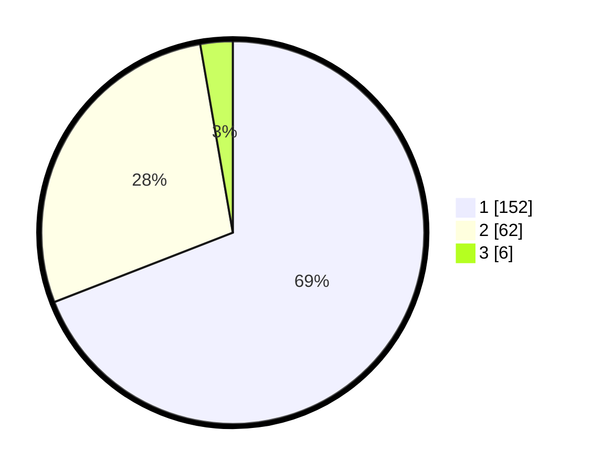

# Hasil

## Grafik

## Tabel

| No. | Nama Paslon    | Suara | Suara (raw) | Persentase |
|:--- |:-------------- | -----:| -----------:| ----------:|
| 1   | ANIES MUHAIMIN | 152   | [152][p-1]  | 69,09      |
| 2   | PRABOWO GIBRAN | 62    | [62][p-2]   | 28,18      |
| 3   | GANJAR MAHFUD  | 6     | [6][p-3]    | 2,73       |

[p-1]: https://github.com/gigit-pemilu/pemilu-2024-32-jawa-barat/blob/main/pilpres/hitung-suara/sub/32-jawa-barat/sub/02-sukabumi/sub/38-purabaya/sub/2007-cicukang/sub/015-tps/sub/paslon-1.txt
[p-2]: https://github.com/gigit-pemilu/pemilu-2024-32-jawa-barat/blob/main/pilpres/hitung-suara/sub/32-jawa-barat/sub/02-sukabumi/sub/38-purabaya/sub/2007-cicukang/sub/015-tps/sub/paslon-2.txt
[p-3]: https://github.com/gigit-pemilu/pemilu-2024-32-jawa-barat/blob/main/pilpres/hitung-suara/sub/32-jawa-barat/sub/02-sukabumi/sub/38-purabaya/sub/2007-cicukang/sub/015-tps/sub/paslon-3.txt

## Foto C Plano

https://sirekap-obj-formc.kpu.go.id/1724/pemilu/ppwp/32/02/38/20/07/3202382007015-20240215-062454--19cc9a5c-2a68-4788-80b0-8331699f4dda.jpg

https://sirekap-obj-formc.kpu.go.id/1724/pemilu/ppwp/32/02/38/20/07/3202382007015-20240215-062912--b1000c11-4684-41c7-975a-ac68f6839769.jpg

https://sirekap-obj-formc.kpu.go.id/1724/pemilu/ppwp/32/02/38/20/07/3202382007015-20240215-072145--f97acb2b-be5b-4473-9554-8343b46c4b9a.jpg

## Metadata

| Key        | Value               |
| ---------- | ------------------- |
| Time Stamp | 2024-02-16 09:00:28 |

