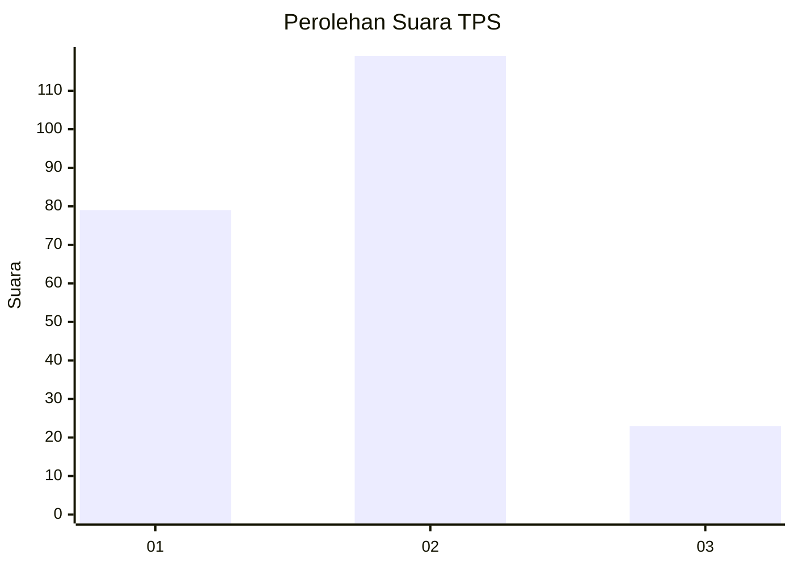
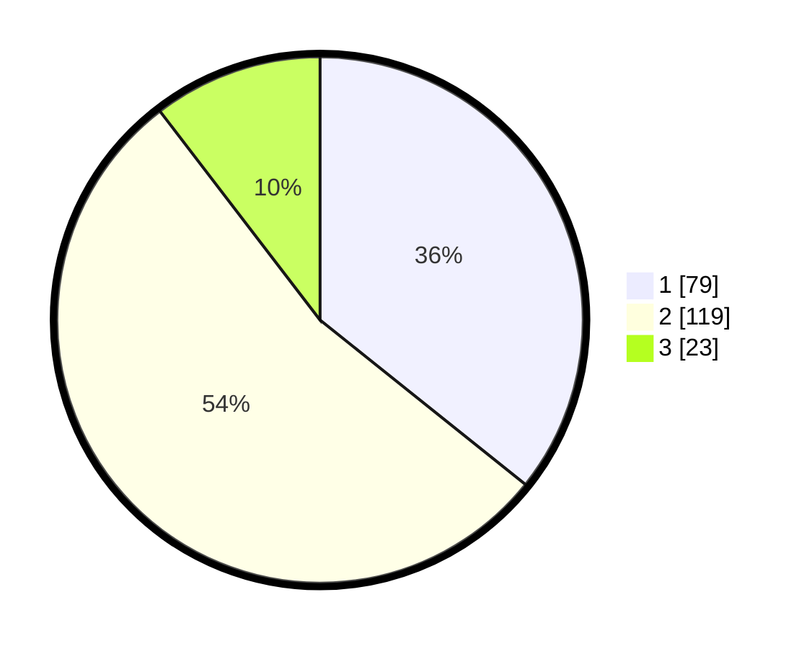

# Hasil

## Grafik

## Tabel

| No. | Nama Paslon    | Suara | Suara (raw) | Persentase |
|:--- |:-------------- | -----:| -----------:| ----------:|
| 1   | ANIES MUHAIMIN | 79    | [79][p-1]   | 35,75      |
| 2   | PRABOWO GIBRAN | 119   | [119][p-2]  | 53,85      |
| 3   | GANJAR MAHFUD  | 23    | [23][p-3]   | 10,41      |

[p-1]: https://github.com/gigit-pemilu/pemilu-2024-32-jawa-barat/blob/main/pilpres/hitung-suara/sub/32-jawa-barat/sub/02-sukabumi/sub/41-sagaranten/sub/2001-sagaranten/sub/001-tps/sub/paslon-1.txt
[p-2]: https://github.com/gigit-pemilu/pemilu-2024-32-jawa-barat/blob/main/pilpres/hitung-suara/sub/32-jawa-barat/sub/02-sukabumi/sub/41-sagaranten/sub/2001-sagaranten/sub/001-tps/sub/paslon-2.txt
[p-3]: https://github.com/gigit-pemilu/pemilu-2024-32-jawa-barat/blob/main/pilpres/hitung-suara/sub/32-jawa-barat/sub/02-sukabumi/sub/41-sagaranten/sub/2001-sagaranten/sub/001-tps/sub/paslon-3.txt

## Foto C Plano

https://sirekap-obj-formc.kpu.go.id/cb51/pemilu/ppwp/32/02/41/20/01/3202412001001-20240215-080719--49c5626d-48f8-4cce-a1a9-c507c90f4b38.jpg

https://sirekap-obj-formc.kpu.go.id/cb51/pemilu/ppwp/32/02/41/20/01/3202412001001-20240214-212417--5dd247be-f7ca-4029-b91e-cbef8e6e9520.jpg

https://sirekap-obj-formc.kpu.go.id/cb51/pemilu/ppwp/32/02/41/20/01/3202412001001-20240215-080840--a571d658-245c-4135-a93d-bb9ab451d0ac.jpg

## Metadata

| Key        | Value               |
| ---------- | ------------------- |
| Time Stamp | 2024-02-15 15:30:25 |

