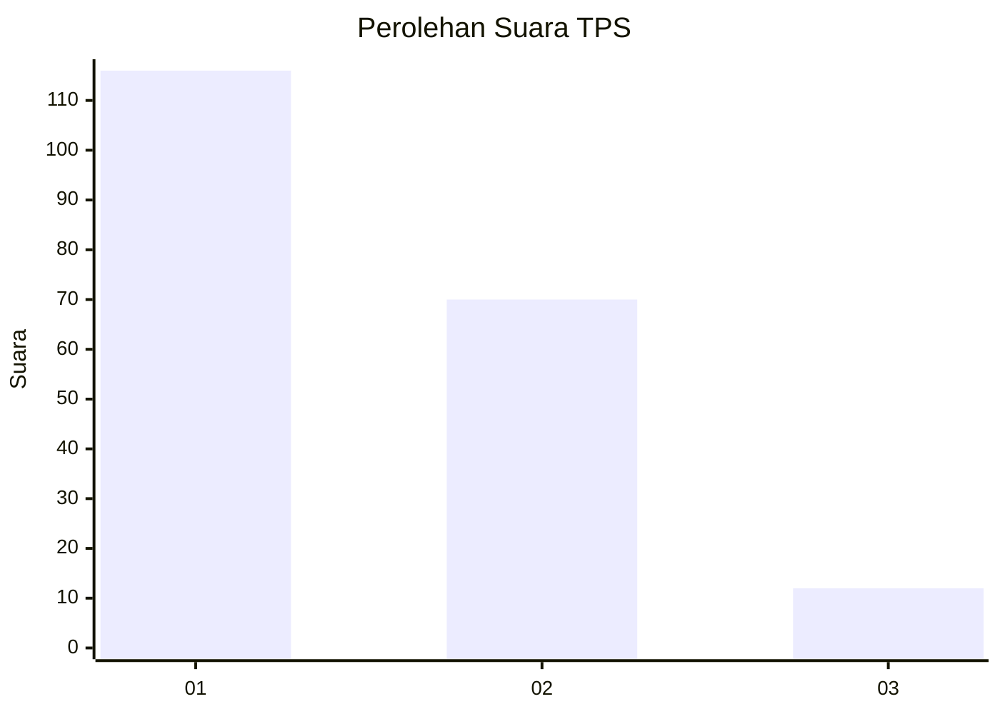
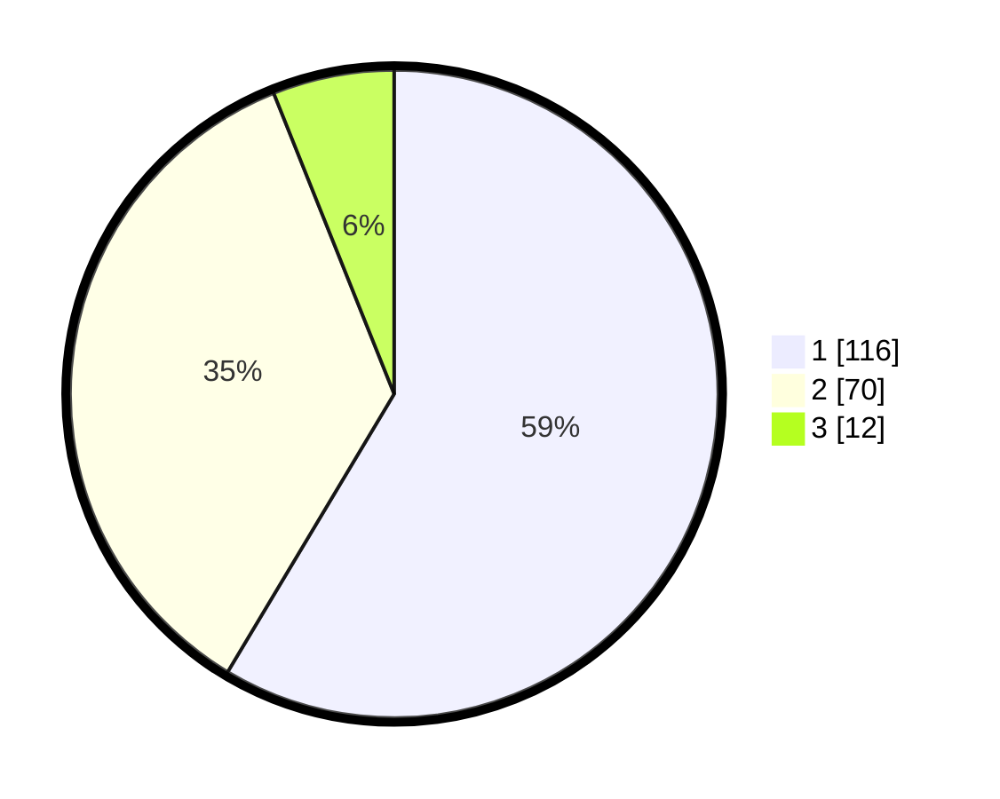

# Hasil

## Grafik

## Tabel

| No. | Nama Paslon    | Suara | Suara (raw) | Persentase |
|:--- |:-------------- | -----:| -----------:| ----------:|
| 1   | ANIES MUHAIMIN | 116   | [116][p-1]  | 58,59      |
| 2   | PRABOWO GIBRAN | 70    | [70][p-2]   | 35,35      |
| 3   | GANJAR MAHFUD  | 12    | [12][p-3]   | 6,06       |

[p-1]: https://github.com/gigit-pemilu/pemilu-2024/blob/main/pilpres/hitung-suara/sub/32-jawa-barat/sub/02-sukabumi/sub/41-sagaranten/sub/2009-sinarbentang/sub/003-tps/sub/paslon-1.txt
[p-2]: https://github.com/gigit-pemilu/pemilu-2024/blob/main/pilpres/hitung-suara/sub/32-jawa-barat/sub/02-sukabumi/sub/41-sagaranten/sub/2009-sinarbentang/sub/003-tps/sub/paslon-2.txt
[p-3]: https://github.com/gigit-pemilu/pemilu-2024/blob/main/pilpres/hitung-suara/sub/32-jawa-barat/sub/02-sukabumi/sub/41-sagaranten/sub/2009-sinarbentang/sub/003-tps/sub/paslon-3.txt

## Foto C Plano

https://sirekap-obj-formc.kpu.go.id/e8d9/pemilu/ppwp/32/02/41/20/09/3202412009003-20240214-222150--c7788b9c-7e09-4e2e-b9e5-247fda18e643.jpg

https://sirekap-obj-formc.kpu.go.id/e8d9/pemilu/ppwp/32/02/41/20/09/3202412009003-20240215-092544--eccd1e3c-aba6-4039-b4bf-65f0a1807d7d.jpg

https://sirekap-obj-formc.kpu.go.id/e8d9/pemilu/ppwp/32/02/41/20/09/3202412009003-20240215-065226--67a0eb00-cd79-4542-94c3-0889fe8a011d.jpg

## Metadata

| Key        | Value               |
| ---------- | ------------------- |
| Time Stamp | 2024-02-15 17:00:25 |

