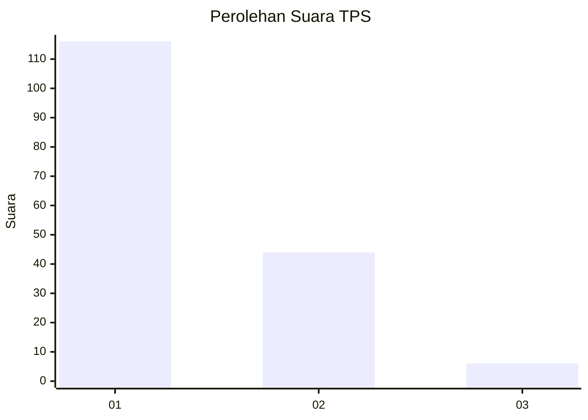
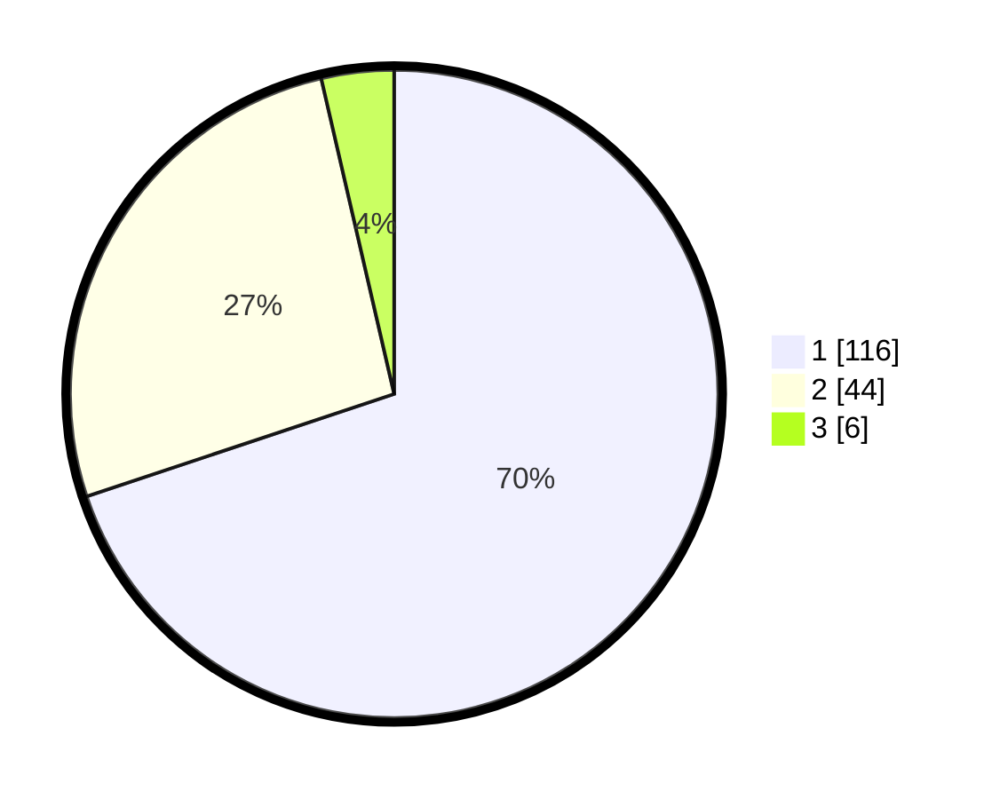

# Hasil

## Grafik

## Tabel

| No. | Nama Paslon    | Suara | Suara (raw) | Persentase |
|:--- |:-------------- | -----:| -----------:| ----------:|
| 1   | ANIES MUHAIMIN | 116   | [116][p-1]  | 69,88      |
| 2   | PRABOWO GIBRAN | 44    | [44][p-2]   | 26,51      |
| 3   | GANJAR MAHFUD  | 6     | [6][p-3]    | 3,61       |

[p-1]: https://github.com/gigit-pemilu/pemilu-2024-32-jawa-barat/blob/main/pilpres/hitung-suara/sub/32-jawa-barat/sub/02-sukabumi/sub/41-sagaranten/sub/2009-sinarbentang/sub/005-tps/sub/paslon-1.txt
[p-2]: https://github.com/gigit-pemilu/pemilu-2024-32-jawa-barat/blob/main/pilpres/hitung-suara/sub/32-jawa-barat/sub/02-sukabumi/sub/41-sagaranten/sub/2009-sinarbentang/sub/005-tps/sub/paslon-2.txt
[p-3]: https://github.com/gigit-pemilu/pemilu-2024-32-jawa-barat/blob/main/pilpres/hitung-suara/sub/32-jawa-barat/sub/02-sukabumi/sub/41-sagaranten/sub/2009-sinarbentang/sub/005-tps/sub/paslon-3.txt

## Foto C Plano

https://sirekap-obj-formc.kpu.go.id/3401/pemilu/ppwp/32/02/41/20/09/3202412009005-20240215-014610--a3bae078-a9e0-4771-a275-b4daf9b53589.jpg

https://sirekap-obj-formc.kpu.go.id/3401/pemilu/ppwp/32/02/41/20/09/3202412009005-20240215-015040--53d9e0da-5567-4c50-9aa5-68cd9c1b9a83.jpg

https://sirekap-obj-formc.kpu.go.id/3401/pemilu/ppwp/32/02/41/20/09/3202412009005-20240215-023209--8347907b-dc58-4344-acf0-6bc9851dbc0b.jpg

## Metadata

| Key        | Value               |
| ---------- | ------------------- |
| Time Stamp | 2024-02-17 09:30:03 |

