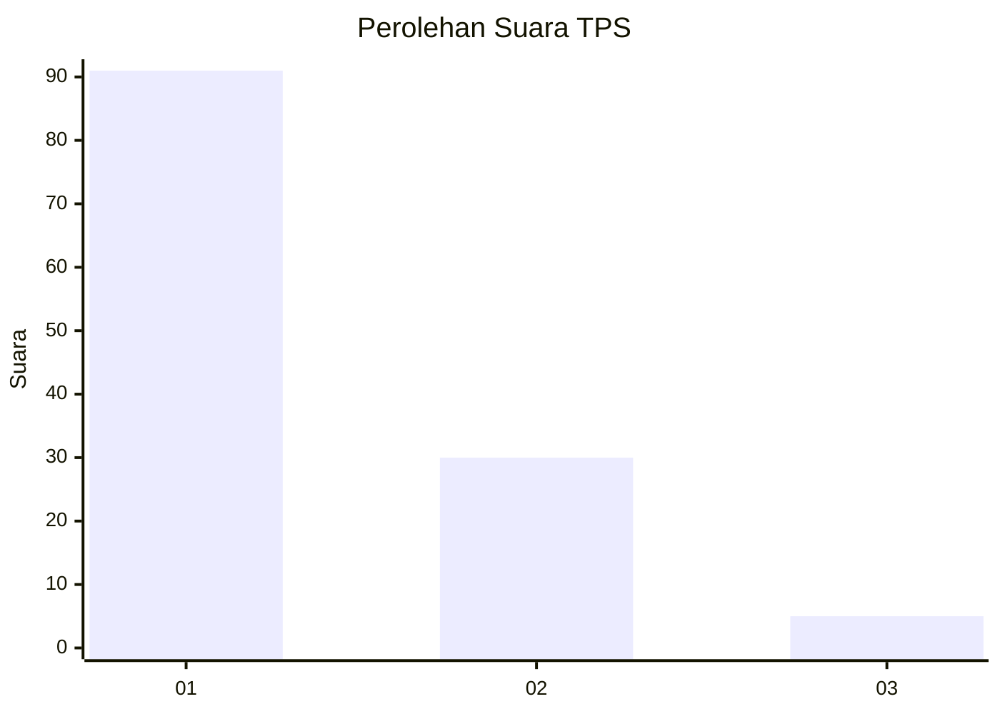
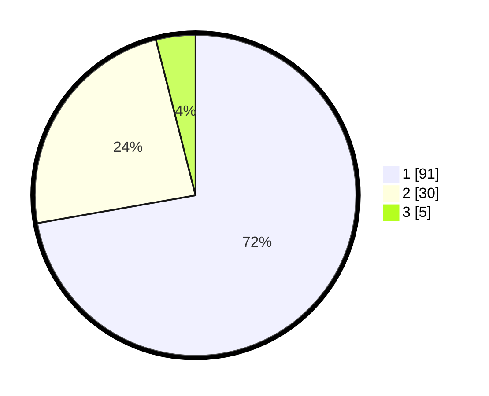

# Hasil

## Grafik

## Tabel

| No. | Nama Paslon    | Suara | Suara (raw) | Persentase |
|:--- |:-------------- | -----:| -----------:| ----------:|
| 1   | ANIES MUHAIMIN | 91    | [91][p-1]   | 72,22      |
| 2   | PRABOWO GIBRAN | 30    | [30][p-2]   | 23,81      |
| 3   | GANJAR MAHFUD  | 5     | [5][p-3]    | 3,97       |

[p-1]: https://github.com/gigit-pemilu/pemilu-2024-32-jawa-barat/blob/main/pilpres/hitung-suara/sub/32-jawa-barat/sub/02-sukabumi/sub/42-curugkembar/sub/2003-tanjungsari/sub/001-tps/sub/paslon-1.txt
[p-2]: https://github.com/gigit-pemilu/pemilu-2024-32-jawa-barat/blob/main/pilpres/hitung-suara/sub/32-jawa-barat/sub/02-sukabumi/sub/42-curugkembar/sub/2003-tanjungsari/sub/001-tps/sub/paslon-2.txt
[p-3]: https://github.com/gigit-pemilu/pemilu-2024-32-jawa-barat/blob/main/pilpres/hitung-suara/sub/32-jawa-barat/sub/02-sukabumi/sub/42-curugkembar/sub/2003-tanjungsari/sub/001-tps/sub/paslon-3.txt

## Foto C Plano

https://sirekap-obj-formc.kpu.go.id/1abc/pemilu/ppwp/32/02/42/20/03/3202422003001-20240214-141456--76ec10b1-080c-40d7-84df-e934a60ddbc1.jpg

https://sirekap-obj-formc.kpu.go.id/1abc/pemilu/ppwp/32/02/42/20/03/3202422003001-20240215-015852--bcf13bc8-bfee-48ab-9337-9e728043465b.jpg

https://sirekap-obj-formc.kpu.go.id/1abc/pemilu/ppwp/32/02/42/20/03/3202422003001-20240214-141403--51973955-a4ea-4cc6-8373-065aee094cce.jpg

## Metadata

| Key        | Value               |
| ---------- | ------------------- |
| Time Stamp | 2024-02-16 10:00:28 |

