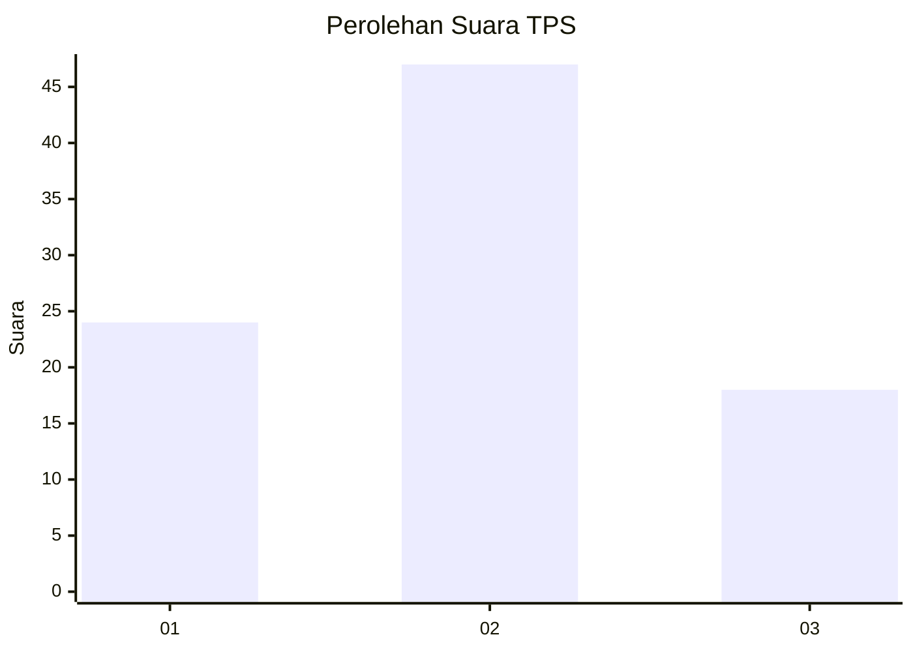
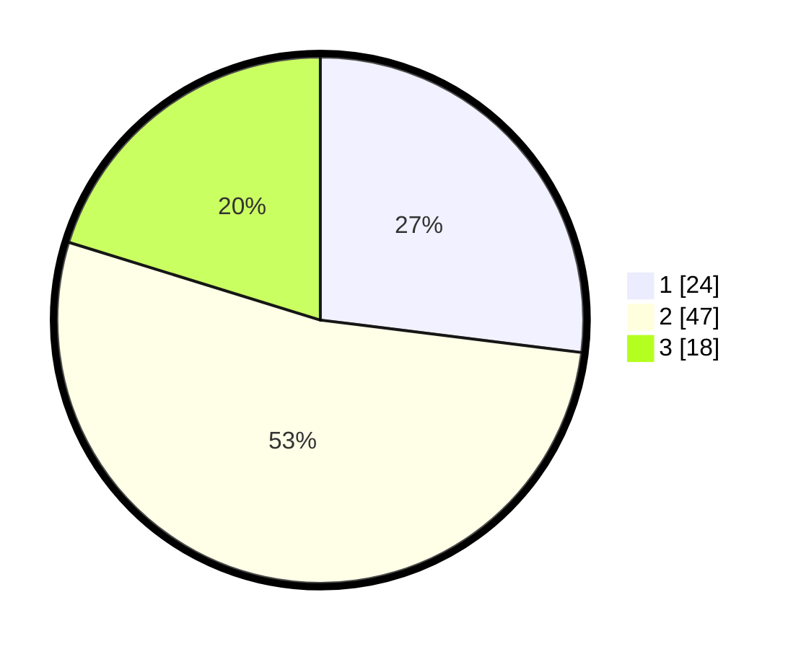

# Hasil

## Grafik

## Tabel

| No. | Nama Paslon    | Suara | Suara (raw) | Persentase |
|:--- |:-------------- | -----:| -----------:| ----------:|
| 1   | ANIES MUHAIMIN | 24    | [24][p-1]   | 26,97      |
| 2   | PRABOWO GIBRAN | 47    | [47][p-2]   | 52,81      |
| 3   | GANJAR MAHFUD  | 18    | [18][p-3]   | 20,22      |

[p-1]: https://github.com/gigit-pemilu/pemilu-2024/blob/main/pilpres/hitung-suara/sub/32-jawa-barat/sub/02-sukabumi/sub/42-curugkembar/sub/2003-tanjungsari/sub/011-tps/sub/paslon-1.txt
[p-2]: https://github.com/gigit-pemilu/pemilu-2024/blob/main/pilpres/hitung-suara/sub/32-jawa-barat/sub/02-sukabumi/sub/42-curugkembar/sub/2003-tanjungsari/sub/011-tps/sub/paslon-2.txt
[p-3]: https://github.com/gigit-pemilu/pemilu-2024/blob/main/pilpres/hitung-suara/sub/32-jawa-barat/sub/02-sukabumi/sub/42-curugkembar/sub/2003-tanjungsari/sub/011-tps/sub/paslon-3.txt

## Foto C Plano

https://sirekap-obj-formc.kpu.go.id/8556/pemilu/ppwp/32/02/42/20/03/3202422003011-20240214-141403--67739fac-3b12-4c25-88c8-9b1782057bb9.jpg

https://sirekap-obj-formc.kpu.go.id/8556/pemilu/ppwp/32/02/42/20/03/3202422003011-20240215-094911--f4b21a5b-f12a-4030-b8a3-696548befe91.jpg

https://sirekap-obj-formc.kpu.go.id/8556/pemilu/ppwp/32/02/42/20/03/3202422003011-20240215-094931--b6ad1778-e6fb-4875-8cff-63f7394de80b.jpg

## Metadata

| Key        | Value               |
| ---------- | ------------------- |
| Time Stamp | 2024-02-16 16:25:10 |

