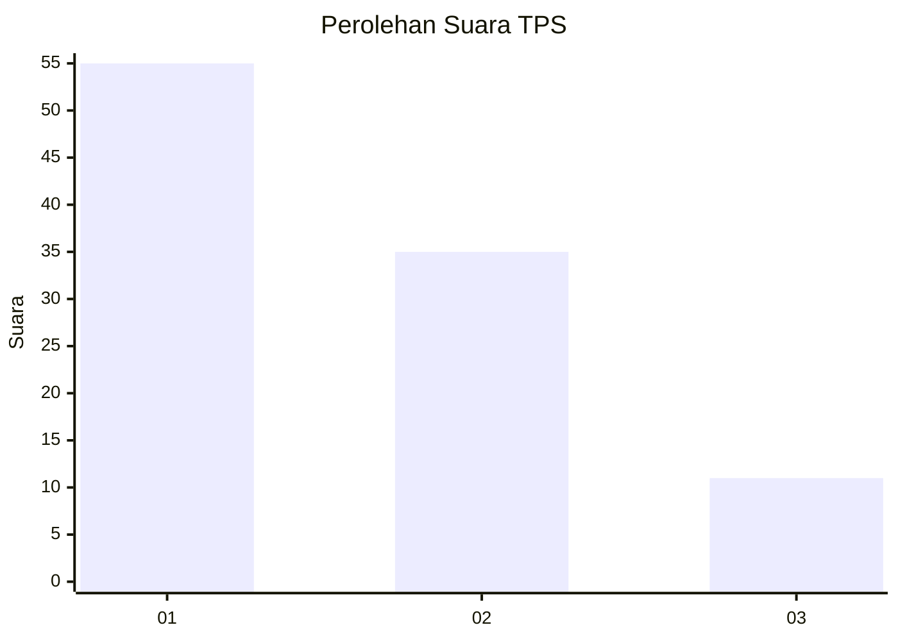
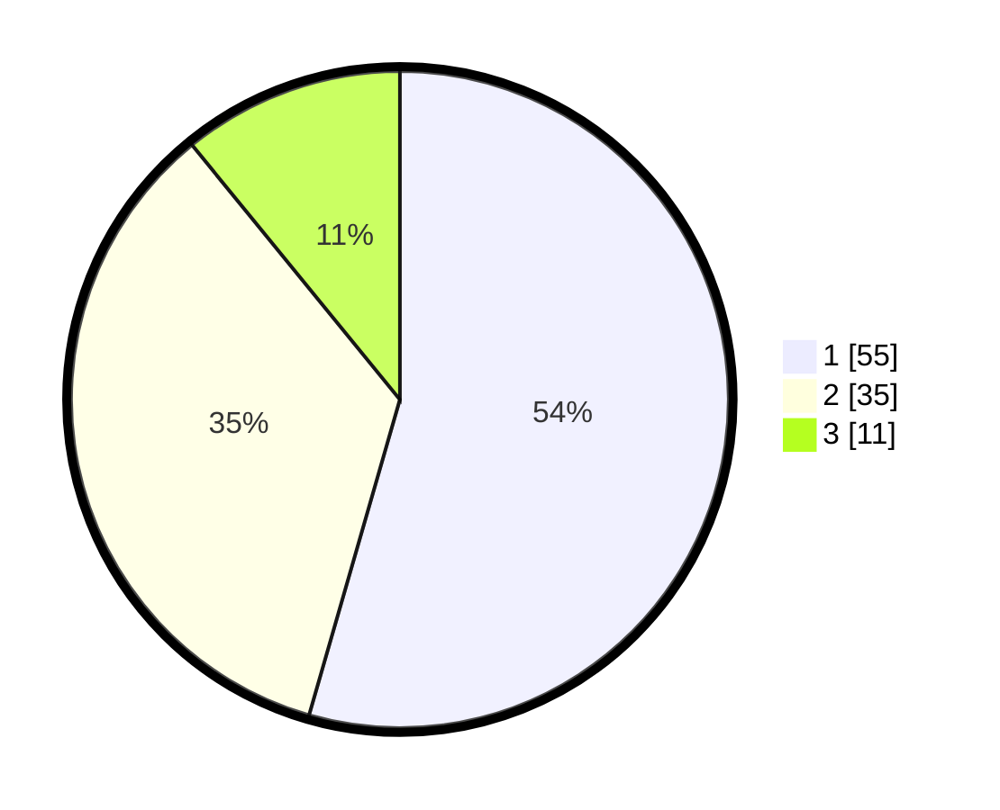

# Hasil

## Grafik

## Tabel

| No. | Nama Paslon    | Suara | Suara (raw) | Persentase |
|:--- |:-------------- | -----:| -----------:| ----------:|
| 1   | ANIES MUHAIMIN | 55    | [55][p-1]   | 54,46      |
| 2   | PRABOWO GIBRAN | 35    | [35][p-2]   | 34,65      |
| 3   | GANJAR MAHFUD  | 11    | [11][p-3]   | 10,89      |

[p-1]: https://github.com/gigit-pemilu/pemilu-2024-32-jawa-barat/blob/main/pilpres/hitung-suara/sub/32-jawa-barat/sub/02-sukabumi/sub/42-curugkembar/sub/2005-mekartanjung/sub/016-tps/sub/paslon-1.txt
[p-2]: https://github.com/gigit-pemilu/pemilu-2024-32-jawa-barat/blob/main/pilpres/hitung-suara/sub/32-jawa-barat/sub/02-sukabumi/sub/42-curugkembar/sub/2005-mekartanjung/sub/016-tps/sub/paslon-2.txt
[p-3]: https://github.com/gigit-pemilu/pemilu-2024-32-jawa-barat/blob/main/pilpres/hitung-suara/sub/32-jawa-barat/sub/02-sukabumi/sub/42-curugkembar/sub/2005-mekartanjung/sub/016-tps/sub/paslon-3.txt

## Foto C Plano

https://sirekap-obj-formc.kpu.go.id/55a3/pemilu/ppwp/32/02/42/20/05/3202422005016-20240214-191506--9737f88e-58ac-4b8d-a07f-68711b6b6d4d.jpg

https://sirekap-obj-formc.kpu.go.id/55a3/pemilu/ppwp/32/02/42/20/05/3202422005016-20240214-190729--0d3eeb22-9627-478b-8428-f3b1dba4ac4d.jpg

https://sirekap-obj-formc.kpu.go.id/55a3/pemilu/ppwp/32/02/42/20/05/3202422005016-20240214-191210--5063e2e1-9501-455c-bb64-c10f5bc4fe24.jpg

## Metadata

| Key        | Value               |
| ---------- | ------------------- |
| Time Stamp | 2024-02-16 10:00:28 |

