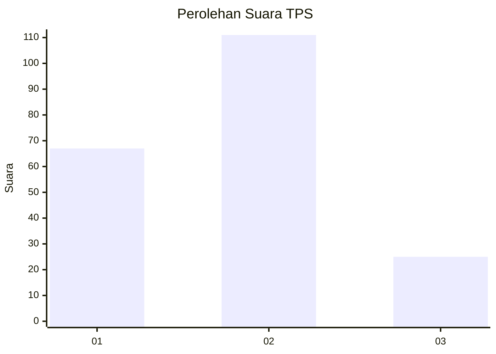
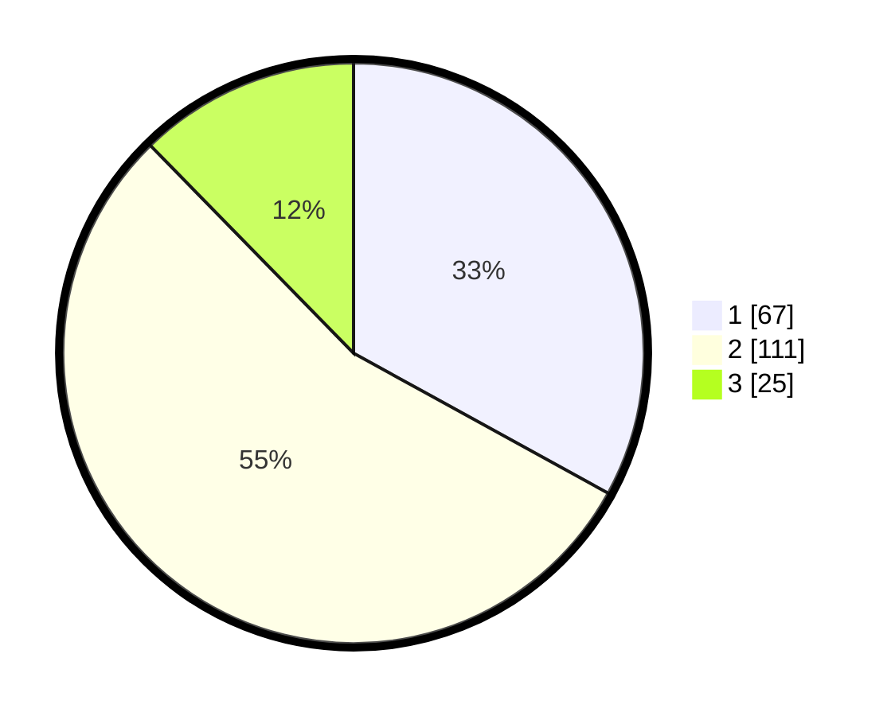

# Hasil

## Grafik

## Tabel

| No. | Nama Paslon    | Suara | Suara (raw) | Persentase |
|:--- |:-------------- | -----:| -----------:| ----------:|
| 1   | ANIES MUHAIMIN | 67    | [67][p-1]   | 33,00      |
| 2   | PRABOWO GIBRAN | 111   | [111][p-2]  | 54,68      |
| 3   | GANJAR MAHFUD  | 25    | [25][p-3]   | 12,32      |

[p-1]: https://github.com/gigit-pemilu/pemilu-2024/blob/main/pilpres/hitung-suara/sub/32-jawa-barat/sub/02-sukabumi/sub/43-cidolog/sub/2002-cipamingkis/sub/003-tps/sub/paslon-1.txt
[p-2]: https://github.com/gigit-pemilu/pemilu-2024/blob/main/pilpres/hitung-suara/sub/32-jawa-barat/sub/02-sukabumi/sub/43-cidolog/sub/2002-cipamingkis/sub/003-tps/sub/paslon-2.txt
[p-3]: https://github.com/gigit-pemilu/pemilu-2024/blob/main/pilpres/hitung-suara/sub/32-jawa-barat/sub/02-sukabumi/sub/43-cidolog/sub/2002-cipamingkis/sub/003-tps/sub/paslon-3.txt

## Foto C Plano

https://sirekap-obj-formc.kpu.go.id/aed4/pemilu/ppwp/32/02/43/20/02/3202432002003-20240216-210122--ae0e71ab-80e8-4eaf-a723-94d174e4a4ee.jpg

https://sirekap-obj-formc.kpu.go.id/aed4/pemilu/ppwp/32/02/43/20/02/3202432002003-20240216-210146--6bff1d0b-2c4b-4cfb-a404-745b10fa8799.jpg

https://sirekap-obj-formc.kpu.go.id/aed4/pemilu/ppwp/32/02/43/20/02/3202432002003-20240216-210205--b3683cd9-db23-4a4c-a4f7-49559ea663e5.jpg

## Metadata

| Key        | Value               |
| ---------- | ------------------- |
| Time Stamp | 2024-02-24 22:31:28 |

