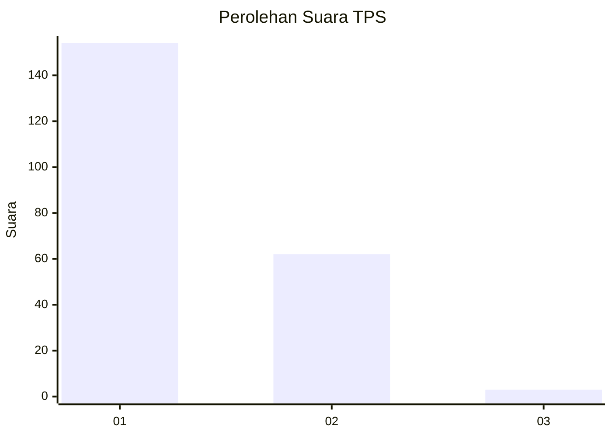
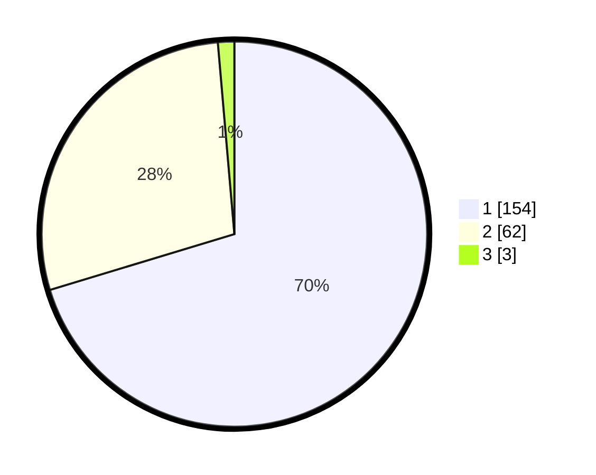

# Hasil

## Grafik

## Tabel

| No. | Nama Paslon    | Suara | Suara (raw) | Persentase |
|:--- |:-------------- | -----:| -----------:| ----------:|
| 1   | ANIES MUHAIMIN | 154   | [154][p-1]  | 70,32      |
| 2   | PRABOWO GIBRAN | 62    | [62][p-2]   | 28,31      |
| 3   | GANJAR MAHFUD  | 3     | [3][p-3]    | 1,37       |

[p-1]: https://github.com/gigit-pemilu/pemilu-2024-32-jawa-barat/blob/main/pilpres/hitung-suara/sub/32-jawa-barat/sub/02-sukabumi/sub/45-tegalbuleud/sub/2008-sirnamekar/sub/003-tps/sub/paslon-1.txt
[p-2]: https://github.com/gigit-pemilu/pemilu-2024-32-jawa-barat/blob/main/pilpres/hitung-suara/sub/32-jawa-barat/sub/02-sukabumi/sub/45-tegalbuleud/sub/2008-sirnamekar/sub/003-tps/sub/paslon-2.txt
[p-3]: https://github.com/gigit-pemilu/pemilu-2024-32-jawa-barat/blob/main/pilpres/hitung-suara/sub/32-jawa-barat/sub/02-sukabumi/sub/45-tegalbuleud/sub/2008-sirnamekar/sub/003-tps/sub/paslon-3.txt

## Foto C Plano

https://sirekap-obj-formc.kpu.go.id/369c/pemilu/ppwp/32/02/45/20/08/3202452008003-20240215-075609--42134422-4522-4cd3-91ca-8cc5c2c68980.jpg

https://sirekap-obj-formc.kpu.go.id/369c/pemilu/ppwp/32/02/45/20/08/3202452008003-20240215-075807--a3ebfcf3-98dc-47f9-bcb8-bc0896daa5c7.jpg

https://sirekap-obj-formc.kpu.go.id/369c/pemilu/ppwp/32/02/45/20/08/3202452008003-20240215-080108--bdce5069-f456-48e9-919c-469f1201f690.jpg

## Metadata

| Key        | Value               |
| ---------- | ------------------- |
| Time Stamp | 2024-02-17 12:00:00 |

